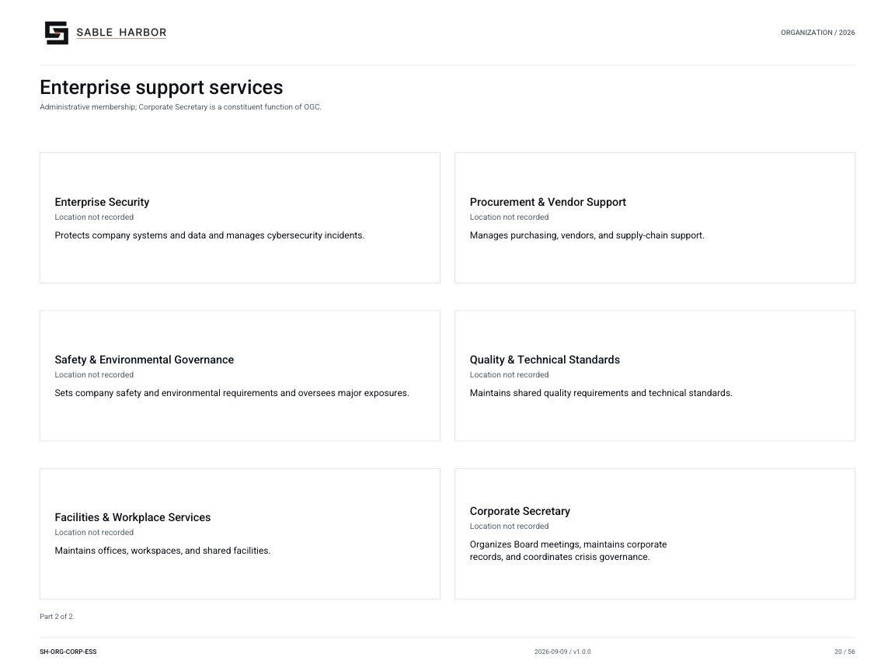

# Enterprise support services

**SH-ORG-CORP-ESS · 2026-09-09 · v1.0.0**

Administrative membership; Corporate Secretary is a constituent function of OGC.

[Vector artwork](../assets/current/corporate-enterprise-support.svg) · [Complete chart book](../assets/current/Sable-Harbor-Organization-Charts.pdf)

[Vector artwork](../assets/current/corporate-enterprise-support-02.svg) · [Complete chart book](../assets/current/Sable-Harbor-Organization-Charts.pdf)

| Name | Location | Actual work |
| --- | --- | --- |
| Enterprise Support Services | Location not recorded | Coordinates shared administration, staffing support, facilities, and service budgets. |
| Office of the General Counsel | Location not recorded | Provides legal advice and manages corporate legal affairs. |
| Risk & Compliance | Location not recorded | Tracks enterprise risks, coordinates controls, and manages compliance requirements. |
| Finance | Location not recorded | Manages financial reporting, treasury, budgets, and capital analysis. |
| People & Culture | Location not recorded | Recruits employees and manages pay, benefits, employee relations, and career development. |
| Enterprise Technology Services | Location not recorded | Runs employee technology, shared platforms, infrastructure, and internal automation. |
| Enterprise Security | Location not recorded | Protects company systems and data and manages cybersecurity incidents. |
| Procurement & Vendor Support | Location not recorded | Manages purchasing, vendors, and supply-chain support. |
| Safety & Environmental Governance | Location not recorded | Sets company safety and environmental requirements and oversees major exposures. |
| Quality & Technical Standards | Location not recorded | Maintains shared quality requirements and technical standards. |
| Facilities & Workplace Services | Location not recorded | Maintains offices, workspaces, and shared facilities. |
| Corporate Secretary | Location not recorded | Organizes Board meetings, maintains corporate records, and coordinates crisis governance. |

## Source qualifications

- **Enterprise Support Services:** Administrative membership must not be drawn as universal substantive reporting to the Chief of ESS. Sacramento is proposed from the headquarters relationship; this unit’s geographic address is not separately recorded.
- **Office of the General Counsel:** Sacramento is proposed from the headquarters relationship; this unit’s geographic address is not separately recorded.
- **Risk & Compliance:** Sacramento is proposed from the headquarters relationship; this unit’s geographic address is not separately recorded.
- **Finance:** Sacramento is proposed from the headquarters relationship; this unit’s geographic address is not separately recorded.
- **People & Culture:** Sacramento is proposed from the headquarters relationship; this unit’s geographic address is not separately recorded.
- **Enterprise Technology Services:** Technology Services and enterprise IT are aliases. Product engineering stays within the businesses. Sacramento is proposed from the headquarters relationship; this unit’s geographic address is not separately recorded.
- **Enterprise Security:** Display label normalizes the source phrase enterprise security capability; exact formal department name is not separately fixed. CISO security authority is independent. Sacramento is proposed from the headquarters relationship; this unit’s geographic address is not separately recorded.
- **Procurement & Vendor Support:** Display label shortens procurement and technology/vendor supply-chain support; formal unit name not separately fixed. Sacramento is proposed from the headquarters relationship; this unit’s geographic address is not separately recorded.
- **Safety & Environmental Governance:** Only where enterprise-wide oversight is justified; proposed concise label, not a newly created department. Sacramento is proposed from the headquarters relationship; this unit’s geographic address is not separately recorded.
- **Quality & Technical Standards:** Only where enterprise-wide standards are justified; proposed concise label, not a newly created department. Sacramento is proposed from the headquarters relationship; this unit’s geographic address is not separately recorded.
- **Facilities & Workplace Services:** Proposed title-case version of the source capability label. Sacramento is proposed from the headquarters relationship; this unit’s geographic address is not separately recorded.
- **Corporate Secretary:** Constituent function of OGC, not a separate top-level department. Sacramento is proposed from the headquarters relationship; this unit’s geographic address is not separately recorded.

## Sources

- [docs/canon/CORPORATE_HEADQUARTERS_CLOSEOUT_2026-09-03.md](../../../docs/canon/CORPORATE_HEADQUARTERS_CLOSEOUT_2026-09-03.md)
- [docs/governance/ENTERPRISE_SUPPORT_SERVICES_AND_INDEPENDENCE.md](../../../docs/governance/ENTERPRISE_SUPPORT_SERVICES_AND_INDEPENDENCE.md)
- [docs/governance/PEOPLE_AND_CULTURE_DOCTRINE.md](../../../docs/governance/PEOPLE_AND_CULTURE_DOCTRINE.md)
- [docs/governance/ENTERPRISE_TECHNOLOGY_SERVICES_DOCTRINE.md](../../../docs/governance/ENTERPRISE_TECHNOLOGY_SERVICES_DOCTRINE.md)
