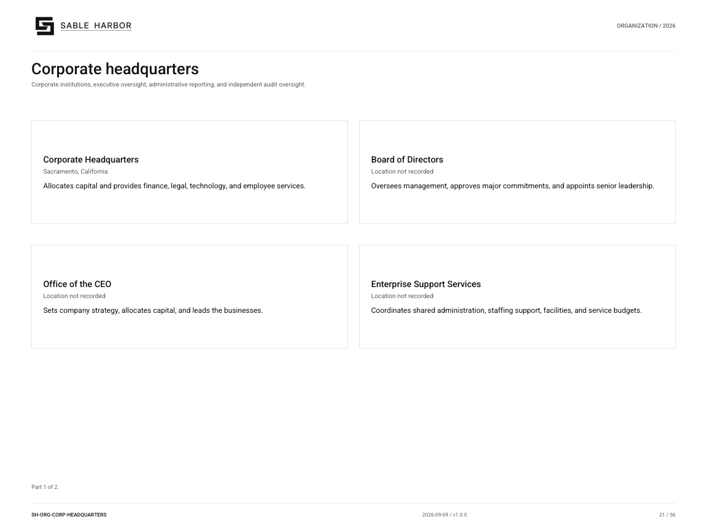
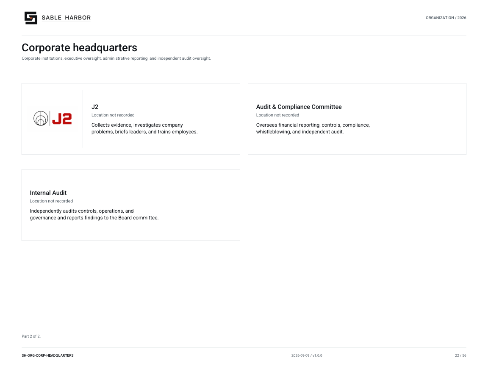

# Corporate headquarters

**SH-ORG-CORP-HEADQUARTERS · 2026-09-09 · v1.0.0**

Corporate institutions, executive oversight, administrative reporting, and independent audit oversight.

[Vector artwork](../assets/current/corporate-headquarters.svg) · [Complete chart book](../assets/current/Sable-Harbor-Organization-Charts.pdf)

[Vector artwork](../assets/current/corporate-headquarters-02.svg) · [Complete chart book](../assets/current/Sable-Harbor-Organization-Charts.pdf)

| Name | Location | Actual work |
| --- | --- | --- |
| Corporate Headquarters | Sacramento, California | Allocates capital and provides finance, legal, technology, and employee services. |
| Board of Directors | Location not recorded | Oversees management, approves major commitments, and appoints senior leadership. |
| Office of the CEO | Location not recorded | Sets company strategy, allocates capital, and leads the businesses. |
| Enterprise Support Services | Location not recorded | Coordinates shared administration, staffing support, facilities, and service budgets. |
| J2 | Location not recorded | Collects evidence, investigates company problems, briefs leaders, and trains employees. |
| Audit & Compliance Committee | Location not recorded | Oversees financial reporting, controls, compliance, whistleblowing, and independent audit. |
| Internal Audit | Location not recorded | Independently audits controls, operations, and governance and reports findings to the Board committee. |

## Source qualifications

- **Corporate Headquarters:** Grouping of corporate institutions; not an additional operating company. Sacramento is proposed from the headquarters relationship; this unit’s geographic address is not separately recorded.
- **Board of Directors:** Sacramento is proposed from the headquarters relationship; this unit’s geographic address is not separately recorded.
- **Office of the CEO:** Sacramento is proposed from the headquarters relationship; this unit’s geographic address is not separately recorded.
- **Enterprise Support Services:** Administrative membership must not be drawn as universal substantive reporting to the Chief of ESS. Sacramento is proposed from the headquarters relationship; this unit’s geographic address is not separately recorded.
- **J2:** Full charter name Judgment & Junction. Distinct from ESS, Internal Audit, and commercial Advisory. Sacramento is inferred from HQ relationship, not an independently fixed facility address. Sacramento is proposed from the headquarters relationship; this unit’s geographic address is not separately recorded.
- **Audit & Compliance Committee:** Sacramento is proposed from the headquarters relationship; this unit’s geographic address is not separately recorded.
- **Internal Audit:** Functional reporting to committee. ESS may supply administration but has no control over audit work. Sacramento is proposed from the headquarters relationship; this unit’s geographic address is not separately recorded.

## Sources

- [docs/canon/CORPORATE_HEADQUARTERS_CLOSEOUT_2026-09-03.md](../../../docs/canon/CORPORATE_HEADQUARTERS_CLOSEOUT_2026-09-03.md)
- [docs/governance/BOARD_AND_CAPITAL_GOVERNANCE_v1.0.1.md](../../../docs/governance/BOARD_AND_CAPITAL_GOVERNANCE_v1.0.1.md)
- [docs/governance/ENTERPRISE_AUTHORITY_CAPITAL_AND_EXECUTIVE_RHYTHM.md](../../../docs/governance/ENTERPRISE_AUTHORITY_CAPITAL_AND_EXECUTIVE_RHYTHM.md)
- [docs/governance/ENTERPRISE_SUPPORT_SERVICES_AND_INDEPENDENCE.md](../../../docs/governance/ENTERPRISE_SUPPORT_SERVICES_AND_INDEPENDENCE.md)
- [docs/canon/DECISION_REGISTER_ADDENDUM_2026-09-03.md](../../../docs/canon/DECISION_REGISTER_ADDENDUM_2026-09-03.md)
- [docs/j2/J2_ESTABLISHMENT.md](../../../docs/j2/J2_ESTABLISHMENT.md)
- [docs/governance/committees/AUDIT_AND_COMPLIANCE_COMMITTEE_CHARTER.md](../../../docs/governance/committees/AUDIT_AND_COMPLIANCE_COMMITTEE_CHARTER.md)
