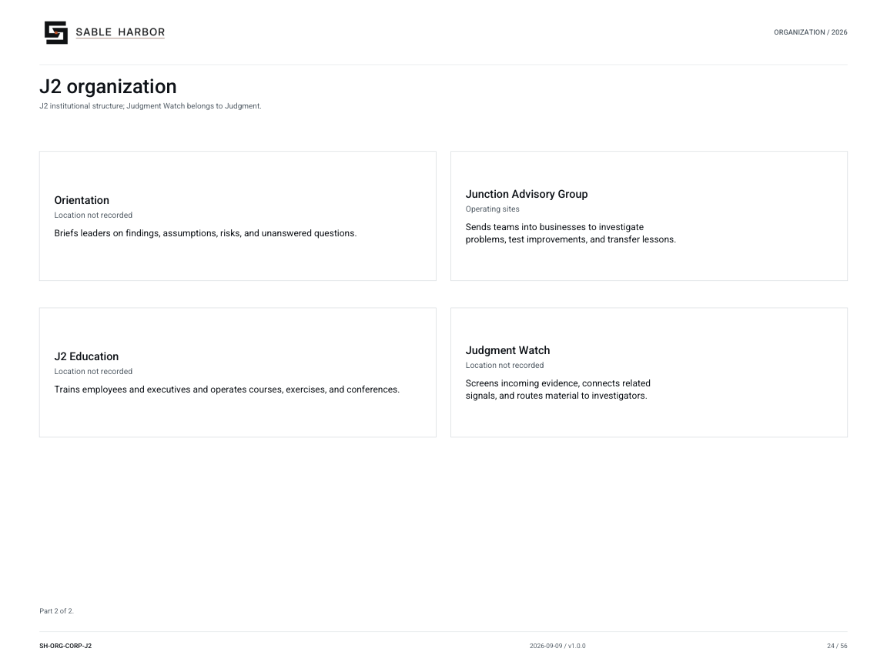

# J2 organization

**SH-ORG-CORP-J2 · 2026-09-09 · v1.0.0**

J2 institutional structure; Judgment Watch belongs to Judgment.

[Vector artwork](../assets/current/corporate-j2.svg) · [Complete chart book](../assets/current/Sable-Harbor-Organization-Charts.pdf)

[Vector artwork](../assets/current/corporate-j2-02.svg) · [Complete chart book](../assets/current/Sable-Harbor-Organization-Charts.pdf)

J2’s relationship to the CEO is LOCKED DIRECTION; reporting details remain OPEN. See docs/j2/J2_CHARTER.md.

| Name | Location | Actual work |
| --- | --- | --- |
| J2 | Location not recorded | Collects evidence, investigates company problems, briefs leaders, and trains employees. |
| J2 Headquarters | Location not recorded | Coordinates intelligence work, professional standards, staffing, and support. |
| Contact | Location not recorded | Collects records, interviews, field observations, and external research for company investigations. |
| Judgment | Location not recorded | Investigates company problems, tests explanations, and produces evidence-based findings. |
| Orientation | Location not recorded | Briefs leaders on findings, assumptions, risks, and unanswered questions. |
| Junction Advisory Group | Operating sites | Sends teams into businesses to investigate problems, test improvements, and transfer lessons. |
| J2 Education | Location not recorded | Trains employees and executives and operates courses, exercises, and conferences. |
| Judgment Watch | Location not recorded | Screens incoming evidence, connects related signals, and routes material to investigators. |

## Source qualifications

- **J2:** Full charter name Judgment & Junction. Distinct from ESS, Internal Audit, and commercial Advisory. Sacramento is inferred from HQ relationship, not an independently fixed facility address. Sacramento is proposed from the headquarters relationship; this unit’s geographic address is not separately recorded.
- **J2 Headquarters:** 28 authorized billets; not actual occupied headcount. Sacramento is proposed from the headquarters relationship; this unit’s geographic address is not separately recorded.
- **Contact:** 78 authorized billets; teams deployed across sites. Base city not separately established.
- **Judgment:** 42 authorized billets, including Judgment Watch.
- **Orientation:** 24 authorized billets. Separate assignments at CEO, Board, Finance, and temporary consequential environments do not create additional arms. Sacramento is proposed from the headquarters relationship; this unit’s geographic address is not separately recorded.
- **Junction Advisory Group:** Six active five-person teams; no canonical individual team names. Do not equate with commercial Sable Harbor Advisory.
- **J2 Education:** 35 permanent authorized billets. Learning-campus city not established.
- **Judgment Watch:** Six billets belong to Judgment. Work occurs at Contact intake, an organizational placement rather than a recorded city.

## Sources

- [docs/canon/DECISION_REGISTER_ADDENDUM_2026-09-03.md](../../../docs/canon/DECISION_REGISTER_ADDENDUM_2026-09-03.md)
- [docs/j2/J2_ESTABLISHMENT.md](../../../docs/j2/J2_ESTABLISHMENT.md)
- [docs/j2/J2_HEADQUARTERS.md](../../../docs/j2/J2_HEADQUARTERS.md)
- [docs/j2/CONTACT_COLLECTION_MANAGEMENT.md](../../../docs/j2/CONTACT_COLLECTION_MANAGEMENT.md)
- [docs/j2/JUDGMENT.md](../../../docs/j2/JUDGMENT.md)
- [docs/j2/ORIENTATION.md](../../../docs/j2/ORIENTATION.md)
- [docs/j2/ORIENTATION_OFFICER_PROFESSION.md](../../../docs/j2/ORIENTATION_OFFICER_PROFESSION.md)
- [docs/j2/JUNCTION_ADVISORY_GROUP.md](../../../docs/j2/JUNCTION_ADVISORY_GROUP.md)
- [docs/j2/EDUCATION.md](../../../docs/j2/EDUCATION.md)
