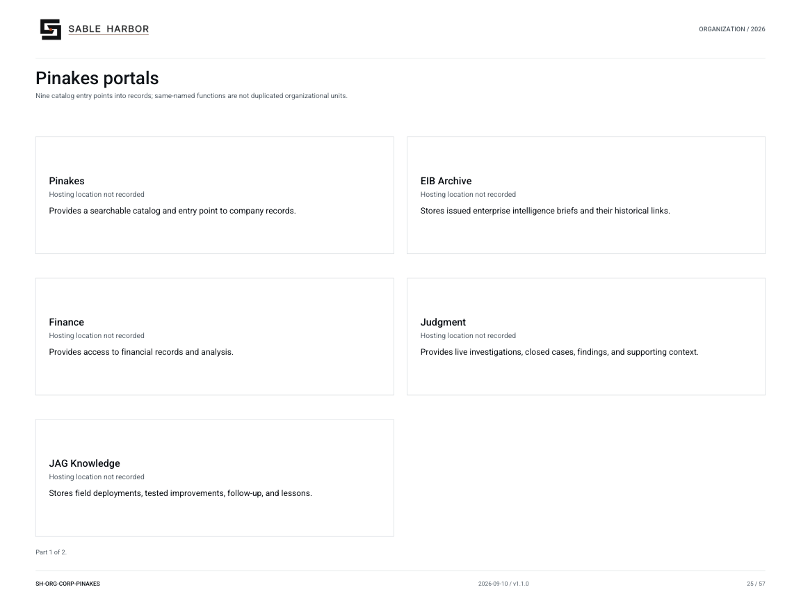
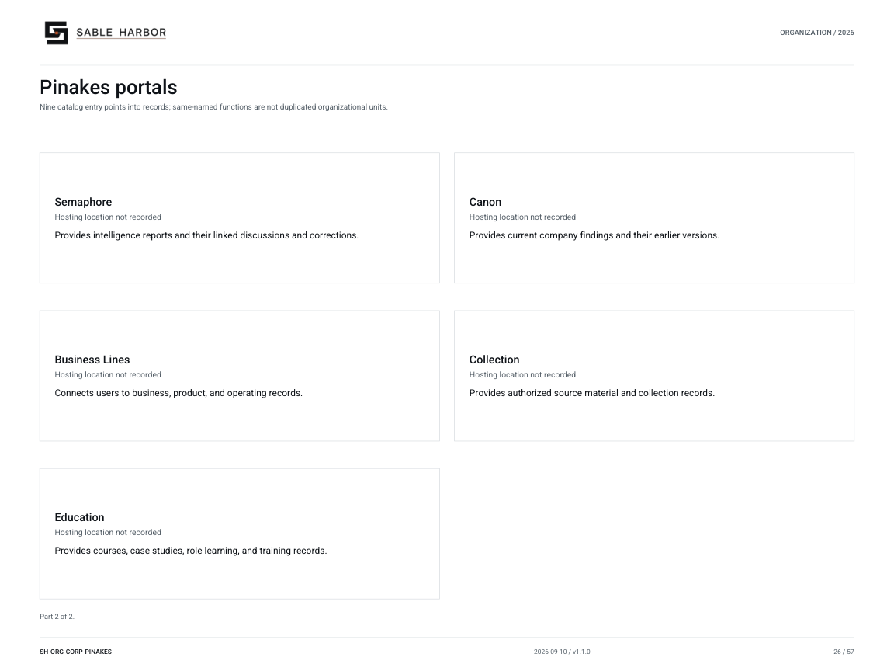

# Pinakes portals

**SH-ORG-CORP-PINAKES · 2026-09-10 · v1.1.0**

Nine catalog entry points into records; same-named functions are not duplicated organizational units.

[Vector artwork](../assets/current/corporate-pinakes-portals.svg) · [Complete chart book](../assets/current/Sable-Harbor-Organization-Charts.pdf)

[Vector artwork](../assets/current/corporate-pinakes-portals-02.svg) · [Complete chart book](../assets/current/Sable-Harbor-Organization-Charts.pdf)

| Name | Location | Actual work |
| --- | --- | --- |
| Pinakes | Hosting location not recorded | Provides a searchable catalog and entry point to company records. |
| EIB Archive | Hosting location not recorded | Stores issued enterprise intelligence briefs and their historical links. |
| Finance | Hosting location not recorded | Provides access to financial records and analysis. |
| Judgment | Hosting location not recorded | Provides live investigations, closed cases, findings, and supporting context. |
| JAG Knowledge | Hosting location not recorded | Stores field deployments, tested improvements, follow-up, and lessons. |
| Semaphore | Hosting location not recorded | Provides intelligence reports and their linked discussions and corrections. |
| Canon | Hosting location not recorded | Provides current company findings and their earlier versions. |
| Business Lines | Hosting location not recorded | Connects users to business, product, and operating records. |
| Collection | Hosting location not recorded | Provides authorized source material and collection records. |
| Education | Hosting location not recorded | Provides courses, case studies, role learning, and training records. |

## Source qualifications

- **Pinakes:** Architecture/doctrine exists; runtime implementation is not asserted. No separate legal entity or employee reporting chain.
- **EIB Archive:** Same-named departments or records are not duplicated as legal entities.
- **Finance:** Same-named departments or records are not duplicated as legal entities.
- **Judgment:** Same-named departments or records are not duplicated as legal entities.
- **JAG Knowledge:** Same-named departments or records are not duplicated as legal entities.
- **Semaphore:** Same-named departments or records are not duplicated as legal entities.
- **Canon:** Same-named departments or records are not duplicated as legal entities.
- **Business Lines:** Same-named departments or records are not duplicated as legal entities.
- **Collection:** Same-named departments or records are not duplicated as legal entities.
- **Education:** Same-named departments or records are not duplicated as legal entities.

## Sources

- [docs/j2/alexandria/PINAKES_PORTAL_AND_UX.md](../../../docs/j2/alexandria/PINAKES_PORTAL_AND_UX.md)
- [docs/j2/structured/pinakes_portals.json](../../../docs/j2/structured/pinakes_portals.json)
