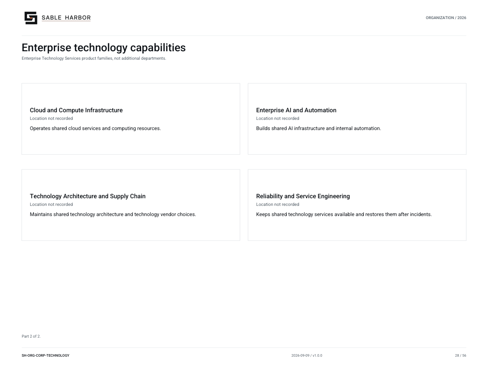

# Enterprise technology capabilities

**SH-ORG-CORP-TECHNOLOGY · 2026-09-09 · v1.0.0**

Enterprise Technology Services product families, not additional departments.

[Vector artwork](../assets/current/corporate-technology-capabilities.svg) · [Complete chart book](../assets/current/Sable-Harbor-Organization-Charts.pdf)

[Vector artwork](../assets/current/corporate-technology-capabilities-02.svg) · [Complete chart book](../assets/current/Sable-Harbor-Organization-Charts.pdf)

| Name | Location | Actual work |
| --- | --- | --- |
| Enterprise Technology Services | Location not recorded | Runs employee technology, shared platforms, infrastructure, and internal automation. |
| Employee Technology and Experience | Location not recorded | Provides employee devices, workplace software, and technology support. |
| Enterprise Platforms | Location not recorded | Builds and operates shared company software platforms. |
| Developer Platform and Engineering Systems | Location not recorded | Provides shared tools and infrastructure for software development. |
| Cloud and Compute Infrastructure | Location not recorded | Operates shared cloud services and computing resources. |
| Enterprise AI and Automation | Location not recorded | Builds shared AI infrastructure and internal automation. |
| Technology Architecture and Supply Chain | Location not recorded | Maintains shared technology architecture and technology vendor choices. |
| Reliability and Service Engineering | Location not recorded | Keeps shared technology services available and restores them after incidents. |

## Source qualifications

- **Enterprise Technology Services:** Technology Services and enterprise IT are aliases. Product engineering stays within the businesses. Sacramento is proposed from the headquarters relationship; this unit’s geographic address is not separately recorded.
- **Employee Technology and Experience:** Source lists product lines, not separate departments or independent reporting chains. Sacramento is proposed from the headquarters relationship; this unit’s geographic address is not separately recorded.
- **Enterprise Platforms:** Source lists product lines, not separate departments or independent reporting chains. Sacramento is proposed from the headquarters relationship; this unit’s geographic address is not separately recorded.
- **Developer Platform and Engineering Systems:** Source lists product lines, not separate departments or independent reporting chains. Sacramento is proposed from the headquarters relationship; this unit’s geographic address is not separately recorded.
- **Cloud and Compute Infrastructure:** Source lists product lines, not separate departments or independent reporting chains. Sacramento is proposed from the headquarters relationship; this unit’s geographic address is not separately recorded.
- **Enterprise AI and Automation:** Source lists product lines, not separate departments or independent reporting chains. Sacramento is proposed from the headquarters relationship; this unit’s geographic address is not separately recorded.
- **Technology Architecture and Supply Chain:** Source lists product lines, not separate departments or independent reporting chains. Sacramento is proposed from the headquarters relationship; this unit’s geographic address is not separately recorded.
- **Reliability and Service Engineering:** Source lists product lines, not separate departments or independent reporting chains. Sacramento is proposed from the headquarters relationship; this unit’s geographic address is not separately recorded.

## Sources

- [docs/canon/CORPORATE_HEADQUARTERS_CLOSEOUT_2026-09-03.md](../../../docs/canon/CORPORATE_HEADQUARTERS_CLOSEOUT_2026-09-03.md)
- [docs/governance/ENTERPRISE_TECHNOLOGY_SERVICES_DOCTRINE.md](../../../docs/governance/ENTERPRISE_TECHNOLOGY_SERVICES_DOCTRINE.md)
