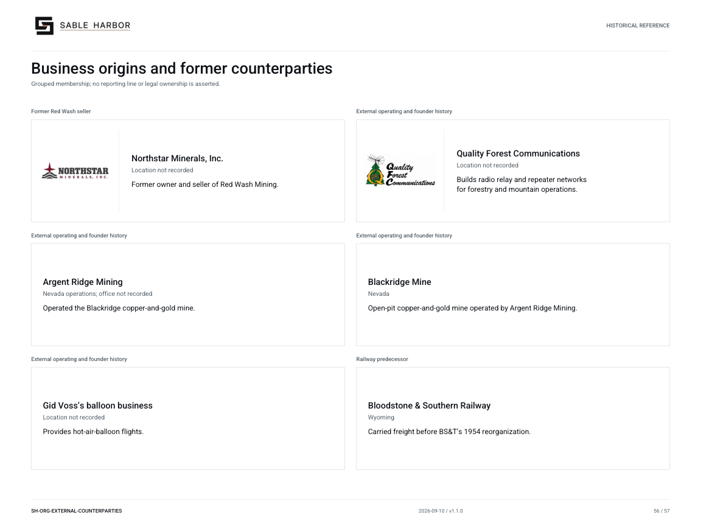

# Business origins and former counterparties

**SH-ORG-EXTERNAL-COUNTERPARTIES · 2026-09-10 · v1.1.0**

Grouped membership; no reporting line or legal ownership is asserted.

Historical/reference view. Inclusion does not establish a current subsidiary or employee.

[Vector artwork](../assets/current/external-counterparties.svg) · [Complete chart book](../assets/current/Sable-Harbor-Organization-Charts.pdf)

| Name | Location | Actual work |
| --- | --- | --- |
| Northstar Minerals, Inc. | Location not recorded | Former owner and seller of Red Wash Mining. |
| Quality Forest Communications | Location not recorded | Builds radio relay and repeater networks for forestry and mountain operations. |
| Argent Ridge Mining | Nevada operations; office not recorded | Operated the Blackridge copper-and-gold mine. |
| Blackridge Mine | Nevada | Open-pit copper-and-gold mine operated by Argent Ridge Mining. |
| Gid Voss’s balloon business | Location not recorded | Provides hot-air-balloon flights. |
| Bloodstone & Southern Railway | Wyoming | Carried freight before BS&T’s 1954 reorganization. |

## Source qualifications

- **Northstar Minerals, Inc.:** External seller. Other current operations not established. Wyoming is jurisdiction, not proven HQ. Wyoming is the jurisdiction of incorporation, not an office location.
- **Quality Forest Communications:** Historical external company founded by Eli before Sable Harbor; no purchase or current subsidiary.
- **Argent Ridge Mining:** Separate historical case company, not owned by Sable Harbor.
- **Blackridge Mine:** Separate historical case asset, not owned by Sable Harbor.
- **Gid Voss’s balloon business:** Personal business; no established proper name, corporate assets, or Sable Harbor ownership.
- **Bloodstone & Southern Railway:** Predecessor of BS&T, not current additional company.

## Sources

- [industrial/source/entities.json](../../../industrial/source/entities.json)
- [docs/canon/WILLOW_KLEIN_CLOSEOUT_2026-09-06.md](../../../docs/canon/WILLOW_KLEIN_CLOSEOUT_2026-09-06.md)
- [docs/canon/SABLE_HARBOR_CORPORATE_LORE_CANON_v0.3.1.md](../../../docs/canon/SABLE_HARBOR_CORPORATE_LORE_CANON_v0.3.1.md)
- [industrial/corporate/LEGAL_STRUCTURE_AND_FORMATION.md](../../../industrial/corporate/LEGAL_STRUCTURE_AND_FORMATION.md)
