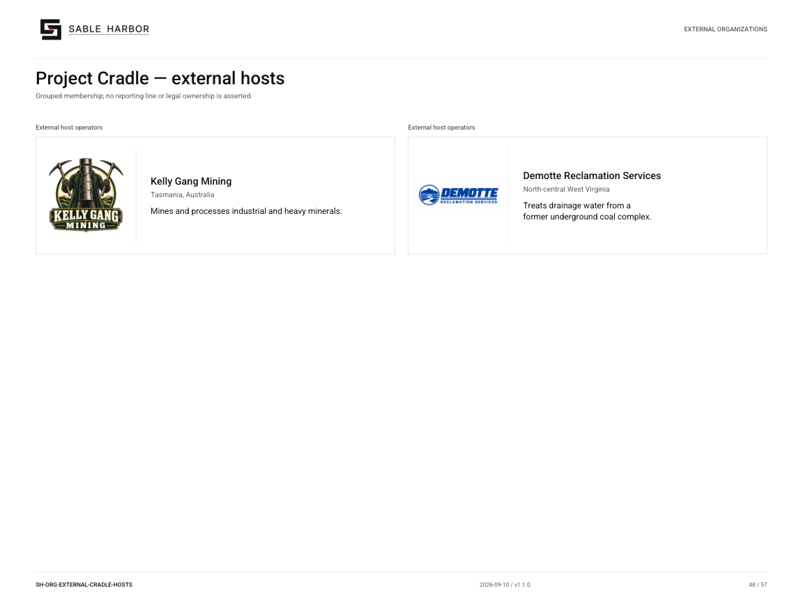

# Project Cradle — external hosts

**SH-ORG-EXTERNAL-CRADLE-HOSTS · 2026-09-10 · v1.1.0**

Grouped membership; no reporting line or legal ownership is asserted.

[Vector artwork](../assets/current/external-cradle-hosts.svg) · [Complete chart book](../assets/current/Sable-Harbor-Organization-Charts.pdf)

| Name | Location | Actual work |
| --- | --- | --- |
| Kelly Gang Mining | Tasmania, Australia | Mines and processes industrial and heavy minerals. |
| Demotte Reclamation Services | North-central West Virginia | Treats drainage water from a former underground coal complex. |

## Source qualifications

- **Kelly Gang Mining:** External Stream 17 host. Replaces Gunns placeholder.
- **Demotte Reclamation Services:** External recovery host; former Morrow Run name superseded.

## Sources

- [docs/canon/CRADLE_CLOSEOUT_2026-09-06.md](../../../docs/canon/CRADLE_CLOSEOUT_2026-09-06.md)
