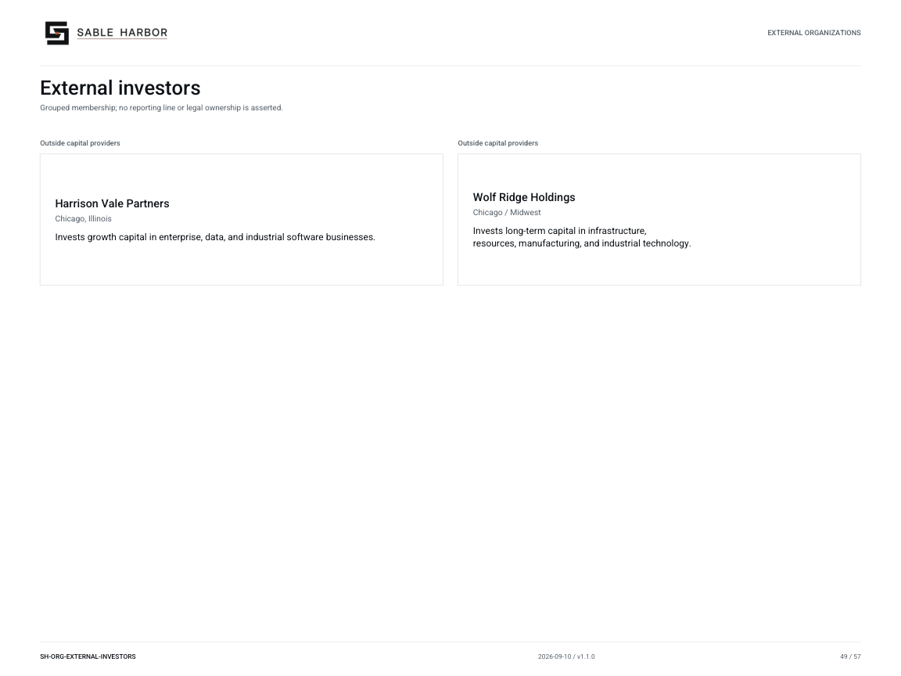

# External investors

**SH-ORG-EXTERNAL-INVESTORS · 2026-09-10 · v1.1.0**

Grouped membership; no reporting line or legal ownership is asserted.

[Vector artwork](../assets/current/external-investors.svg) · [Complete chart book](../assets/current/Sable-Harbor-Organization-Charts.pdf)

| Name | Location | Actual work |
| --- | --- | --- |
| Harrison Vale Partners | Chicago, Illinois | Invests growth capital in enterprise, data, and industrial software businesses. |
| Wolf Ridge Holdings | Chicago / Midwest | Invests long-term capital in infrastructure, resources, manufacturing, and industrial technology. |

## Source qualifications

- **Harrison Vale Partners:** 2021 growth-financing lead; external shareholder, not Sable Harbor subsidiary.
- **Wolf Ridge Holdings:** 2022 industrial-financing lead; external shareholder, not Sable Harbor subsidiary.

## Sources

- [docs/governance/BOARD_AND_CAPITAL_GOVERNANCE_v1.0.1.md](../../../docs/governance/BOARD_AND_CAPITAL_GOVERNANCE_v1.0.1.md)
