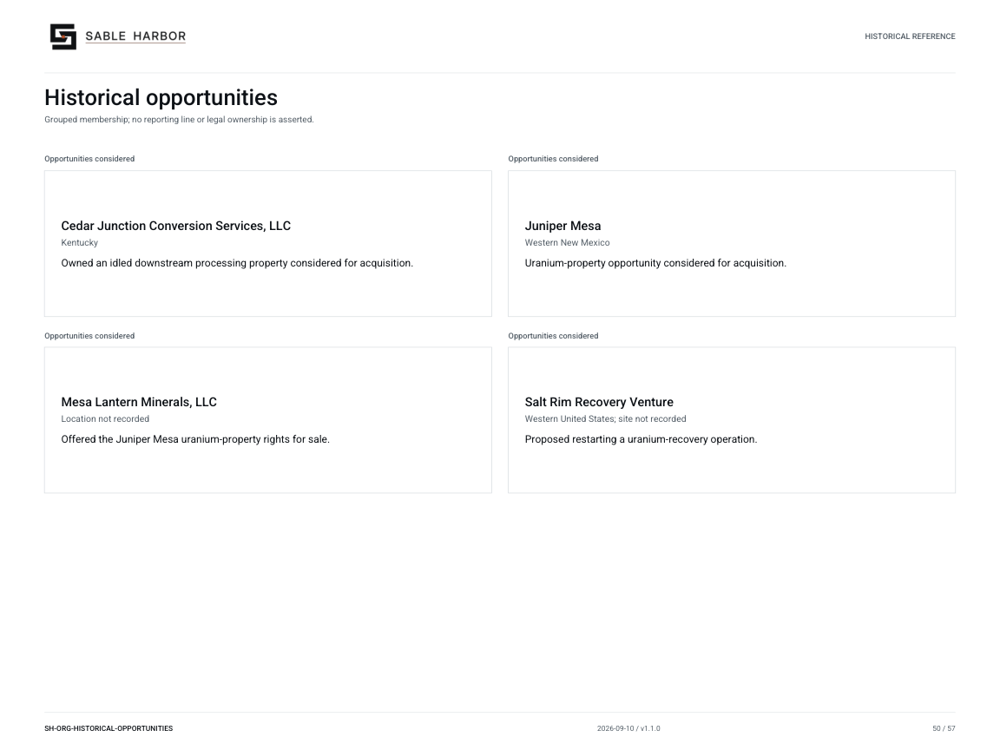

# Historical opportunities

**SH-ORG-HISTORICAL-OPPORTUNITIES · 2026-09-10 · v1.1.0**

Grouped membership; no reporting line or legal ownership is asserted.

Historical/reference view. Inclusion does not establish a current subsidiary or employee.

[Vector artwork](../assets/current/historical-opportunities.svg) · [Complete chart book](../assets/current/Sable-Harbor-Organization-Charts.pdf)

| Name | Location | Actual work |
| --- | --- | --- |
| Cedar Junction Conversion Services, LLC | Kentucky | Owned an idled downstream processing property considered for acquisition. |
| Juniper Mesa | Western New Mexico | Uranium-property opportunity considered for acquisition. |
| Mesa Lantern Minerals, LLC | Location not recorded | Offered the Juniper Mesa uranium-property rights for sale. |
| Salt Rim Recovery Venture | Western United States; site not recorded | Proposed restarting a uranium-recovery operation. |

## Source qualifications

- **Cedar Junction Conversion Services, LLC:** Abandoned acquisition 2024-02-16; never owned or operated by Sable Harbor.
- **Juniper Mesa:** Abandoned acquisition 2024-06-14; no ownership or approved production.
- **Mesa Lantern Minerals, LLC:** External seller. Do not infer headquarters from property location.
- **Salt Rim Recovery Venture:** Abandoned 2024-10-04; never consolidated.

## Sources

- [industrial/pale_sun/05_FALSE_START_CEDAR_JUNCTION.md](../../../industrial/pale_sun/05_FALSE_START_CEDAR_JUNCTION.md)
- [industrial/pale_sun/06_FALSE_START_JUNIPER_MESA.md](../../../industrial/pale_sun/06_FALSE_START_JUNIPER_MESA.md)
- [industrial/pale_sun/07_FALSE_START_SALT_RIM.md](../../../industrial/pale_sun/07_FALSE_START_SALT_RIM.md)
