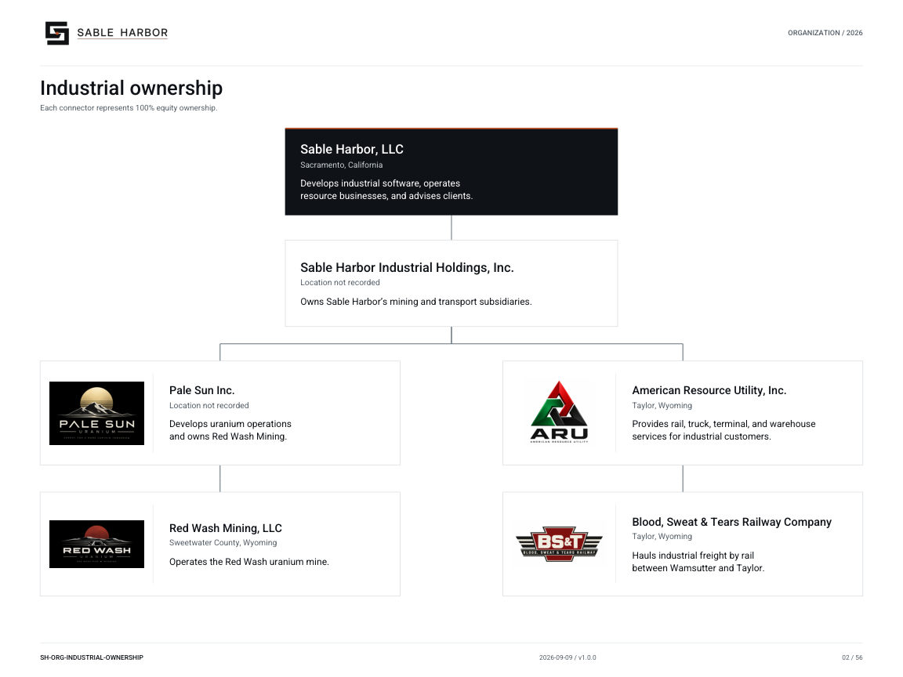

# Industrial ownership

**SH-ORG-INDUSTRIAL-OWNERSHIP · 2026-09-09 · v1.0.0**

Each connector represents 100% equity ownership.

[Vector artwork](../assets/current/industrial-ownership.svg) · [Complete chart book](../assets/current/Sable-Harbor-Organization-Charts.pdf)

| Owner | Owned entity | Relationship |
| --- | --- | --- |
| Sable Harbor, LLC | Sable Harbor Industrial Holdings, Inc. | 100% equity ownership |
| Sable Harbor Industrial Holdings, Inc. | Pale Sun Inc. | 100% equity ownership |
| Pale Sun Inc. | Red Wash Mining, LLC | 100% equity ownership |
| Sable Harbor Industrial Holdings, Inc. | American Resource Utility, Inc. | 100% equity ownership |
| American Resource Utility, Inc. | Blood, Sweat & Tears Railway Company | 100% equity ownership |

| Name | Location | Actual work |
| --- | --- | --- |
| Sable Harbor, LLC | Sacramento, California | Develops industrial software, operates resource businesses, and advises clients. |
| Sable Harbor Industrial Holdings, Inc. | Location not recorded | Owns Sable Harbor’s mining and transport subsidiaries. |
| Pale Sun Inc. | Location not recorded | Develops uranium operations and owns Red Wash Mining. |
| American Resource Utility, Inc. | Taylor, Wyoming | Provides rail, truck, terminal, and warehouse services for industrial customers. |
| Red Wash Mining, LLC | Sweetwater County, Wyoming | Operates the Red Wash uranium mine. |
| Blood, Sweat & Tears Railway Company | Taylor, Wyoming | Hauls industrial freight by rail between Wamsutter and Taylor. |

## Source qualifications

- **Sable Harbor, LLC:** Ultimate parent. SHI does not mean Inc. Parent handled again in institutional inventory: deduplicate.
- **Sable Harbor Industrial Holdings, Inc.:** 100% owned. Delaware is formation jurisdiction, not an established office. No separately staffed business implied.
- **Pale Sun Inc.:** 100% owned. Wyoming is Red Wash operating footprint; Pale Sun office not located. Delaware is jurisdiction.
- **American Resource Utility, Inc.:** 100% owned since 2026-01-07. Taylor office FAC-ARU-OFFICE; estate includes Wamsutter and Rawlins.
- **Red Wash Mining, LLC:** 100% owned since 2025-07-18. RWH is a code, never Red Wash Holdings. Mine and company not two businesses.
- **Blood, Sweat & Tears Railway Company:** 100% owned by ARU. 40 unique route miles. No Rawlins branch or Red Wash mine spur.

## Sources

- [industrial/source/entities.json](../../../industrial/source/entities.json)
