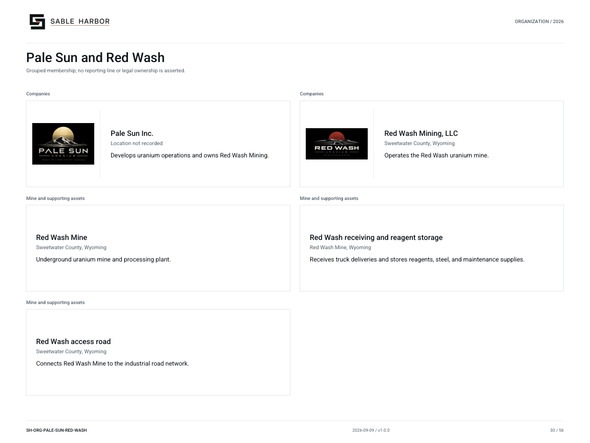

# Pale Sun and Red Wash

**SH-ORG-PALE-SUN-RED-WASH · 2026-09-09 · v1.0.0**

Grouped membership; no reporting line or legal ownership is asserted.

[Vector artwork](../assets/current/pale-sun-red-wash.svg) · [Complete chart book](../assets/current/Sable-Harbor-Organization-Charts.pdf)

| Name | Location | Actual work |
| --- | --- | --- |
| Pale Sun Inc. | Location not recorded | Develops uranium operations and owns Red Wash Mining. |
| Red Wash Mining, LLC | Sweetwater County, Wyoming | Operates the Red Wash uranium mine. |
| Red Wash Mine | Sweetwater County, Wyoming | Underground uranium mine and processing plant. |
| Red Wash receiving and reagent storage | Red Wash Mine, Wyoming | Receives truck deliveries and stores reagents, steel, and maintenance supplies. |
| Red Wash access road | Sweetwater County, Wyoming | Connects Red Wash Mine to the industrial road network. |

## Source qualifications

- **Pale Sun Inc.:** 100% owned. Wyoming is Red Wash operating footprint; Pale Sun office not located. Delaware is jurisdiction.
- **Red Wash Mining, LLC:** 100% owned since 2025-07-18. RWH is a code, never Red Wash Holdings. Mine and company not two businesses.
- **Red Wash Mine:** Site anchor 42.22,-108.18. Great Divide Basin/Red Desert. Site, not second legal entity.
- **Red Wash receiving and reagent storage:** Authored synthetic operating case; property envelope is not surveyed. Truck only; no rail spur.
- **Red Wash access road:** Nine-mile last-mile road assumption; existing industrial access upgraded in 2026. No surveyed right-of-way or public road verification.

## Sources

- [industrial/source/entities.json](../../../industrial/source/entities.json)
- [geospatial/sources/GOVERNING_CANON_ADDENDUM_2026-09-05.md](../../../geospatial/sources/GOVERNING_CANON_ADDENDUM_2026-09-05.md)
- [industrial/source/operations.json](../../../industrial/source/operations.json)
