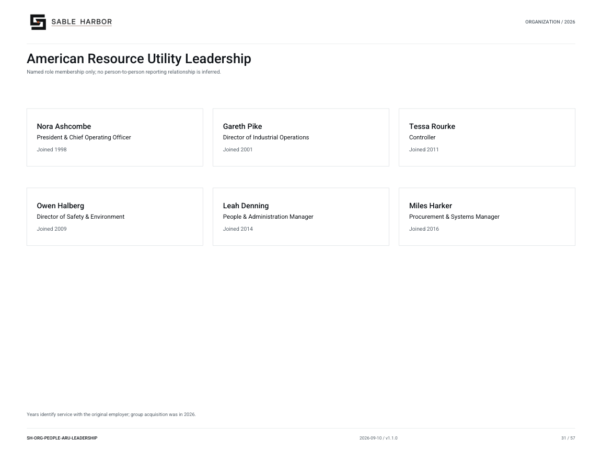

# American Resource Utility Leadership

**SH-ORG-PEOPLE-ARU-LEADERSHIP · 2026-09-10 · v1.1.0**

Named role membership only; no person-to-person reporting relationship is inferred.

[Vector artwork](../assets/current/people-aru-leadership.svg) · [Complete chart book](../assets/current/Sable-Harbor-Organization-Charts.pdf)

Years identify service with the original employer; group acquisition was in 2026.

| Name | Job title | Joined |
| --- | --- | --- |
| Nora Ashcombe | President & Chief Operating Officer | Joined 1998 |
| Gareth Pike | Director of Industrial Operations | Joined 2001 |
| Tessa Rourke | Controller | Joined 2011 |
| Owen Halberg | Director of Safety & Environment | Joined 2009 |
| Leah Denning | People & Administration Manager | Joined 2014 |
| Miles Harker | Procurement & Systems Manager | Joined 2016 |

## Source qualifications

- **Nora Ashcombe:** Show joined ARU/BS&T or state operating-company service in chart legend. Entered Sable Harbor group January 7, 2026 through acquisition. Year basis: Original operating-company service, not Sable Harbor group tenure Title status: SOURCE_SUPPORTED_PLAIN_EQUIVALENT
- **Gareth Pike:** Show joined ARU/BS&T or state operating-company service in chart legend. Entered Sable Harbor group January 7, 2026 through acquisition. Year basis: Original operating-company service, not Sable Harbor group tenure Title status: SOURCE_SUPPORTED_PLAIN_EQUIVALENT
- **Tessa Rourke:** Show joined ARU/BS&T or state operating-company service in chart legend. Entered Sable Harbor group January 7, 2026 through acquisition. Year basis: Original operating-company service, not Sable Harbor group tenure Title status: SOURCE_SUPPORTED_PLAIN_EQUIVALENT
- **Owen Halberg:** Show joined ARU/BS&T or state operating-company service in chart legend. Entered Sable Harbor group January 7, 2026 through acquisition. Year basis: Original operating-company service, not Sable Harbor group tenure Title status: SOURCE_SUPPORTED_PLAIN_EQUIVALENT
- **Leah Denning:** Show joined ARU/BS&T or state operating-company service in chart legend. Entered Sable Harbor group January 7, 2026 through acquisition. Year basis: Original operating-company service, not Sable Harbor group tenure Title status: SOURCE_SUPPORTED_PLAIN_EQUIVALENT
- **Miles Harker:** Show joined ARU/BS&T or state operating-company service in chart legend. Entered Sable Harbor group January 7, 2026 through acquisition. Year basis: Original operating-company service, not Sable Harbor group tenure Title status: SOURCE_SUPPORTED_PLAIN_EQUIVALENT

## Sources

- [industrial/corporate/LEADERSHIP_AND_AUTHORITY.md](../../../industrial/corporate/LEADERSHIP_AND_AUTHORITY.md)
