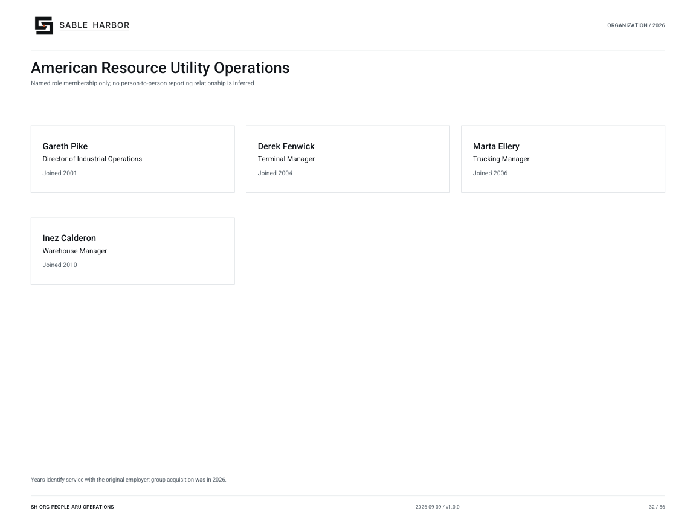

# American Resource Utility Operations

**SH-ORG-PEOPLE-ARU-OPERATIONS · 2026-09-09 · v1.0.0**

Named role membership only; no person-to-person reporting relationship is inferred.

[Vector artwork](../assets/current/people-aru-operations.svg) · [Complete chart book](../assets/current/Sable-Harbor-Organization-Charts.pdf)

Years identify service with the original employer; group acquisition was in 2026.

| Name | Job title | Joined |
| --- | --- | --- |
| Gareth Pike | Director of Industrial Operations | Joined 2001 |
| Derek Fenwick | Terminal Manager | Joined 2004 |
| Marta Ellery | Trucking Manager | Joined 2006 |
| Inez Calderon | Warehouse Manager | Joined 2010 |

## Source qualifications

- **Gareth Pike:** Show joined ARU/BS&T or state operating-company service in chart legend. Entered Sable Harbor group January 7, 2026 through acquisition. Year basis: Original operating-company service, not Sable Harbor group tenure Title status: SOURCE_SUPPORTED_PLAIN_EQUIVALENT
- **Derek Fenwick:** Show joined ARU/BS&T or state operating-company service in chart legend. Entered Sable Harbor group January 7, 2026 through acquisition. Year basis: Original operating-company service, not Sable Harbor group tenure Title status: SOURCE_SUPPORTED_PLAIN_EQUIVALENT
- **Marta Ellery:** Show joined ARU/BS&T or state operating-company service in chart legend. Entered Sable Harbor group January 7, 2026 through acquisition. Year basis: Original operating-company service, not Sable Harbor group tenure Title status: SOURCE_SUPPORTED_PLAIN_EQUIVALENT
- **Inez Calderon:** Show joined ARU/BS&T or state operating-company service in chart legend. Entered Sable Harbor group January 7, 2026 through acquisition. Year basis: Original operating-company service, not Sable Harbor group tenure Title status: SOURCE_SUPPORTED_PLAIN_EQUIVALENT

## Sources

- [industrial/corporate/LEADERSHIP_AND_AUTHORITY.md](../../../industrial/corporate/LEADERSHIP_AND_AUTHORITY.md)
