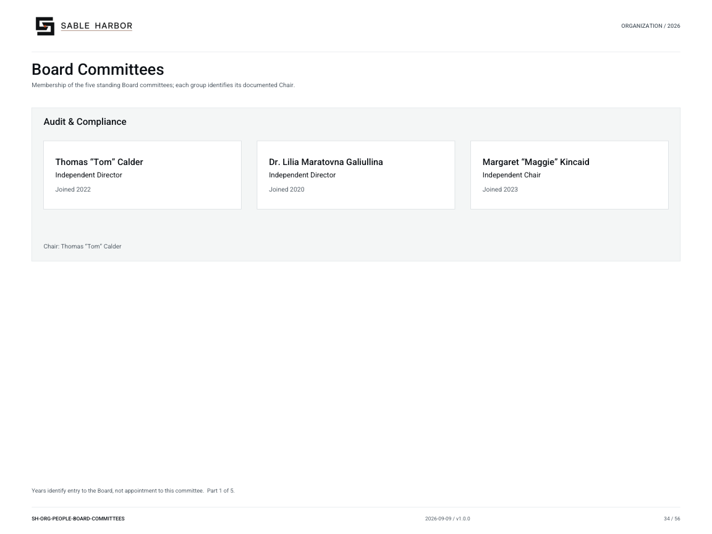
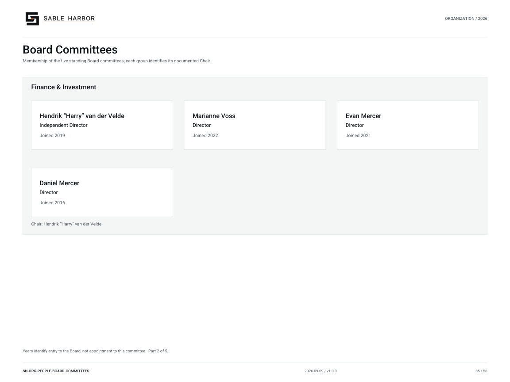
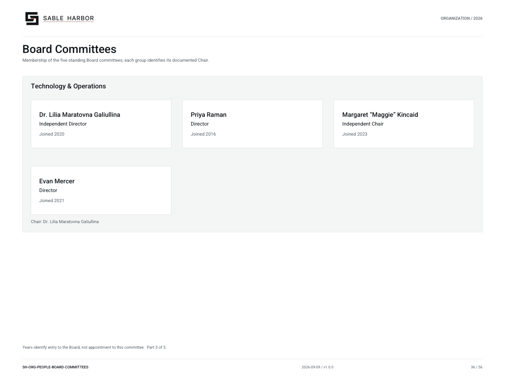
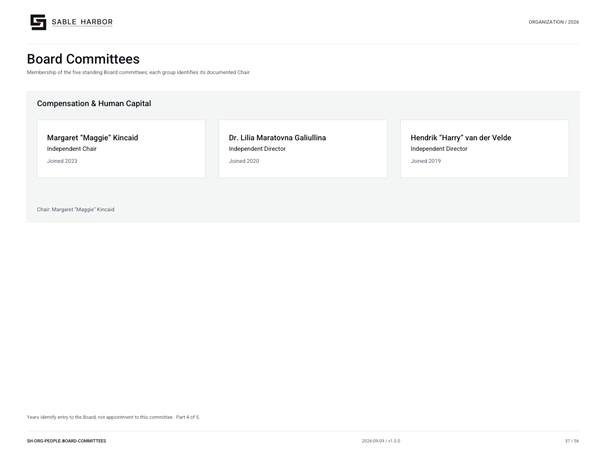
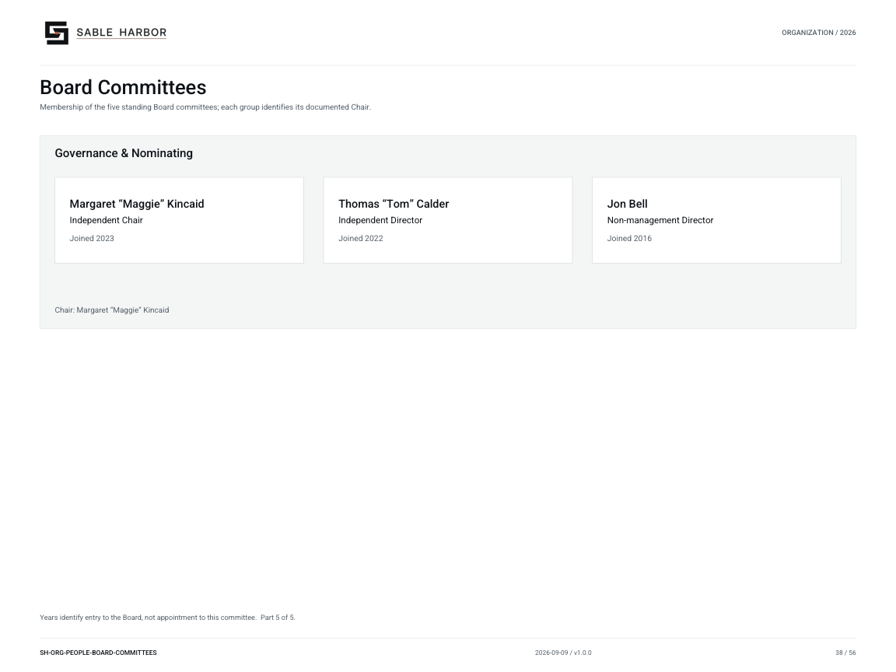

# Board Committees

**SH-ORG-PEOPLE-BOARD-COMMITTEES · 2026-09-09 · v1.0.0**

Membership of the five standing Board committees; each group identifies its documented Chair.

[Vector artwork](../assets/current/people-board-committees.svg) · [Complete chart book](../assets/current/Sable-Harbor-Organization-Charts.pdf)

[Vector artwork](../assets/current/people-board-committees-02.svg) · [Complete chart book](../assets/current/Sable-Harbor-Organization-Charts.pdf)

[Vector artwork](../assets/current/people-board-committees-03.svg) · [Complete chart book](../assets/current/Sable-Harbor-Organization-Charts.pdf)

[Vector artwork](../assets/current/people-board-committees-04.svg) · [Complete chart book](../assets/current/Sable-Harbor-Organization-Charts.pdf)

[Vector artwork](../assets/current/people-board-committees-05.svg) · [Complete chart book](../assets/current/Sable-Harbor-Organization-Charts.pdf)

Years identify entry to the Board, not appointment to this committee.  Part 1 of 5.

Years identify entry to the Board, not appointment to this committee.  Part 2 of 5.

Years identify entry to the Board, not appointment to this committee.  Part 3 of 5.

Years identify entry to the Board, not appointment to this committee.  Part 4 of 5.

Years identify entry to the Board, not appointment to this committee.  Part 5 of 5.

| Name | Job title | Joined |
| --- | --- | --- |
| Thomas “Tom” Calder | Independent Director | Joined 2022 |
| Dr. Lilia Maratovna Galiullina | Independent Director | Joined 2020 |
| Margaret “Maggie” Kincaid | Independent Chair | Joined 2023 |
| Hendrik “Harry” van der Velde | Independent Director | Joined 2019 |
| Marianne Voss | Director | Joined 2022 |
| Evan Mercer | Director | Joined 2021 |
| Daniel Mercer | Director | Joined 2016 |
| Priya Raman | Director | Joined 2016 |
| Jon Bell | Non-management Director | Joined 2016 |

## Source qualifications

- **Thomas “Tom” Calder:** Board chart legend must define Joined as board appointment year. Year basis: Board appointment year; not employee joining year Title status: SOURCE_SUPPORTED
- **Dr. Lilia Maratovna Galiullina:** Board chart legend must define Joined as board appointment year. Year basis: Board appointment year; not employee joining year Title status: SOURCE_SUPPORTED
- **Margaret “Maggie” Kincaid:** Board chart legend must define Joined as board appointment year. Became Chair 2024; joined board 2023. Year basis: Board appointment year; not employee joining year Title status: SOURCE_SUPPORTED
- **Hendrik “Harry” van der Velde:** Board chart legend must define Joined as board appointment year. Year basis: Board appointment year; not employee joining year Title status: SOURCE_SUPPORTED
- **Marianne Voss:** Board chart legend must define Joined as board appointment year. Year basis: Board appointment year; not employee joining year Title status: SOURCE_SUPPORTED
- **Evan Mercer:** Board chart legend must define Joined as board appointment year. Year basis: Board appointment year; not employee joining year Title status: SOURCE_SUPPORTED
- **Daniel Mercer:** Year basis: Board appointment year; not employee joining year Title status: SOURCE_SUPPORTED
- **Priya Raman:** Formal executive title remains OPEN. Existing finance Chief Product & Systems Officer is MODEL_PROPOSED, not an appointment. Year basis: Board appointment year; not employee joining year Title status: PROPOSED_EXECUTIVE_TITLE; founder/director locked
- **Jon Bell:** Do not show as a current employee or operating executive. Year basis: Board appointment year; not employee joining year Title status: SOURCE_SUPPORTED_PLAIN_EQUIVALENT

## Sources

- [docs/governance/BOARD_AND_CAPITAL_GOVERNANCE_v1.0.1.md](../../../docs/governance/BOARD_AND_CAPITAL_GOVERNANCE_v1.0.1.md)
- [docs/canon/SABLE_HARBOR_CORPORATE_LORE_CANON_v0.3.1.md](../../../docs/canon/SABLE_HARBOR_CORPORATE_LORE_CANON_v0.3.1.md)
