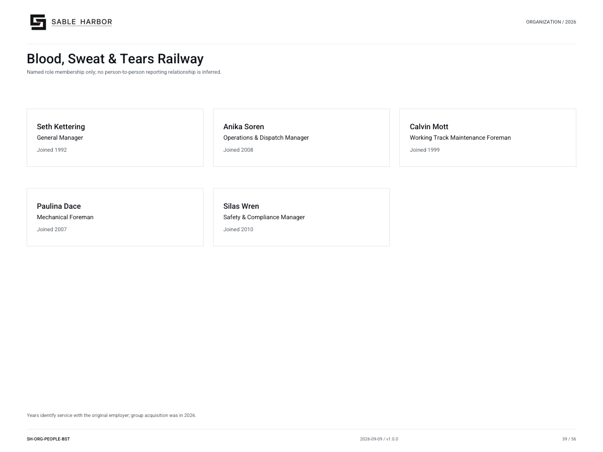

# Blood, Sweat & Tears Railway

**SH-ORG-PEOPLE-BST · 2026-09-09 · v1.0.0**

Named role membership only; no person-to-person reporting relationship is inferred.

[Vector artwork](../assets/current/people-bst.svg) · [Complete chart book](../assets/current/Sable-Harbor-Organization-Charts.pdf)

Years identify service with the original employer; group acquisition was in 2026.

| Name | Job title | Joined |
| --- | --- | --- |
| Seth Kettering | General Manager | Joined 1992 |
| Anika Soren | Operations & Dispatch Manager | Joined 2008 |
| Calvin Mott | Working Track Maintenance Foreman | Joined 1999 |
| Paulina Dace | Mechanical Foreman | Joined 2007 |
| Silas Wren | Safety & Compliance Manager | Joined 2010 |

## Source qualifications

- **Seth Kettering:** Show joined ARU/BS&T or state operating-company service in chart legend. Entered Sable Harbor group January 7, 2026 through acquisition. Year basis: Original operating-company service, not Sable Harbor group tenure Title status: SOURCE_SUPPORTED_PLAIN_EQUIVALENT
- **Anika Soren:** Show joined ARU/BS&T or state operating-company service in chart legend. Entered Sable Harbor group January 7, 2026 through acquisition. Year basis: Original operating-company service, not Sable Harbor group tenure Title status: SOURCE_SUPPORTED_PLAIN_EQUIVALENT
- **Calvin Mott:** Show joined ARU/BS&T or state operating-company service in chart legend. Entered Sable Harbor group January 7, 2026 through acquisition. Source title Working MOW Foreman; proposed expands MOW to Track Maintenance. Year basis: Original operating-company service, not Sable Harbor group tenure Title status: SOURCE_SUPPORTED_PLAIN_EQUIVALENT
- **Paulina Dace:** Show joined ARU/BS&T or state operating-company service in chart legend. Entered Sable Harbor group January 7, 2026 through acquisition. Year basis: Original operating-company service, not Sable Harbor group tenure Title status: SOURCE_SUPPORTED_PLAIN_EQUIVALENT
- **Silas Wren:** Show joined ARU/BS&T or state operating-company service in chart legend. Entered Sable Harbor group January 7, 2026 through acquisition. Year basis: Original operating-company service, not Sable Harbor group tenure Title status: SOURCE_SUPPORTED_PLAIN_EQUIVALENT

## Sources

- [industrial/corporate/LEADERSHIP_AND_AUTHORITY.md](../../../industrial/corporate/LEADERSHIP_AND_AUTHORITY.md)
