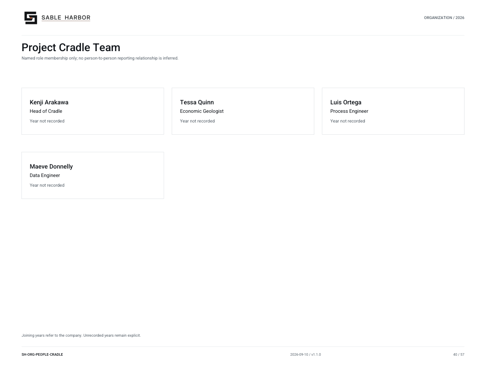

# Project Cradle Team

**SH-ORG-PEOPLE-CRADLE · 2026-09-10 · v1.1.0**

Named role membership only; no person-to-person reporting relationship is inferred.

[Vector artwork](../assets/current/people-cradle.svg) · [Complete chart book](../assets/current/Sable-Harbor-Organization-Charts.pdf)

Joining years refer to the company. Unrecorded years remain explicit.

“Year not recorded” means the exact joining year is not established in the sources.

| Name | Job title | Joined |
| --- | --- | --- |
| Kenji Arakawa | Head of Cradle | Year not recorded |
| Tessa Quinn | Economic Geologist | Year not recorded |
| Luis Ortega | Process Engineer | Year not recorded |
| Maeve Donnelly | Data Engineer | Year not recorded |

## Source qualifications

- **Kenji Arakawa:** Cradle founding team role is locked; exact company hire year is not. Plain professional title proposed from stated role. Year basis: not recorded Title status: PROPOSED_PLAIN_TITLE
- **Tessa Quinn:** Cradle founding team role is locked; exact company hire year is not. Plain professional title proposed from stated role. Year basis: not recorded Title status: PROPOSED_PLAIN_TITLE
- **Luis Ortega:** Cradle founding team role is locked; exact company hire year is not. Plain professional title proposed from stated role. Year basis: not recorded Title status: PROPOSED_PLAIN_TITLE
- **Maeve Donnelly:** Cradle founding team role is locked; exact company hire year is not. Plain professional title proposed from stated role. Year basis: not recorded Title status: PROPOSED_PLAIN_TITLE

## Sources

- [docs/canon/SABLE_HARBOR_CORPORATE_LORE_CANON_v0.3.1.md](../../../docs/canon/SABLE_HARBOR_CORPORATE_LORE_CANON_v0.3.1.md)
- [docs/canon/CRADLE_CLOSEOUT_2026-09-06.md](../../../docs/canon/CRADLE_CLOSEOUT_2026-09-06.md)
