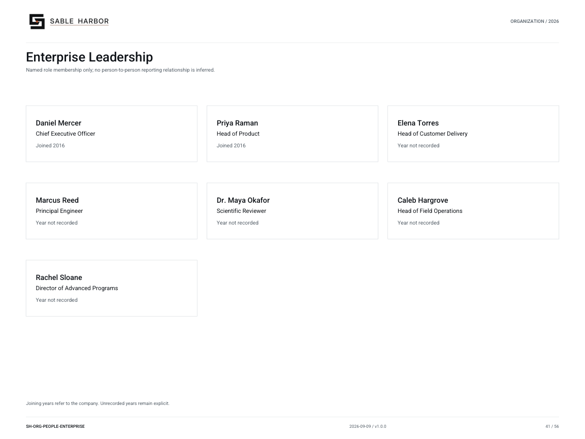

# Enterprise Leadership

**SH-ORG-PEOPLE-ENTERPRISE · 2026-09-09 · v1.0.0**

Named role membership only; no person-to-person reporting relationship is inferred.

[Vector artwork](../assets/current/people-enterprise.svg) · [Complete chart book](../assets/current/Sable-Harbor-Organization-Charts.pdf)

Joining years refer to the company. Unrecorded years remain explicit.

“Year not recorded” means the exact joining year is not established in the sources.

| Name | Job title | Joined |
| --- | --- | --- |
| Daniel Mercer | Chief Executive Officer | Joined 2016 |
| Priya Raman | Head of Product | Joined 2016 |
| Elena Torres | Head of Customer Delivery | Year not recorded |
| Marcus Reed | Principal Engineer | Year not recorded |
| Dr. Maya Okafor | Scientific Reviewer | Year not recorded |
| Caleb Hargrove | Head of Field Operations | Year not recorded |
| Rachel Sloane | Director of Advanced Programs | Year not recorded |

## Source qualifications

- **Daniel Mercer:** Year basis: Sable Harbor formation / founding director 2016 Title status: SOURCE_SUPPORTED
- **Priya Raman:** Formal executive title remains OPEN. Existing finance Chief Product & Systems Officer is MODEL_PROPOSED, not an appointment. Year basis: Founder 2016 Title status: PROPOSED_EXECUTIVE_TITLE; founder/director locked
- **Elena Torres:** Formal title and exact hire year remain OPEN. Original Eight formed through 2016–2017. Do not turn a functional role into an approved appointment. A 2016 customer incident names this person; this establishes presence by 2016, not an explicit hire record. Year basis: not recorded Title status: PROPOSED_PLAIN_TITLE
- **Marcus Reed:** Formal title and exact hire year remain OPEN. Original Eight formed through 2016–2017. Do not turn a functional role into an approved appointment. A 2016 customer incident names this person; this establishes presence by 2016, not an explicit hire record. Year basis: not recorded Title status: PROPOSED_PLAIN_TITLE
- **Dr. Maya Okafor:** Formal title and exact hire year remain OPEN. Original Eight formed through 2016–2017. Do not turn a functional role into an approved appointment. Maya is active in the 2017 incident; this is not an explicit hire date. Year basis: not recorded Title status: PROPOSED_PLAIN_TITLE
- **Caleb Hargrove:** Formal title and exact hire year remain OPEN. Original Eight formed through 2016–2017. Do not turn a functional role into an approved appointment. A 2016 customer incident names this person; this establishes presence by 2016, not an explicit hire record. Year basis: not recorded Title status: PROPOSED_PLAIN_TITLE
- **Rachel Sloane:** Source says Director of Advanced Programs or equivalent: title not finally locked. After-2022 role is not evidence of hire year. Not Gid’s manager. Year basis: not recorded Title status: PROPOSED_PLAIN_TITLE

## Sources

- [docs/governance/BOARD_AND_CAPITAL_GOVERNANCE_v1.0.1.md](../../../docs/governance/BOARD_AND_CAPITAL_GOVERNANCE_v1.0.1.md)
- [docs/canon/SABLE_HARBOR_CORPORATE_LORE_CANON_v0.3.1.md](../../../docs/canon/SABLE_HARBOR_CORPORATE_LORE_CANON_v0.3.1.md)
