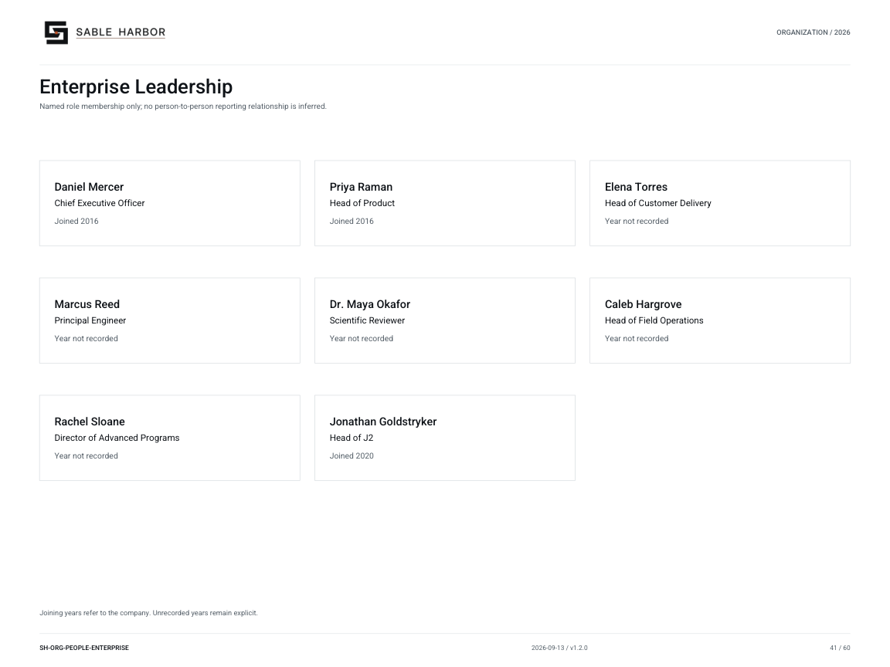
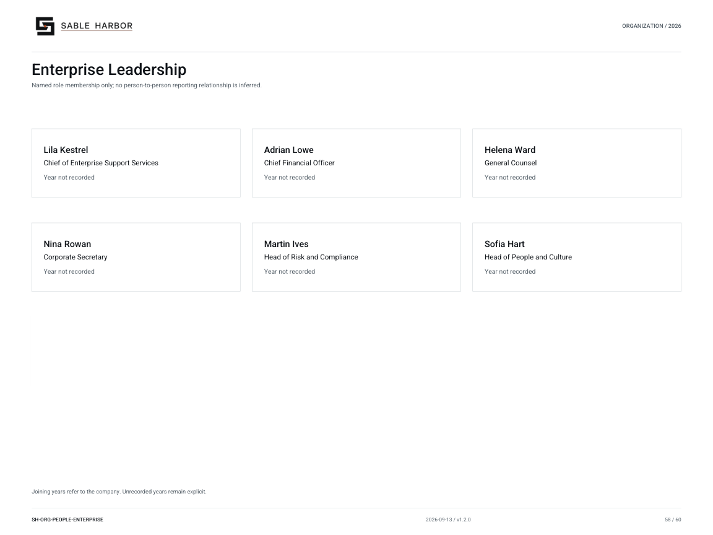
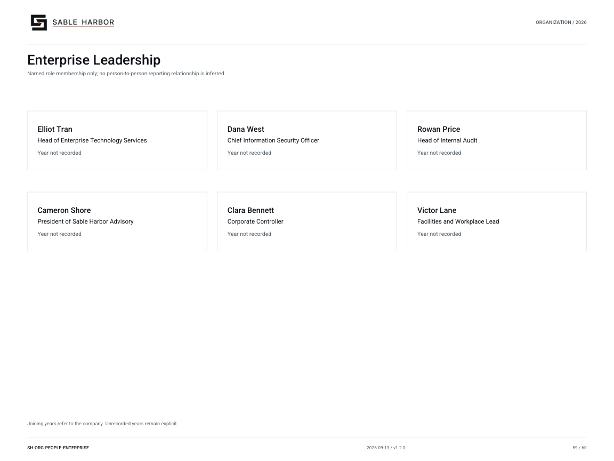
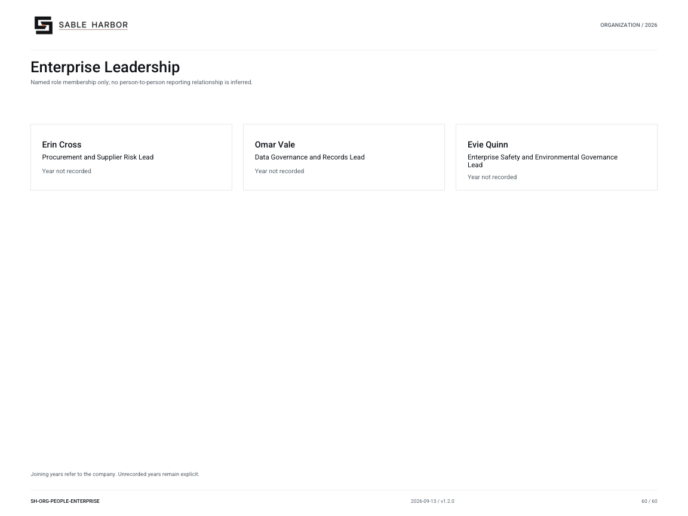

# Enterprise Leadership

**SH-ORG-PEOPLE-ENTERPRISE · 2026-09-13 · v1.2.0**

Named role membership only; no person-to-person reporting relationship is inferred.

[Vector artwork](../assets/current/people-enterprise.svg) · [Complete chart book](../assets/current/Sable-Harbor-Organization-Charts.pdf)

[Vector artwork](../assets/current/people-enterprise-02.svg) · [Complete chart book](../assets/current/Sable-Harbor-Organization-Charts.pdf)

[Vector artwork](../assets/current/people-enterprise-03.svg) · [Complete chart book](../assets/current/Sable-Harbor-Organization-Charts.pdf)

[Vector artwork](../assets/current/people-enterprise-04.svg) · [Complete chart book](../assets/current/Sable-Harbor-Organization-Charts.pdf)

Joining years refer to the company. Unrecorded years remain explicit.

“Year not recorded” means the exact joining year is not established in the sources.

September 13 delegated appointments fill existing support offices; employment start years and occupied workplaces remain unestablished.

Internal Audit retains Board Audit & Compliance oversight; J2 remains outside ESS. Membership is not an operating approval delegation.

| Name | Job title | Joined |
| --- | --- | --- |
| Daniel Mercer | Chief Executive Officer | Joined 2016 |
| Priya Raman | Head of Product | Joined 2016 |
| Elena Torres | Head of Customer Delivery | Year not recorded |
| Marcus Reed | Principal Engineer | Year not recorded |
| Dr. Maya Okafor | Scientific Reviewer | Year not recorded |
| Caleb Hargrove | Head of Field Operations | Year not recorded |
| Rachel Sloane | Director of Advanced Programs | Year not recorded |
| Jonathan Goldstryker | Head of J2 | Joined 2020 |
| Lila Kestrel | Chief of Enterprise Support Services | Year not recorded |
| Adrian Lowe | Chief Financial Officer | Year not recorded |
| Helena Ward | General Counsel | Year not recorded |
| Nina Rowan | Corporate Secretary | Year not recorded |
| Martin Ives | Head of Risk and Compliance | Year not recorded |
| Sofia Hart | Head of People and Culture | Year not recorded |
| Elliot Tran | Head of Enterprise Technology Services | Year not recorded |
| Dana West | Chief Information Security Officer | Year not recorded |
| Rowan Price | Head of Internal Audit | Year not recorded |
| Cameron Shore | President of Sable Harbor Advisory | Year not recorded |
| Clara Bennett | Corporate Controller | Year not recorded |
| Victor Lane | Facilities and Workplace Lead | Year not recorded |
| Erin Cross | Procurement and Supplier Risk Lead | Year not recorded |
| Omar Vale | Data Governance and Records Lead | Year not recorded |
| Evie Quinn | Enterprise Safety and Environmental Governance Lead | Year not recorded |

## Source qualifications

- **Daniel Mercer:** Year basis: Sable Harbor formation / founding director 2016 Title status: SOURCE_SUPPORTED
- **Priya Raman:** Formal executive title remains OPEN. Existing finance Chief Product & Systems Officer is MODEL_PROPOSED, not an appointment. Year basis: Founder 2016 Title status: PROPOSED_EXECUTIVE_TITLE; founder/director locked
- **Elena Torres:** Formal title and exact hire year remain OPEN. Original Eight formed through 2016–2017. Do not turn a functional role into an approved appointment. A 2016 customer incident names this person; this establishes presence by 2016, not an explicit hire record. Year basis: not recorded Title status: PROPOSED_PLAIN_TITLE
- **Marcus Reed:** Formal title and exact hire year remain OPEN. Original Eight formed through 2016–2017. Do not turn a functional role into an approved appointment. A 2016 customer incident names this person; this establishes presence by 2016, not an explicit hire record. Year basis: not recorded Title status: PROPOSED_PLAIN_TITLE
- **Dr. Maya Okafor:** Formal title and exact hire year remain OPEN. Original Eight formed through 2016–2017. Do not turn a functional role into an approved appointment. Maya is active in the 2017 incident; this is not an explicit hire date. Year basis: not recorded Title status: PROPOSED_PLAIN_TITLE
- **Caleb Hargrove:** Formal title and exact hire year remain OPEN. Original Eight formed through 2016–2017. Do not turn a functional role into an approved appointment. A 2016 customer incident names this person; this establishes presence by 2016, not an explicit hire record. Year basis: not recorded Title status: PROPOSED_PLAIN_TITLE
- **Rachel Sloane:** Source says Director of Advanced Programs or equivalent: title not finally locked. After-2022 role is not evidence of hire year. Not Gid’s manager. Year basis: not recorded Title status: PROPOSED_PLAIN_TITLE
- **Jonathan Goldstryker:** Exact appointment and commission dates are not established by the company joining year. Year basis: Sable Harbor employment; owner-approved year Title status: SOURCE_SUPPORTED
- **Lila Kestrel:** Dated fictional source addition; branch acceptance remains pending. No incremental position or occupied workplace. Year basis: Company joining year not established; appointment date is not a joining year Title status: DELEGATED_FICTIONAL_APPOINTMENT_PENDING_ACCEPTANCE
- **Adrian Lowe:** Dated fictional source addition; branch acceptance remains pending. No incremental position or occupied workplace. Year basis: Company joining year not established; appointment date is not a joining year Title status: DELEGATED_FICTIONAL_APPOINTMENT_PENDING_ACCEPTANCE
- **Helena Ward:** Dated fictional source addition; branch acceptance remains pending. No incremental position or occupied workplace. Year basis: Company joining year not established; appointment date is not a joining year Title status: DELEGATED_FICTIONAL_APPOINTMENT_PENDING_ACCEPTANCE
- **Nina Rowan:** Dated fictional source addition; branch acceptance remains pending. No incremental position or occupied workplace. Year basis: Company joining year not established; appointment date is not a joining year Title status: DELEGATED_FICTIONAL_APPOINTMENT_PENDING_ACCEPTANCE
- **Martin Ives:** Dated fictional source addition; branch acceptance remains pending. No incremental position or occupied workplace. Year basis: Company joining year not established; appointment date is not a joining year Title status: DELEGATED_FICTIONAL_APPOINTMENT_PENDING_ACCEPTANCE
- **Sofia Hart:** Dated fictional source addition; branch acceptance remains pending. No incremental position or occupied workplace. Year basis: Company joining year not established; appointment date is not a joining year Title status: DELEGATED_FICTIONAL_APPOINTMENT_PENDING_ACCEPTANCE
- **Elliot Tran:** Dated fictional source addition; branch acceptance remains pending. No incremental position or occupied workplace. Year basis: Company joining year not established; appointment date is not a joining year Title status: DELEGATED_FICTIONAL_APPOINTMENT_PENDING_ACCEPTANCE
- **Dana West:** Dated fictional source addition; branch acceptance remains pending. No incremental position or occupied workplace. Year basis: Company joining year not established; appointment date is not a joining year Title status: DELEGATED_FICTIONAL_APPOINTMENT_PENDING_ACCEPTANCE
- **Rowan Price:** Dated fictional source addition; branch acceptance remains pending. No incremental position or occupied workplace. Year basis: Company joining year not established; appointment date is not a joining year Title status: DELEGATED_FICTIONAL_APPOINTMENT_PENDING_ACCEPTANCE
- **Cameron Shore:** Dated fictional source addition; branch acceptance remains pending. No incremental position or occupied workplace. Year basis: Company joining year not established; appointment date is not a joining year Title status: DELEGATED_FICTIONAL_APPOINTMENT_PENDING_ACCEPTANCE
- **Clara Bennett:** Dated fictional source addition; branch acceptance remains pending. No incremental position or occupied workplace. Year basis: Company joining year not established; appointment date is not a joining year Title status: DELEGATED_FICTIONAL_APPOINTMENT_PENDING_ACCEPTANCE
- **Victor Lane:** Dated fictional source addition; branch acceptance remains pending. No incremental position or occupied workplace. Year basis: Company joining year not established; appointment date is not a joining year Title status: DELEGATED_FICTIONAL_APPOINTMENT_PENDING_ACCEPTANCE
- **Erin Cross:** Dated fictional source addition; branch acceptance remains pending. No incremental position or occupied workplace. Year basis: Company joining year not established; appointment date is not a joining year Title status: DELEGATED_FICTIONAL_APPOINTMENT_PENDING_ACCEPTANCE
- **Omar Vale:** Dated fictional source addition; branch acceptance remains pending. No incremental position or occupied workplace. Year basis: Company joining year not established; appointment date is not a joining year Title status: DELEGATED_FICTIONAL_APPOINTMENT_PENDING_ACCEPTANCE
- **Evie Quinn:** Dated fictional source addition; branch acceptance remains pending. No incremental position or occupied workplace. Year basis: Company joining year not established; appointment date is not a joining year Title status: DELEGATED_FICTIONAL_APPOINTMENT_PENDING_ACCEPTANCE

## Sources

- [docs/governance/BOARD_AND_CAPITAL_GOVERNANCE_v1.0.1.md](../../../docs/governance/BOARD_AND_CAPITAL_GOVERNANCE_v1.0.1.md)
- [docs/canon/SABLE_HARBOR_CORPORATE_LORE_CANON_v0.3.1.md](../../../docs/canon/SABLE_HARBOR_CORPORATE_LORE_CANON_v0.3.1.md)
- [docs/canon/J2_LEADERSHIP_APPOINTMENTS_2026-09-10.md](../../../docs/canon/J2_LEADERSHIP_APPOINTMENTS_2026-09-10.md)
- [docs/canon/ENTERPRISE_APPOINTMENTS_2026-09-13.md](../../../docs/canon/ENTERPRISE_APPOINTMENTS_2026-09-13.md)
