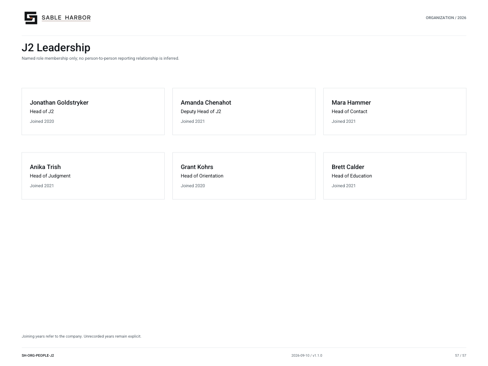

# J2 Leadership

**SH-ORG-PEOPLE-J2 · 2026-09-10 · v1.1.0**

Named role membership only; no person-to-person reporting relationship is inferred.

[Vector artwork](../assets/current/people-j2.svg) · [Complete chart book](../assets/current/Sable-Harbor-Organization-Charts.pdf)

Joining years refer to Sable Harbor employment, not appointment or commission dates.

The Chief of Staff and remaining unnamed deputies are outside this six-person decision.

| Name | Job title | Joined |
| --- | --- | --- |
| Jonathan Goldstryker | Head of J2 | Joined 2020 |
| Amanda Chenahot | Deputy Head of J2 | Joined 2021 |
| Mara Hammer | Head of Contact | Joined 2021 |
| Anika Trish | Head of Judgment | Joined 2021 |
| Grant Kohrs | Head of Orientation | Joined 2020 |
| Brett Calder | Head of Education | Joined 2021 |

## Source qualifications

- **Jonathan Goldstryker:** Exact appointment and commission dates are not established by the company joining year. Year basis: Sable Harbor employment; owner-approved year Title status: SOURCE_SUPPORTED
- **Amanda Chenahot:** Exact appointment and commission dates are not established by the company joining year. Year basis: Sable Harbor employment; owner-approved year Title status: SOURCE_SUPPORTED
- **Mara Hammer:** Exact appointment and commission dates are not established by the company joining year. Year basis: Sable Harbor employment; owner-approved year Title status: SOURCE_SUPPORTED
- **Anika Trish:** Exact appointment and commission dates are not established by the company joining year. Year basis: Sable Harbor employment; owner-approved year Title status: SOURCE_SUPPORTED
- **Grant Kohrs:** Exact appointment and commission dates are not established by the company joining year. Year basis: Sable Harbor employment; owner-approved year Title status: SOURCE_SUPPORTED
- **Brett Calder:** Exact appointment and commission dates are not established by the company joining year. Year basis: Sable Harbor employment; owner-approved year Title status: SOURCE_SUPPORTED

## Sources

- [docs/canon/J2_LEADERSHIP_APPOINTMENTS_2026-09-10.md](../../../docs/canon/J2_LEADERSHIP_APPOINTMENTS_2026-09-10.md)
- [docs/j2/J2_HEADQUARTERS.md](../../../docs/j2/J2_HEADQUARTERS.md)
- [docs/j2/J2_ESTABLISHMENT.md](../../../docs/j2/J2_ESTABLISHMENT.md)
