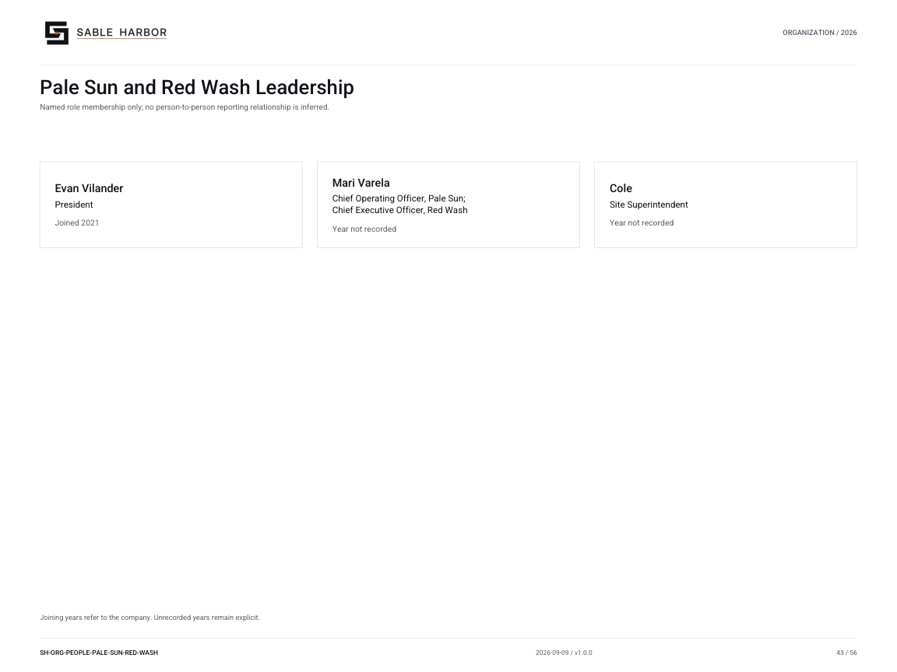

# Pale Sun and Red Wash Leadership

**SH-ORG-PEOPLE-PALE-SUN-RED-WASH · 2026-09-09 · v1.0.0**

Named role membership only; no person-to-person reporting relationship is inferred.

[Vector artwork](../assets/current/people-pale-sun-red-wash.svg) · [Complete chart book](../assets/current/Sable-Harbor-Organization-Charts.pdf)

Joining years refer to the company. Unrecorded years remain explicit.

“Year not recorded” means the exact joining year is not established in the sources.

| Name | Job title | Joined |
| --- | --- | --- |
| Evan Vilander | President | Joined 2021 |
| Mari Varela | Chief Operating Officer, Pale Sun; Chief Executive Officer, Red Wash | Year not recorded |
| Cole | Site Superintendent | Year not recorded |

## Source qualifications

- **Evan Vilander:** Do not use presidency appointment year 2025 as company join year; do not confuse with Evan Mercer. Year basis: Joined J2 May 3, 2021; transferred to Pale Sun 2025 Title status: SOURCE_SUPPORTED
- **Mari Varela:** Dual role: COO Pale Sun, CEO Red Wash. One person, not duplicate positions in a roster total. January 2025 legal appointment does not settle earlier Sable Harbor employment date. Year basis: not recorded Title status: SOURCE_SUPPORTED
- **Cole:** Surname and original Red Wash hire year unresolved. Acquisition into Sable Harbor group occurred 2025; do not substitute for hire year. Year basis: not recorded Title status: SOURCE_SUPPORTED

## Sources

- [industrial/pale_sun/01_VILANDER_BIOGRAPHY.md](../../../industrial/pale_sun/01_VILANDER_BIOGRAPHY.md)
- [docs/canon/INDUSTRIAL_CLOSEOUT_2026-09-05.md](../../../docs/canon/INDUSTRIAL_CLOSEOUT_2026-09-05.md)
- [industrial/corporate/LEADERSHIP_AND_AUTHORITY.md](../../../industrial/corporate/LEADERSHIP_AND_AUTHORITY.md)
