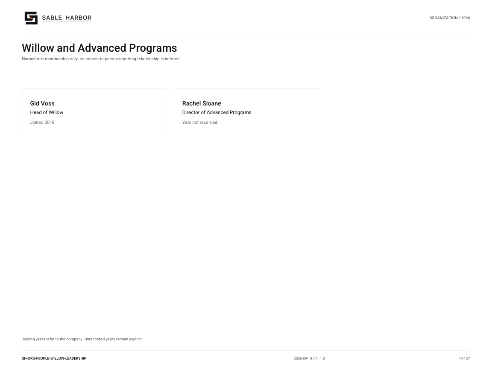

# Willow and Advanced Programs

**SH-ORG-PEOPLE-WILLOW-LEADERSHIP · 2026-09-10 · v1.1.0**

Named role membership only; no person-to-person reporting relationship is inferred.

[Vector artwork](../assets/current/people-willow-leadership.svg) · [Complete chart book](../assets/current/Sable-Harbor-Organization-Charts.pdf)

Joining years refer to the company. Unrecorded years remain explicit.

“Year not recorded” means the exact joining year is not established in the sources.

| Name | Job title | Joined |
| --- | --- | --- |
| Gid Voss | Head of Willow | Joined 2018 |
| Rachel Sloane | Director of Advanced Programs | Year not recorded |

## Source qualifications

- **Gid Voss:** Leadership is locked; formal title is proposed. Year basis: Explicit joined late 2018 Title status: PROPOSED_PLAIN_TITLE
- **Rachel Sloane:** Source says Director of Advanced Programs or equivalent: title not finally locked. After-2022 role is not evidence of hire year. Not Gid’s manager. Year basis: not recorded Title status: PROPOSED_PLAIN_TITLE

## Sources

- [docs/canon/SABLE_HARBOR_CORPORATE_LORE_CANON_v0.3.1.md](../../../docs/canon/SABLE_HARBOR_CORPORATE_LORE_CANON_v0.3.1.md)
- [docs/canon/SABLE_HARBOR_CORPORATE_LORE_CANON_v0.3.1.md](../../../docs/canon/SABLE_HARBOR_CORPORATE_LORE_CANON_v0.3.1.md)
