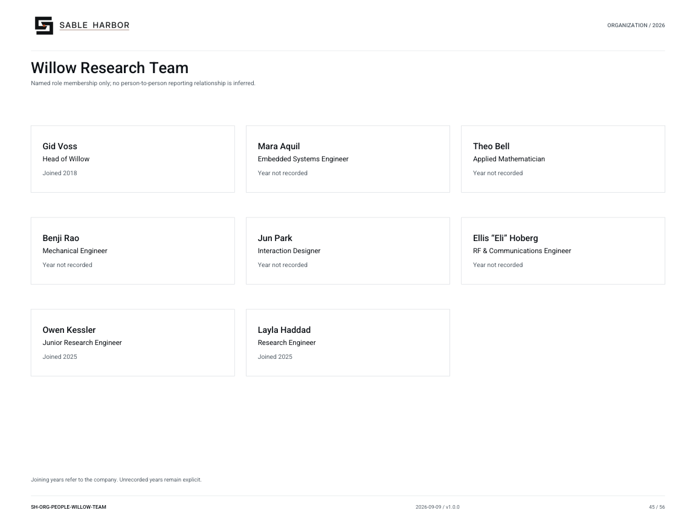

# Willow Research Team

**SH-ORG-PEOPLE-WILLOW-TEAM · 2026-09-09 · v1.0.0**

Named role membership only; no person-to-person reporting relationship is inferred.

[Vector artwork](../assets/current/people-willow-team.svg) · [Complete chart book](../assets/current/Sable-Harbor-Organization-Charts.pdf)

Joining years refer to the company. Unrecorded years remain explicit.

“Year not recorded” means the exact joining year is not established in the sources.

| Name | Job title | Joined |
| --- | --- | --- |
| Gid Voss | Head of Willow | Joined 2018 |
| Mara Aquil | Embedded Systems Engineer | Year not recorded |
| Theo Bell | Applied Mathematician | Year not recorded |
| Benji Rao | Mechanical Engineer | Year not recorded |
| Jun Park | Interaction Designer | Year not recorded |
| Ellis “Eli” Hoberg | RF & Communications Engineer | Year not recorded |
| Owen Kessler | Junior Research Engineer | Joined 2025 |
| Layla Haddad | Research Engineer | Joined 2025 |

## Source qualifications

- **Gid Voss:** Leadership is locked; formal title is proposed. Year basis: Explicit joined late 2018 Title status: PROPOSED_PLAIN_TITLE
- **Mara Aquil:** In Klein core team by 2021; exact hire year and formal title not supplied. Professional title proposed from stated specialty. Year basis: not recorded Title status: PROPOSED_PLAIN_TITLE
- **Theo Bell:** In Klein core team by 2021; exact hire year and formal title not supplied. Professional title proposed from stated specialty. Year basis: not recorded Title status: PROPOSED_PLAIN_TITLE
- **Benji Rao:** In Klein core team by 2021; exact hire year and formal title not supplied. Professional title proposed from stated specialty. Year basis: not recorded Title status: PROPOSED_PLAIN_TITLE
- **Jun Park:** In Klein core team by 2021; exact hire year and formal title not supplied. Professional title proposed from stated specialty. Year basis: not recorded Title status: PROPOSED_PLAIN_TITLE
- **Ellis “Eli” Hoberg:** Full name locked by September 6/7 closeout. Existing chart generator still displays Eli / surname OPEN. Core team by 2021 is not explicit join year. Year basis: not recorded Title status: PROPOSED_PLAIN_TITLE
- **Owen Kessler:** Year basis: Section 9.3 explicitly August 2025 Title status: SOURCE_SUPPORTED
- **Layla Haddad:** Join year locked. Formal job title not explicitly supplied; Research Engineer is proposed. Year basis: Section 9.4 explicitly September 2025 Title status: PROPOSED_PLAIN_TITLE

## Sources

- [docs/canon/SABLE_HARBOR_CORPORATE_LORE_CANON_v0.3.1.md](../../../docs/canon/SABLE_HARBOR_CORPORATE_LORE_CANON_v0.3.1.md)
- [docs/canon/SABLE_HARBOR_CORPORATE_LORE_CANON_v0.3.1.md](../../../docs/canon/SABLE_HARBOR_CORPORATE_LORE_CANON_v0.3.1.md)
- [docs/canon/WILLOW_KLEIN_CLOSEOUT_2026-09-06.md](../../../docs/canon/WILLOW_KLEIN_CLOSEOUT_2026-09-06.md)
