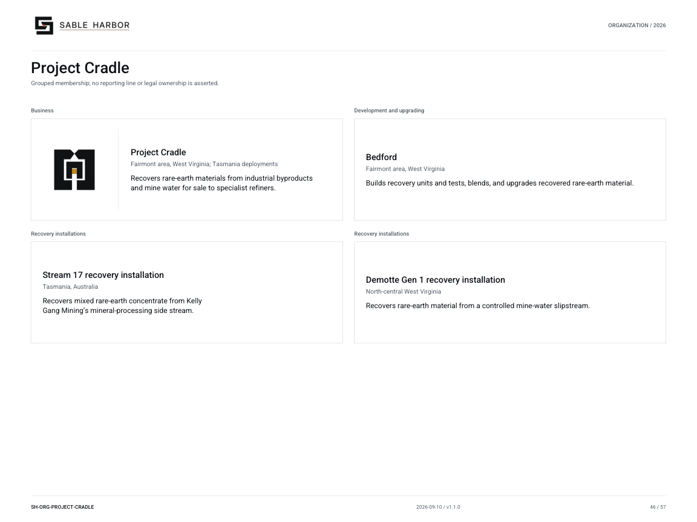

# Project Cradle

**SH-ORG-PROJECT-CRADLE · 2026-09-10 · v1.1.0**

Grouped membership; no reporting line or legal ownership is asserted.

[Vector artwork](../assets/current/project-cradle.svg) · [Complete chart book](../assets/current/Sable-Harbor-Organization-Charts.pdf)

| Name | Location | Actual work |
| --- | --- | --- |
| Project Cradle | Fairmont area, West Virginia; Tasmania deployments | Recovers rare-earth materials from industrial byproducts and mine water for sale to specialist refiners. |
| Bedford | Fairmont area, West Virginia | Builds recovery units and tests, blends, and upgrades recovered rare-earth material. |
| Stream 17 recovery installation | Tasmania, Australia | Recovers mixed rare-earth concentrate from Kelly Gang Mining’s mineral-processing side stream. |
| Demotte Gen 1 recovery installation | North-central West Virginia | Recovers rare-earth material from a controlled mine-water slipstream. |

## Source qualifications

- **Project Cradle:** Early commercial parent business. Bedford plus external hosts; no acquisition of host mine or water treatment plant.
- **Bedford:** 15–20 acres, fictional brownfield. Not a mine and not Demotte treatment site. Belle/Kanawha siting superseded.
- **Stream 17 recovery installation:** Sable owns recovery equipment and term recovery right; Kelly Gang Mining owns host operation.
- **Demotte Gen 1 recovery installation:** Operating 2026 reference installation. Demotte retains host treatment and compliance. Distinct from scenario DEMOTTE-GEN2.

## Sources

- [docs/canon/CRADLE_CLOSEOUT_2026-09-06.md](../../../docs/canon/CRADLE_CLOSEOUT_2026-09-06.md)
