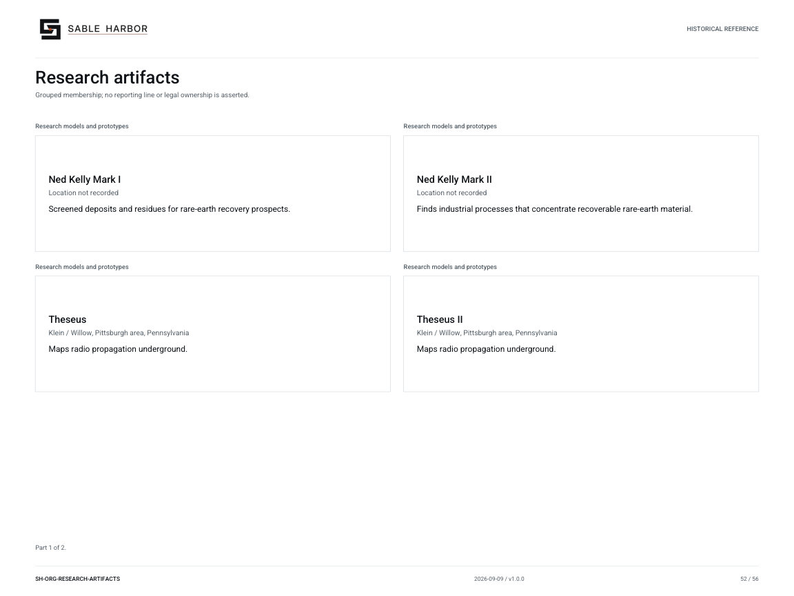
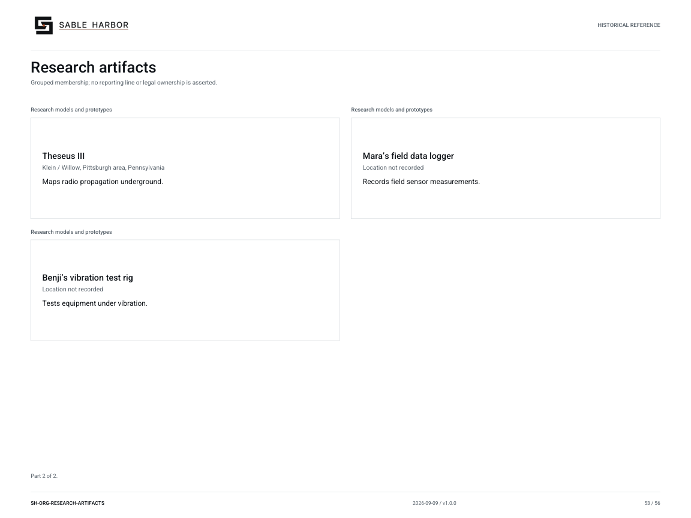

# Research artifacts

**SH-ORG-RESEARCH-ARTIFACTS · 2026-09-09 · v1.0.0**

Grouped membership; no reporting line or legal ownership is asserted.

Historical/reference view. Inclusion does not establish a current subsidiary or employee.

[Vector artwork](../assets/current/research-artifacts.svg) · [Complete chart book](../assets/current/Sable-Harbor-Organization-Charts.pdf)

[Vector artwork](../assets/current/research-artifacts-02.svg) · [Complete chart book](../assets/current/Sable-Harbor-Organization-Charts.pdf)

| Name | Location | Actual work |
| --- | --- | --- |
| Ned Kelly Mark I | Location not recorded | Screened deposits and residues for rare-earth recovery prospects. |
| Ned Kelly Mark II | Location not recorded | Finds industrial processes that concentrate recoverable rare-earth material. |
| Theseus | Klein / Willow, Pittsburgh area, Pennsylvania | Maps radio propagation underground. |
| Theseus II | Klein / Willow, Pittsburgh area, Pennsylvania | Maps radio propagation underground. |
| Theseus III | Klein / Willow, Pittsburgh area, Pennsylvania | Maps radio propagation underground. |
| Mara’s field data logger | Location not recorded | Records field sensor measurements. |
| Benji’s vibration test rig | Location not recorded | Tests equipment under vibration. |

## Source qualifications

- **Ned Kelly Mark I:** Historical discovery model, not a person or business.
- **Ned Kelly Mark II:** Discovery model supporting Cradle; no separate current business.
- **Theseus:** RF prototype rig; later Theseus II and III replace components.
- **Theseus II:** Named prototype successor, not a product line.
- **Theseus III:** Named prototype successor, not a product line.
- **Mara’s field data logger:** Prototype mentioned in research history; present location and use not recorded.
- **Benji’s vibration test rig:** Prototype mentioned in research history; present location and use not recorded.

## Sources

- [docs/canon/SABLE_HARBOR_CORPORATE_LORE_CANON_v0.3.1.md](../../../docs/canon/SABLE_HARBOR_CORPORATE_LORE_CANON_v0.3.1.md)
