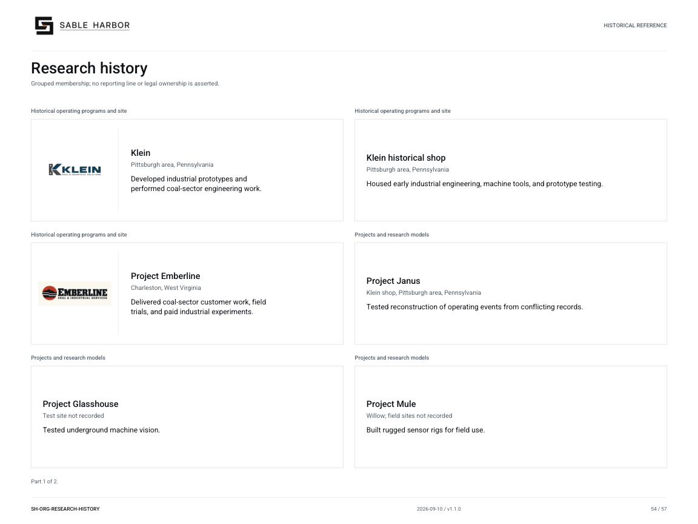
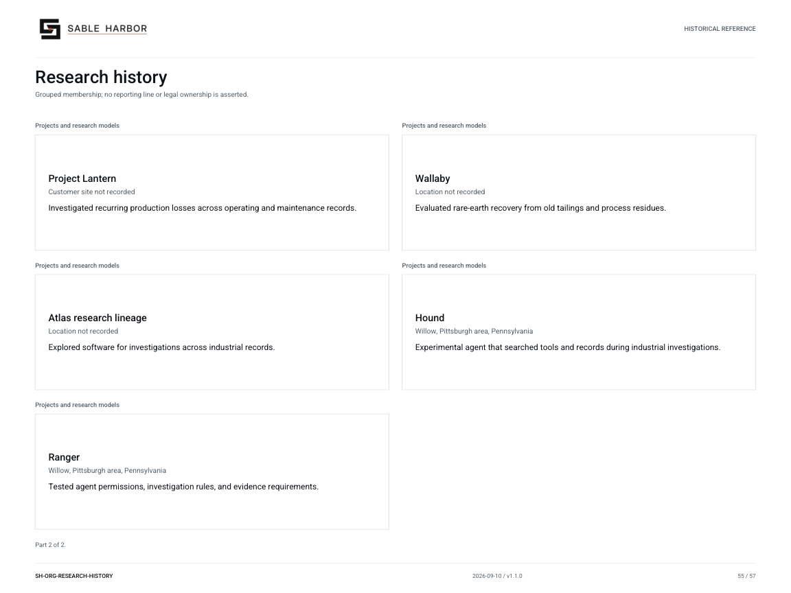

# Research history

**SH-ORG-RESEARCH-HISTORY · 2026-09-10 · v1.1.0**

Grouped membership; no reporting line or legal ownership is asserted.

Historical/reference view. Inclusion does not establish a current subsidiary or employee.

[Vector artwork](../assets/current/research-history.svg) · [Complete chart book](../assets/current/Sable-Harbor-Organization-Charts.pdf)

[Vector artwork](../assets/current/research-history-02.svg) · [Complete chart book](../assets/current/Sable-Harbor-Organization-Charts.pdf)

| Name | Location | Actual work |
| --- | --- | --- |
| Klein | Pittsburgh area, Pennsylvania | Developed industrial prototypes and performed coal-sector engineering work. |
| Klein historical shop | Pittsburgh area, Pennsylvania | Housed early industrial engineering, machine tools, and prototype testing. |
| Project Emberline | Charleston, West Virginia | Delivered coal-sector customer work, field trials, and paid industrial experiments. |
| Project Janus | Klein shop, Pittsburgh area, Pennsylvania | Tested reconstruction of operating events from conflicting records. |
| Project Glasshouse | Test site not recorded | Tested underground machine vision. |
| Project Mule | Willow; field sites not recorded | Built rugged sensor rigs for field use. |
| Project Lantern | Customer site not recorded | Investigated recurring production losses across operating and maintenance records. |
| Wallaby | Location not recorded | Evaluated rare-earth recovery from old tailings and process residues. |
| Atlas research lineage | Location not recorded | Explored software for investigations across industrial records. |
| Hound | Willow, Pittsburgh area, Pennsylvania | Experimental agent that searched tools and records during industrial investigations. |
| Ranger | Willow, Pittsburgh area, Pennsylvania | Tested agent permissions, investigation rules, and evidence requirements. |

## Source qualifications

- **Klein:** 2020–2022. Rechartered as Willow. Evalon is superseded editorial name; no in-world rename.
- **Klein historical shop:** Outside Pittsburgh. Link to eventual Fort occupancy remains unresolved; do not assume same building.
- **Project Emberline:** 2022–2025. Work absorbed into Foundry, Willow, field operations, Advisory. No standalone 2026 division.
- **Project Janus:** Did not ship; representational work migrated to Foundry.
- **Project Glasshouse:** Failed as designed under dust, moisture, glare, contamination.
- **Project Mule:** Not standalone product; techniques transferred.
- **Project Lantern:** Closed inconclusive; representational methods entered Foundry.
- **Wallaby:** Killed. Maeve did not rescue project.
- **Atlas research lineage:** Historical lineage, not separate current product or business.
- **Hound:** Historical prototype, not employee or current department.
- **Ranger:** Research lineage; no separate current commercial product.

## Sources

- [docs/canon/SABLE_HARBOR_CORPORATE_LORE_CANON_v0.3.1.md](../../../docs/canon/SABLE_HARBOR_CORPORATE_LORE_CANON_v0.3.1.md)
