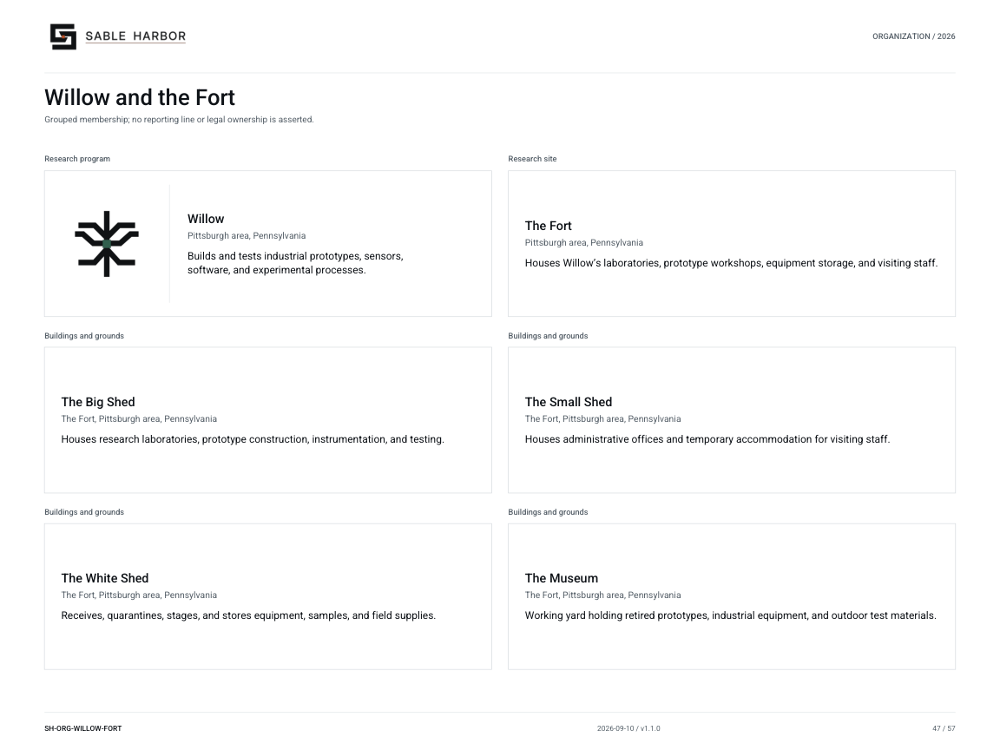

# Willow and the Fort

**SH-ORG-WILLOW-FORT · 2026-09-10 · v1.1.0**

Grouped membership; no reporting line or legal ownership is asserted.

[Vector artwork](../assets/current/willow-fort.svg) · [Complete chart book](../assets/current/Sable-Harbor-Organization-Charts.pdf)

| Name | Location | Actual work |
| --- | --- | --- |
| Willow | Pittsburgh area, Pennsylvania | Builds and tests industrial prototypes, sensors, software, and experimental processes. |
| The Fort | Pittsburgh area, Pennsylvania | Houses Willow’s laboratories, prototype workshops, equipment storage, and visiting staff. |
| The Big Shed | The Fort, Pittsburgh area, Pennsylvania | Houses research laboratories, prototype construction, instrumentation, and testing. |
| The Small Shed | The Fort, Pittsburgh area, Pennsylvania | Houses administrative offices and temporary accommodation for visiting staff. |
| The White Shed | The Fort, Pittsburgh area, Pennsylvania | Receives, quarantines, stages, and stores equipment, samples, and field supplies. |
| The Museum | The Fort, Pittsburgh area, Pennsylvania | Working yard holding retired prototypes, industrial equipment, and outdoor test materials. |

## Source qualifications

- **Willow:** Project Willow / Willow Labs are same program. No separate subsidiary; Rachel Sloane institutional role in Sacramento does not relocate laboratory.
- **The Fort:** 10–20 acres; exact parcel and historic Klein-to-Fort occupancy link unrecorded. Hazelwood is study geography only.
- **The Big Shed:** Not separate business; Museum is not a public museum and Small Shed is not public hotel.
- **The Small Shed:** Not separate business; Museum is not a public museum and Small Shed is not public hotel.
- **The White Shed:** Not separate business; Museum is not a public museum and Small Shed is not public hotel.
- **The Museum:** Not separate business; Museum is not a public museum and Small Shed is not public hotel.

## Sources

- [docs/canon/WILLOW_KLEIN_CLOSEOUT_2026-09-06.md](../../../docs/canon/WILLOW_KLEIN_CLOSEOUT_2026-09-06.md)
