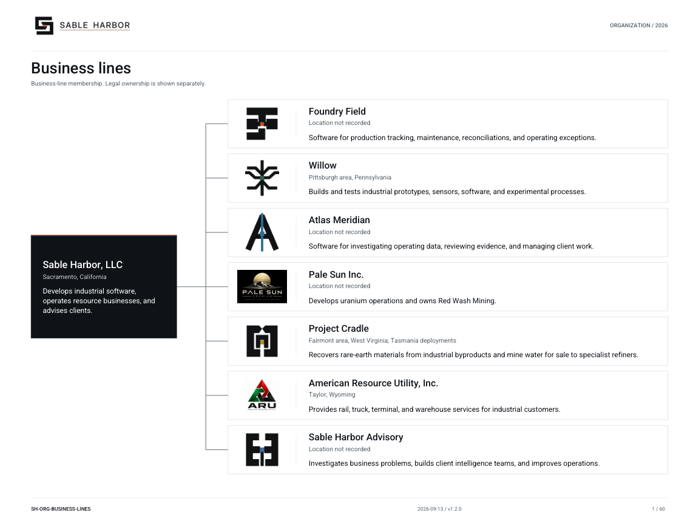

# Explore Sable Harbor

Welcome to Sable Harbor. This fictional company develops industrial software, operates resource businesses and provides professional services. Meet its people, explore their workplaces and follow the records behind their work—from a customer invoice to an acquisition or a mine's operating plan.

You can browse the company out of curiosity or use its records for accounting, audit and business exercises. Start with whatever interests you; you do not need to read the archive in order.

[Start here](Start-Here.md) · [All files](Files.md) · [Audit practice](Audit.md) · [Document library](Library.md) · [Full-text reading room](https://github.com/SquirmyWormy275/SABLEHARBOR/wiki/Reading)

## Start your reading

Choose a business or department below. Each guide introduces its work and points to useful records when you are ready to look closer. Looking for a particular document, dataset, map or program? [All files](Files.md) takes you there in three clicks: directory, collection, original.

For a first exercise, try [tracing an invoice](../reader/exercises/INVOICE.md). It connects contract terms, dated movements and journal entries. The [acquisition](../reader/exercises/ACQUISITION.md) and [contract review](../reader/exercises/CONTRACTS.md) exercises offer other ways in. Read the instructions here and download the linked records as you go.

## Try an exercise

The [audit practice guide](Audit.md) introduces the audit workspace and the accounting and control exercises. The [three document exercises](../reader/exercises/README.md) cover acquisition accounting, invoice tracing and contract review.

| I want to… | Open first | Then inspect |
|---|---|---|
| Reconcile an invoice, revenue balance, or cash shortfall | [Accounting exercises](../finance/READER_EXERCISES.md) | The named workbook sheets and supporting files for the same release, unit, and period. |
| Work through an audit engagement | [Local audit workspace](../audit-suite/LOCAL_WORKSPACE.md) | Request and collect company originals, select samples, record findings and prepare reviewed workpapers in CLEAN or MESSY cases. |
| Test a control and follow an exception | [CCF example procedures](../../enterprise/ccf/PROCEDURES.md) | The records tested, original result, waiver, and independent retest. |
| Prepare a SOC-oriented evidence request or compare frameworks | [Assessment workbench](../../enterprise/ccf/assurance/README.md) | Excel/HTML workpapers for local use, a source inventory, and the review tasks needed to complete the assessment. |
| Review a purchase or an operating investment | [Industrial case guide](../../industrial/CASE_GUIDE.md) | Transaction documents, operating constraints, and financial schedules for the selected scenario. |
| Understand who decides and who reviews | [Department directory](departments/README.md) | Organization charts, authority documents, and dated Board records. |
| Visit or inspect the campus concept | [Sacramento visitor map](../../geospatial/facilities/visitor/v08/artifacts/visitor-map-v08.png) | The [PDF](../../geospatial/facilities/visitor/v08/artifacts/visitor-map-v08.pdf) for a visitor overview, or the [facility index](../../geospatial/maps/facilities/ARTIFACT_INDEX.md) for site, building, and floor plans. |

The [full exercise guide](../reader/USE_CASES.md) includes more exercises and explains what to produce. Use the [document library](Library.md) to find files by subject or format.

## Businesses

| Business | What it does |
|---|---|
| [Foundry Field](businesses/Foundry-Field.md) | Software for production tracking, maintenance, reconciliations, and operating exceptions. |
| [Atlas Meridian](businesses/Atlas-Meridian.md) | Software for investigating operating data, reviewing evidence, and managing client work. |
| [Willow](businesses/Willow.md) | Builds and tests industrial prototypes, sensors, software, and experimental processes. |
| [Pale Sun and Red Wash](businesses/Pale-Sun-Red-Wash.md) | Develops uranium operations and owns the Red Wash mining business. |
| [Project Cradle](businesses/Cradle.md) | Recovers rare-earth materials from industrial byproducts and mine water for specialist refiners. |
| [American Resource Utility and BS&T](businesses/American-Resource-Utility.md) | Rail, truck, terminal, and warehouse services for industrial customers. |
| [Sable Harbor Advisory](businesses/Advisory.md) | Investigates business problems, builds client intelligence teams, and improves operations. |

This chart shows business-line relationships. For legal entities and consolidation, use the [legal ownership chart](../organization/charts/industrial-ownership.md).

## Departments and institutions

[Full department and capability directory](departments/README.md)

| Area | Start here |
|---|---|
| Governance and direction | [Board and committees](departments/board.md), [CEO](departments/executive.md), [Corporate Secretary](departments/corporate-secretary.md) |
| Shared services | [ESS](departments/ess.md), [Finance](departments/finance.md), [People & Culture](departments/people-culture.md), [Technology](departments/technology.md) |
| Legal and assurance | [General Counsel](departments/legal.md), [Risk & Compliance](departments/risk-compliance.md), [Internal Audit](departments/internal-audit.md) |
| Workplace and operating support | [Facilities](departments/facilities.md), [Security](departments/security.md), [Procurement](departments/procurement.md), [Safety](departments/safety-environment.md), [Quality](departments/quality-standards.md) |
| J2 | [Directorate](departments/j2.md), [Headquarters](departments/j2-headquarters.md), [Contact](departments/contact.md), [Judgment](departments/judgment.md), [Orientation](departments/orientation.md), [Education](departments/education.md), [JAG](departments/jag.md) |
| Institutional records and systems | [Alexandria](departments/alexandria.md) |

These groups make the directory easier to browse; they are not an organization chart. Internal Audit retains independent functional accountability, and J2 remains outside ESS. Follow the linked charts for reporting relationships.

## Places, records, and history

Take a look around the workplaces, follow a transaction or read how the company developed.

- [Locations and facilities](Locations.md) — Offices, operating sites, shared accommodation, maps and floor plans.
- [Organization charts](../organization/README.md) — Businesses, people, institutions, external parties, and historical relationships.
- [Legal and transaction records](../reader/transactions/README.md) — Commercial, corporate, acquisition, and host-rights documents, with accounting links and missing evidence identified.
- [Accounting evidence packages](../finance/evidence/coverage/README.md) — Five groups of records. Each contains the complete set of rows and reconciliation results for its stated scope.
- [Controlled document index](../CONTROLLED_DOCUMENT_INDEX.md) — Formal company documents and their published editions.
- [History and external subjects](subjects/README.md) — Nine guides to people, former programs, host relationships, and separate cases.
- [Records and decisions](Records-and-Decisions.md) — Supporting sources, approval history and the decisions that replaced older records.
- [Historical and external relationships](../business-lines/HISTORICAL_AND_EXTERNAL_BOUNDARIES.md) — How former programs, host operators, and counterparties differ from current businesses.
- [Logos and brand artwork](../../assets/brand/README.md) — The company’s logos and original artwork.

## How to read

Read Markdown directly on GitHub. Open PDFs for formatted documents, and download Excel workbooks to inspect schedules and calculations. Release packages contain additional operating records, databases, and, where supplied, offline browsers. The [download guide](../reader/USE_CASES.md#downloads-and-tools) explains how to open them.

The [library](Library.md) points to the original files rather than keeping separate copies. It includes historical material, so check each record's date and status before treating it as current. Some figures are conditional scenarios or reconstructions, not observed history. The [source guide](../reader/SOURCES_AND_FORMATS.md) explains these distinctions and why documents are maintained in three forms.

Unfamiliar term? Try the [glossary](Glossary.md). The detailed approval history lives in [Records and decisions](Records-and-Decisions.md), with [decisions and remaining work](Open-Questions.md) explaining what has been completed and what comes next. Supporting records stay available without interrupting the company guides.
