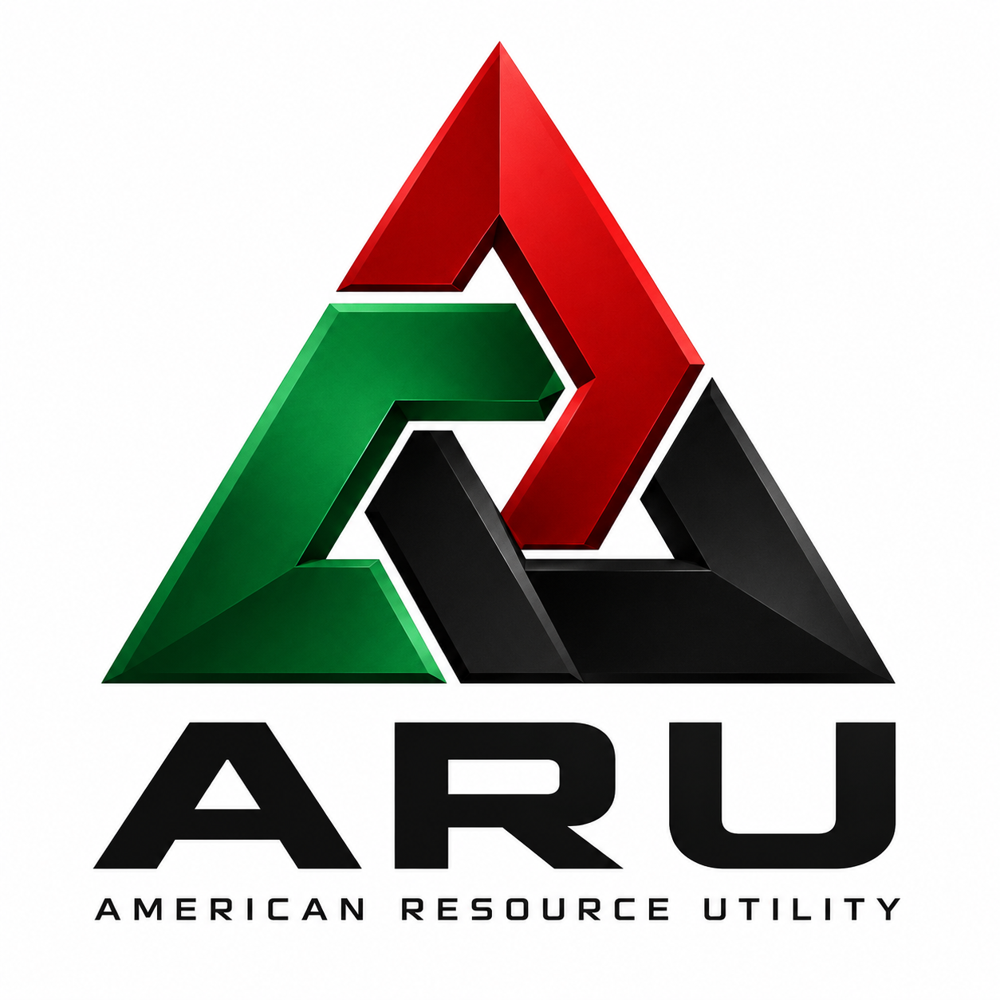

# American Resource Utility / BS&T

[Wiki home](../Home.md) · [Business directory](README.md) · [Department directory](../departments/README.md) · [Business dossiers](../../business-lines/README.md) · [Company charts](../../organization/README.md)

American Resource Utility provides railway, terminal, trucking and warehouse services for industrial customers. Blood, Sweat & Tears Railway Company is its separately incorporated railway subsidiary. Taylor, Wamsutter and Rawlins records describe different parts of the operating network.

**Reviewed:** September 12, 2026 · Fictional enterprise; source records control.

## Reading guide

Follow freight through railway, truck, terminal and warehouse services, then reconcile the service volumes and costs. Use the legal ownership chain when studying consolidation and the operating network when studying capacity.

## Start here

[Current business dossier](../../../docs/business-lines/AMERICAN_RESOURCE_UTILITY.md) · [Letterhead dossier PDF](../../../docs/business-lines/publications/SH-BIZ-AMERICAN-RESOURCE-UTILITY-001_v1.1.0.pdf)

The legal chain is Sable Harbor → Sable Harbor Industrial Holdings → ARU → BS&T. Nonrail services are operating businesses within ARU, not additional subsidiaries. The accepted network has 40 unique route miles; route miles and track miles are different measures.

## Organization and people

[Read the chart’s text roster, relationship key and source qualifications](../../../docs/organization/charts/aru-services.md). Grouped functions are not automatically reporting lines, separate companies or additional employees.

[Named people and recorded roles](../../../docs/organization/charts/people-aru-leadership.md) — the current chart preserves unknown joining years rather than inventing them.

## Operating, legal and control records

| Open | What you will find |
|---|---|
| [Industrial reader guide](../../../industrial/CASE_GUIDE.md) | Choose transaction diligence, accounting, operating analysis or capital planning. |
| [Legal structure](../../../industrial/corporate/LEGAL_STRUCTURE_AND_FORMATION.md) | Read the legal entities and formation/acquisition history. |
| [Purchase agreement record](../../../industrial/transaction/04_ARU_APPROVAL_AND_PURCHASE_AGREEMENT.md) | Inspect the approval and transaction terms. |
| [Purchase agreement PDF](../../../industrial/publications/SH-IND-ARU-SPA-001_v1.0.0.pdf) | Open the existing controlled document publication. |
| [Operating and service plan](../../../industrial/operations/OPERATING_AND_SERVICE_PLAN.md) | Read the rail and nonrail service model and capacity boundaries. |
| [Labor and safety](../../../industrial/operations/LABOR_SAFETY_AND_CONTROLS.md) | Follow qualifications, workforce and operating controls. |
| [Capital review](../../../industrial/planning/docs/CAPITAL_INVESTMENT_REVIEW.md) | Compare logistics choices on consistent demand and investment scope. |

## Finance and accounting practice

Reconcile service volumes and allocated service manifests to revenue and capacity, then examine procurement, payroll, fixed assets and debt. Separate the acquisition enterprise value, stock price, refinancing and parent funding. Monthly reconstructed allocations are not individually observed waybills.

1. Read the [business-finance release index](../../../docs/releases/BUSINESS_FINANCE_RELEASES.md) and download its indexed ZIP.
2. Open `units/american-resource-utility/audit.xlsx` in the extracted release. Its `README.md` explains the unit scope. The matching CSV and SQLite extracts provide the same scoped evidence; SQL is optional.
3. Read the [unit evidence guide](../../../docs/audit/UNIT_EXPORT_SPECIFICATION.md) before choosing samples. Select scenario and period together, and distinguish retained 2026 reconstruction from conditional 2027–2031 forecasts.

The [finance successor guide](../../../enterprise/business/README.md) explains generation, reconciliation and limits. A workbook is scenario evidence, not an audited financial statement or observed bank record.

## Places and plans

| Open | What you will find |
|---|---|
| [Network organization](../../../docs/organization/charts/bst-network.md) | Open the railway/facility grouping and both existing chart pages. |
| [Industrial facility programs](../../../geospatial/facilities/INDUSTRIAL_FACILITIES.md) | Find Taylor, Rawlins and Wamsutter plan scope and structure limitations. |

Use the [complete facility artifact index](../../../geospatial/maps/facilities/ARTIFACT_INDEX.md) for independently saved maps and floor plans, or open the [interactive atlas](../../../geospatial/maps/index.html) locally in a browser. GitHub displays the linked Markdown and images directly; it does not execute the atlas HTML.

## What remains unknown

Early railway alignments and detailed engineering remain incomplete. Service availability does not establish uranium custody qualification or authorize a mine spur. See the [open questions register](https://github.com/SquirmyWormy275/SABLEHARBOR/wiki/Open-Questions) for the evidence needed to resolve tracked gaps.

## Related reading

- [Pale Sun / Red Wash](Pale-Sun-Red-Wash.md)
- [Procurement and vendor support](../departments/procurement.md)
- [Safety and environmental governance](../departments/safety-environment.md)
- [Finance](../departments/finance.md)

Related reading describes useful connections, not additional reporting lines.
