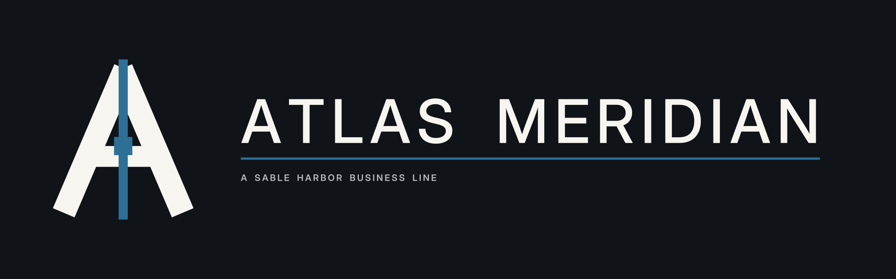
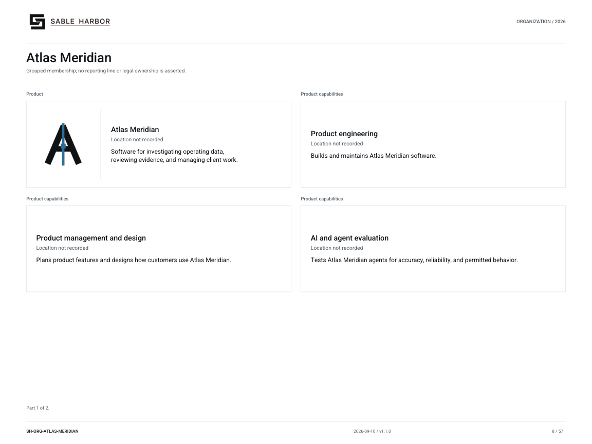

# Atlas Meridian

[Wiki home](../Home.md) · [All business dossiers](../../business-lines/README.md) · [Company charts](../../organization/README.md)

Atlas Meridian is software for investigating operating data, reviewing evidence and managing client work. It provides client workspaces and supports Advisory delivery while retaining a dedicated product organization and separately contracted licenses.

**Reader status:** Navigation summary checked September 11, 2026. Linked canon controls; this page creates no new facts. Existing chart artwork is from publication 1.1.0, September 10, 2026. Financial cases are publicly synthetic.

## Start here

[Current business dossier](../../../docs/business-lines/ATLAS_MERIDIAN.md) · [Letterhead dossier PDF](../../../docs/business-lines/publications/SH-BIZ-ATLAS-MERIDIAN-001_v1.1.0.pdf)

Atlas is a parent-book product business, distinct from Advisory, J2 and the geographic atlas. A dedicated physical working base remains unresolved.

## Organization and people

Open the chart to read its relationship key and any additional pages. Grouped functions are not automatically reporting lines, separate companies or additional employees.

[Named people and recorded roles](../../../docs/organization/charts/people-atlas-meridian.md) — the current chart preserves unknown joining years rather than inventing them.

## Operating, legal and control records

| Open | What you will find |
|---|---|
| [Product standard](../../../docs/advisory/ATLAS_MERIDIAN_COMMERCIAL_PRODUCT_STANDARD.md) | Read editions, licensing, tenant boundaries, connectors, evaluation, support and export requirements. |
| [Professional platform](../../../docs/advisory/ATLAS_MERIDIAN_PROFESSIONAL_PLATFORM.md) | See which responsibilities belong to Product and which belong to the Advisory matter team. |
| [September 9 decisions](../../../docs/canon/DECISION_REGISTER_ADDENDUM_2026-09-09_ADVISORY_TIER1.md) | Use ATL-201–209 for current commercial direction; these supersede older open pricing and edition wording. |
| [Runtime estate](../../../enterprise/runtime/README.md) | Follow the current hosting, implementation and provider evidence, including readiness limits. |

## Finance and accounting practice

Inspect license contracts separately from Advisory matter fees. Compare invoices, service periods, product/support capacity and internal-use costs. Internal use creates no external revenue.

1. Read the [business-finance release index](../../../docs/releases/BUSINESS_FINANCE_RELEASES.md) and download its indexed ZIP.
2. Open `units/atlas-meridian/audit.xlsx` in the extracted release. Its `README.md` explains the unit scope. The matching CSV and SQLite extracts provide the same scoped evidence; SQL is optional.
3. Read the [unit evidence guide](../../../docs/audit/UNIT_EXPORT_SPECIFICATION.md) before choosing samples. Select scenario and period together, and distinguish retained 2026 reconstruction from conditional 2027–2031 forecasts.

The [finance successor guide](../../../enterprise/business/README.md) explains generation, reconciliation and limits. A workbook is scenario evidence, not an audited financial statement or observed bank record.

## Places and plans

| Open | What you will find |
|---|---|
| [Proposed product floor](../../../geospatial/maps/facilities/SH-MAP-SAC-025.pdf) | See the shared Sacramento product-engineering proposal, not a claimed dedicated Atlas office. |

Use the [complete facility artifact index](../../../geospatial/maps/facilities/ARTIFACT_INDEX.md) for independently saved maps and floor plans, or open the [interactive atlas](../../../geospatial/maps/index.html) locally in a browser. GitHub displays the linked Markdown and images directly; it does not execute the atlas HTML.

## Limits to keep visible

Product architecture does not establish a deployed client portal or completed security sign-off. The 70/30 professional/client-plane heuristic is not a revenue split or usage ratio.
