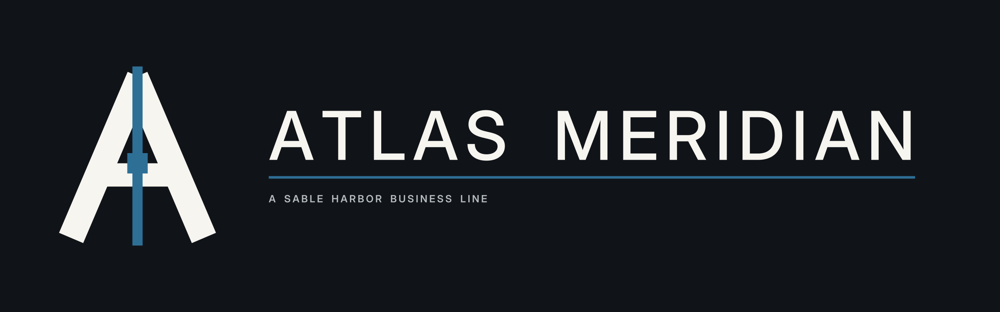
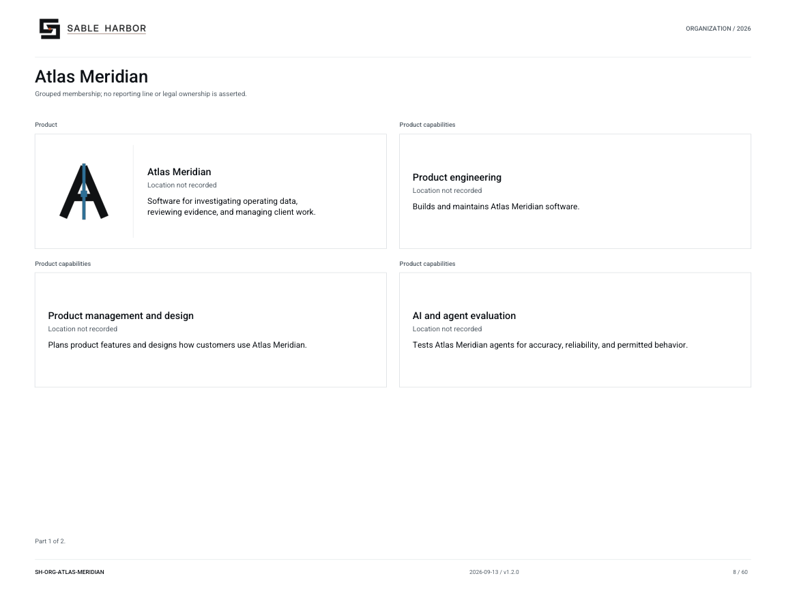

# Atlas Meridian

[Wiki home](../Home.md) · [Businesses](README.md) · [All files](../Files.md)

Atlas Meridian is software for investigating operating data, reviewing evidence and managing client work. It provides client workspaces and supports Advisory delivery while retaining a dedicated product organization and separately contracted licenses.

## Start here

[Business dossier](../../../docs/business-lines/ATLAS_MERIDIAN.md) · [Dossier PDF](../../../docs/business-lines/publications/SH-BIZ-ATLAS-MERIDIAN-001_v1.1.0.pdf)

Atlas is recorded on the parent’s books and remains distinct from Advisory, J2 and the geographic atlas. It uses shared accommodation in Tucson and Sacramento, with deployed work through the existing business teams. See the [location directory](../Locations.md).

## Organization and people

[Chart and text roster](../../../docs/organization/charts/atlas-meridian.md).

[Named people and recorded roles](../../../docs/organization/charts/people-atlas-meridian.md).

## Operating, legal and control records

| Open | What you will find |
|---|---|
| [Product standard](../../../docs/advisory/ATLAS_MERIDIAN_COMMERCIAL_PRODUCT_STANDARD.md) | Read editions, licensing, tenant boundaries, connectors, evaluation, support and export requirements. |
| [Professional platform](../../../docs/advisory/ATLAS_MERIDIAN_PROFESSIONAL_PLATFORM.md) | See which responsibilities belong to Product and which belong to the Advisory matter team. |
| [Runtime estate](../../../enterprise/runtime/README.md) | Follow the current hosting, implementation and provider evidence, including readiness limits. |

## Finance and accounting practice

Commercial models describe pricing and service assumptions. Use the contract and customer records for the terms and activity recorded in the selected case.

Inspect license contracts separately from Advisory matter fees. Compare invoices, service periods, product/support capacity and internal-use costs. Internal use creates no external revenue.

1. Read the [business-finance release index](../../../docs/releases/BUSINESS_FINANCE_RELEASES.md) and download its indexed ZIP.
2. Open `units/atlas-meridian/audit.xlsx` in the extracted release. Its `README.md` explains the unit scope. The matching CSV and SQLite extracts contain the same records; SQL is optional.
3. Read the [unit evidence guide](../../../docs/audit/UNIT_EXPORT_SPECIFICATION.md) before choosing samples. Select scenario and period together, and distinguish retained 2026 reconstruction from conditional 2027–2031 forecasts.

The [finance model guide](../../../enterprise/business/README.md) explains generation, reconciliation and limits. The workbook records the selected scenario and its assumptions.

## Places and plans

| Open | What you will find |
|---|---|
| [Proposed product floor](../../../geospatial/maps/facilities/SH-MAP-SAC-025.pdf) | See the shared Sacramento product-engineering proposal, not a claimed dedicated Atlas office. |

Use the [complete facility artifact index](../../../geospatial/maps/facilities/ARTIFACT_INDEX.md) for independently saved maps and floor plans, or open the [interactive atlas](../../../geospatial/maps/index.html) locally in a browser. GitHub displays the linked Markdown and images directly; it does not execute the atlas HTML.

## Related reading

- [Sable Harbor Advisory](Advisory.md)
- [Foundry Field](Foundry-Field.md)
- [Judgment](../departments/judgment.md)
- [Enterprise Technology Services](../departments/technology.md)

[Departments](../departments/README.md) · [Business dossiers](../../business-lines/README.md) · [Company charts](../../organization/README.md)
