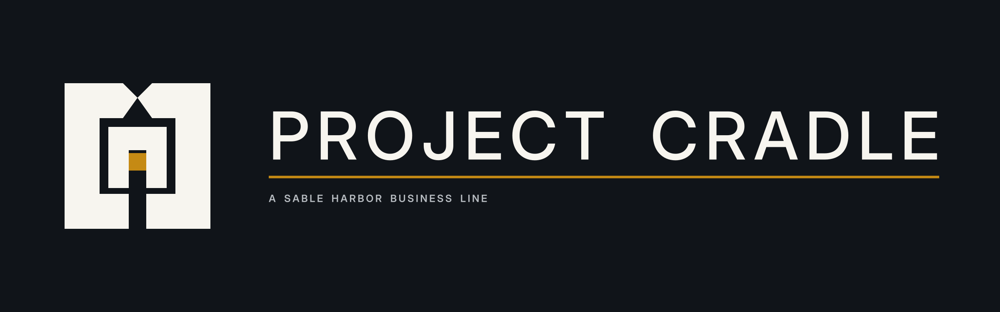

# Project Cradle

[Wiki home](../Home.md) · [Business directory](README.md) · [Department directory](../departments/README.md) · [Business dossiers](../../business-lines/README.md) · [Company charts](../../organization/README.md)

Cradle recovers rare-earth materials from designated industrial side streams and mine water for specialist downstream sale. Its work connects external host deployments with the separate Bedford development, refurbishment, analytical and upgrading facility.

**Reviewed:** September 12, 2026 · Fictional enterprise; source records control.

## Reading guide

Follow a material stream from the host site through recovery and onward processing. Host rights, technical results and the economics of a useful recovered output answer different questions in that chain.

## Start here

[Current business dossier](../../../docs/business-lines/PROJECT_CRADLE.md) · [Letterhead dossier PDF](../../../docs/business-lines/publications/SH-BIZ-PROJECT-CRADLE-001_v1.1.0.pdf)

Cradle is an early commercial parent-book business. Kelly Gang Mining and Demotte Reclamation Services are external hosts, not subsidiaries. Bedford is a fictional Fairmont-area facility concept; it is not the Demotte treatment plant.

## Organization and people

[Read the chart’s text roster, relationship key and source qualifications](../../../docs/organization/charts/project-cradle.md). Grouped functions are not automatically reporting lines, separate companies or additional employees.

[Named people and recorded roles](../../../docs/organization/charts/people-cradle.md) — the current chart preserves unknown joining years rather than inventing them.

## Operating, legal and control records

| Open | What you will find |
|---|---|
| [Accepted recovery architecture](../../../docs/canon/CRADLE_CLOSEOUT_2026-09-06.md) | Read Stream 17, the Demotte slipstream, equipment ownership, host boundaries and Bedford’s purpose. |
| [Product and deployment record](../../../docs/organization/PROJECT_CRADLE.md) | Follow the product history and deployment distinctions. |
| [Recovery controls](../../../docs/business-lines/BUSINESS_FINANCE_AND_ALEXANDRIA_INTERFACES.md) | Find title, custody, assay, acceptance and host-settlement evidence requirements. |

## Finance and accounting practice

Compare feed measurements with recovered lots, assay and downstream acceptance, then follow inventory, invoices and host obligations. Keep mineral tonnes separate from water volume and dissolved concentration. Unsold recovered material is not cash.

1. Read the [business-finance release index](../../../docs/releases/BUSINESS_FINANCE_RELEASES.md) and download its indexed ZIP.
2. Open `units/project-cradle/audit.xlsx` in the extracted release. Its `README.md` explains the unit scope. The matching CSV and SQLite extracts provide the same scoped evidence; SQL is optional.
3. Read the [unit evidence guide](../../../docs/audit/UNIT_EXPORT_SPECIFICATION.md) before choosing samples. Select scenario and period together, and distinguish retained 2026 reconstruction from conditional 2027–2031 forecasts.

The [finance successor guide](../../../enterprise/business/README.md) explains generation, reconciliation and limits. A workbook is scenario evidence, not an audited financial statement or observed bank record.

## Places and plans

| Open | What you will find |
|---|---|
| [Bedford program](../../../geospatial/facilities/RESEARCH_CAMPUSES.md) | Read the four modelled building functions and host/site separation. |
| [Facility maps](../../../geospatial/maps/facilities/ARTIFACT_INDEX.md) | Find the SH-MAP-CRD Bedford and host context assets, each with its own status. |

Use the [complete facility artifact index](../../../geospatial/maps/facilities/ARTIFACT_INDEX.md) for independently saved maps and floor plans, or open the [interactive atlas](../../../geospatial/maps/index.html) locally in a browser. GitHub displays the linked Markdown and images directly; it does not execute the atlas HTML.

[Kelly Gang Mining and Demotte host interfaces](../subjects/External-Hosts.md) · [Wallaby history](../subjects/Project-History.md)

## What remains unknown

External host records do not establish ownership of the host sites. Exact footprints, access instruments and remaining implementation evidence retain their source limits. See the [open questions register](https://github.com/SquirmyWormy275/SABLEHARBOR/wiki/Open-Questions) for the evidence needed to resolve tracked gaps.

## Related reading

- [Cradle's external hosts](../subjects/External-Hosts.md)
- [Safety and environmental governance](../departments/safety-environment.md)
- [Quality and technical standards](../departments/quality-standards.md)
- [Willow](Willow.md)

Related reading describes useful connections, not additional reporting lines.
