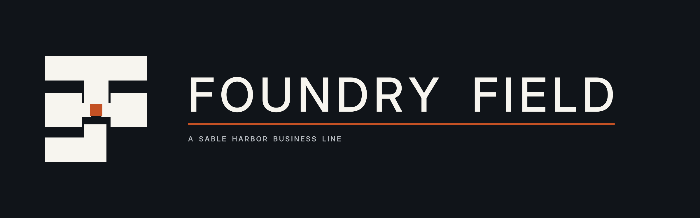

# Foundry Field

[Wiki home](../Home.md) · [Business directory](README.md) · [Department directory](../departments/README.md) · [Business dossiers](../../business-lines/README.md) · [Company charts](../../organization/README.md)

Foundry Field is software for production tracking, maintenance, reconciliations and operating exceptions. Foundry supplies the underlying representation of records, relationships, provenance and authority. Foundry Field packages that capability for customer operating work.

**Reviewed:** September 12, 2026 · Fictional enterprise; source records control.

## Reading guide

Start with the operating loop: record production, reconcile what happened and make exceptions visible to the responsible operator. Then trace the commercial and deployment records behind a customer engagement.

## Start here

[Current business dossier](../../../docs/business-lines/FOUNDRY_FIELD.md) · [Letterhead dossier PDF](../../../docs/business-lines/publications/SH-BIZ-FOUNDRY-FIELD-001_v1.1.0.pdf)

It is a commercial product business recorded on the parent’s SHI books. A dedicated working base is unresolved; the Sacramento product floor is a proposed campus allocation, not proof of current occupancy.

## Organization and people

[Read the chart’s text roster, relationship key and source qualifications](../../../docs/organization/charts/foundry-field.md). Grouped functions are not automatically reporting lines, separate companies or additional employees.

[Named people and recorded roles](../../../docs/organization/charts/people-foundry-field.md) — the current chart preserves unknown joining years rather than inventing them.

## Operating, legal and control records

| Open | What you will find |
|---|---|
| [Product and authority](../../../docs/organization/FOUNDRY_AND_FOUNDRY_FIELD.md) | Understand the distinction between the substrate and deployable product, and between information and operating authority. |
| [Product responsibilities](../../../docs/organization/FOUNDRY_FIELD_ORGANIZATION.md) | Read the documented architecture, deployment and customer-delivery responsibilities. |
| [Business controls](../../../docs/business-lines/BUSINESS_FINANCE_AND_ALEXANDRIA_INTERFACES.md) | Find the evidence expected at contract, acceptance, support and billing boundaries. |

## Finance and accounting practice

Compare deployment acceptance with deployment revenue; then compare subscription service periods, advance billing, deferred revenue and collections. The unit package includes contracts, subscription events, invoices, renewal/churn and capacity evidence.

1. Read the [business-finance release index](../../../docs/releases/BUSINESS_FINANCE_RELEASES.md) and download its indexed ZIP.
2. Open `units/foundry-field/audit.xlsx` in the extracted release. Its `README.md` explains the unit scope. The matching CSV and SQLite extracts provide the same scoped evidence; SQL is optional.
3. Read the [unit evidence guide](../../../docs/audit/UNIT_EXPORT_SPECIFICATION.md) before choosing samples. Select scenario and period together, and distinguish retained 2026 reconstruction from conditional 2027–2031 forecasts.

The [finance successor guide](../../../enterprise/business/README.md) explains generation, reconciliation and limits. A workbook is scenario evidence, not an audited financial statement or observed bank record.

## Places and plans

| Open | What you will find |
|---|---|
| [Proposed product floor](../../../geospatial/maps/facilities/SH-MAP-SAC-025.pdf) | Open the Sacramento product-engineering/deployment floor proposal. |

Use the [complete facility artifact index](../../../geospatial/maps/facilities/ARTIFACT_INDEX.md) for independently saved maps and floor plans, or open the [interactive atlas](../../../geospatial/maps/index.html) locally in a browser. GitHub displays the linked Markdown and images directly; it does not execute the atlas HTML.

## What remains unknown

Conditional revenue and deployment scenarios do not prove executed customer terms. Billing proposal PR #138 remains unapproved. See the [open questions register](https://github.com/SquirmyWormy275/SABLEHARBOR/wiki/Open-Questions) for the evidence needed to resolve tracked gaps.

## Related reading

- [Enterprise Technology Services](../departments/technology.md)
- [Finance](../departments/finance.md)
- [Company history and The Crossing](../subjects/History.md)
- [Atlas Meridian](Atlas-Meridian.md)

Related reading describes useful connections, not additional reporting lines.
