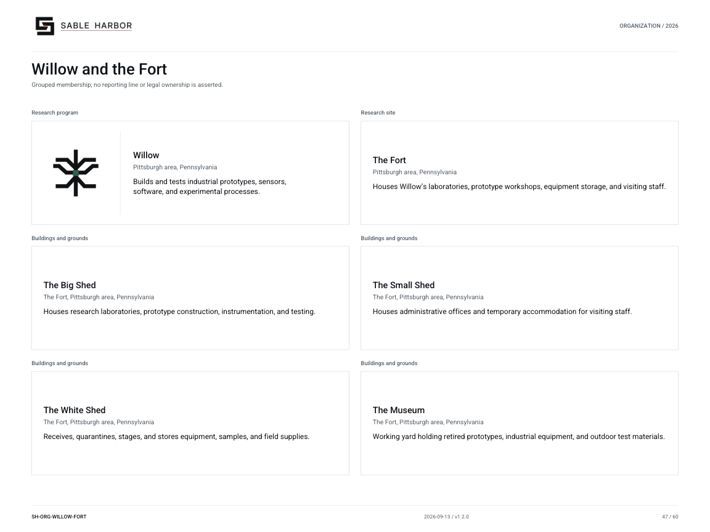

# Willow

[Wiki home](../Home.md) · [Businesses](README.md) · [All files](../Files.md)

Willow builds and tests industrial prototypes, sensors, software and experimental processes at the Pittsburgh-area Fort. Its outputs include experiments, failed-test records, prototypes and qualified transfers to operating owners.

## Start here

[Business dossier](../../../docs/business-lines/WILLOW.md) · [Dossier PDF](../../../docs/business-lines/publications/SH-BIZ-WILLOW-001_v1.1.0.pdf)

Willow is an internal parent-book program and cost center, not a subsidiary or a product-sales business. Klein is its historical Pittsburgh lineage. The Fort’s three sheds and outdoor Museum have distinct functions.

## Organization and people

[Chart and text roster](../../../docs/organization/charts/willow-fort.md).

[Named people and recorded roles](../../../docs/organization/charts/people-willow-team.md).

## Operating, legal and control records

| Open | What you will find |
|---|---|
| [Accepted Willow/Klein record](../../../docs/canon/WILLOW_KLEIN_CLOSEOUT_2026-09-06.md) | Read the laboratory’s remit, history, authority and physical concept. |
| [Corporate history](../../../docs/organization/WILLOW_KLEIN_CORPORATE_RECORD.md) | Trace the historical program without treating it as a separate current company. |
| [Research finance](../../../docs/finance/WILLOW_KLEIN_FINANCE_AND_CORPORATE_MODEL_2026-09-06.md) | Distinguish research expense, reusable equipment and internal transfer accounting. |

## Finance and accounting practice

Follow an experiment from authorization through materials and equipment to a continue/change/kill/transfer decision. Compare reusable-asset depreciation and transfers with project costs. An internal transfer within SHI creates no external profit.

1. Read the [business-finance release index](../../../docs/releases/BUSINESS_FINANCE_RELEASES.md) and download its indexed ZIP.
2. Open `units/willow/audit.xlsx` in the extracted release. Its `README.md` explains the unit scope. The matching CSV and SQLite extracts contain the same records; SQL is optional.
3. Read the [unit evidence guide](../../../docs/audit/UNIT_EXPORT_SPECIFICATION.md) before choosing samples. Select scenario and period together, and distinguish retained 2026 reconstruction from conditional 2027–2031 forecasts.

The [finance model guide](../../../enterprise/business/README.md) explains generation, reconciliation and limits. The workbook records the selected scenario and its assumptions.

## Places and plans

The [geographic decisions](../../canon/GEOGRAPHIC_COMPLETION_2026-09-13.md) and [Fort occupancy history](../../canon/KLEIN_FORT_OCCUPANCY_2026-09-13.md) record the selected location and staged move. The 24-person calibration is a planning population.

| Open | What you will find |
|---|---|
| [Fort and Bedford programs](../../../geospatial/facilities/RESEARCH_CAMPUSES.md) | Read the Fort’s building purposes, visitor/service separation and explicit planning assumptions. |
| [Fort master plan](../../../geospatial/maps/facilities/SH-MAP-WIL-020.pdf) | View the modelled campus; use the facility index below for each shed and floor. |

Use the [complete facility artifact index](../../../geospatial/maps/facilities/ARTIFACT_INDEX.md) for independently saved maps and floor plans, or open the [interactive atlas](../../../geospatial/maps/index.html) locally in a browser. GitHub displays the linked Markdown and images directly; it does not execute the atlas HTML.

[Klein, Emberline and the Willow transition](../subjects/Research-History.md) · [Failed research projects](../subjects/Project-History.md)

## Related reading

- [Klein, Emberline and Willow](../subjects/Research-History.md)
- [Glasshouse, Wallaby and failed experiments](../subjects/Project-History.md)
- [Finance](../departments/finance.md)
- [Enterprise Technology Services](../departments/technology.md)

[Departments](../departments/README.md) · [Business dossiers](../../business-lines/README.md) · [Company charts](../../organization/README.md)
