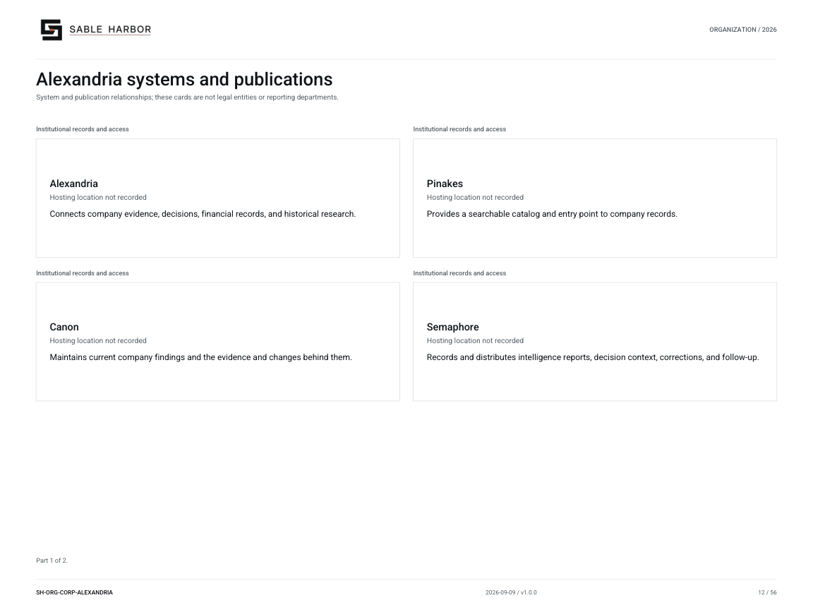

# Alexandria institutional environment

**Canon state:** LOCKED DIRECTION institutional environment; runtime design has separate accepted scope. 
**Last substantive review:** September 11, 2026. This page is secondary navigation; the linked source records control.

Alexandria preserves institutional records and their history and connects questions, evidence, judgments and decisions. Pinakes is the human catalog/portal; Daedalus assists the user within human-authorship and authority boundaries.

## Read and use the records

- [Alexandria source library](../../../docs/j2/alexandria/README.md) — Start with the charter and navigate all foundation doctrines.
- [Charter](../../../docs/j2/alexandria/ALEXANDRIA_CHARTER.md) — Temporal integrity, provenance and desktop-first access.
- [Pinakes portal doctrine](../../../docs/j2/alexandria/PINAKES_PORTAL_AND_UX.md) — Human navigation and portal responsibilities.
- [Temporal integrity](../../../docs/j2/alexandria/TEMPORAL_INTEGRITY.md) — Separate event, record, access and institutional knowledge dates.
- [Institutional catalog query guide](../../../docs/internal/INSTITUTIONAL_CATALOG_QUERY_GUIDE.md) — Use the existing generated database without treating it as new canon.
- [Institutional SQLite index](../../../docs/internal/institutional_catalog.sqlite3) — Download the queryable institutional document index.
- [Current runtime design](../../../enterprise/runtime/README.md) — Later accepted hosting and runtime implementation records.
- [Controlled charter PDF](../../../docs/j2/publications/SH-J2-ALX-001_v1.0.1.pdf) — Reader edition.

## Organization and identity

[Current chart and all of its pages](../../organization/charts/corporate-alexandria.md) · [Complete organization publication](../../organization/assets/current/Sable-Harbor-Organization-Charts.pdf).

The shared chart retains its original scope; it is not a new reporting chart for this page. The approved J2 mark above identifies the parent institution.

## Boundaries and unresolved detail

Alexandria is a system, not an additional department. This wiki and the generated catalog do not claim to implement the full Pinakes experience or a production Alexandria estate.

[Department and institution directory](README.md) · [Wiki home](../Home.md)
