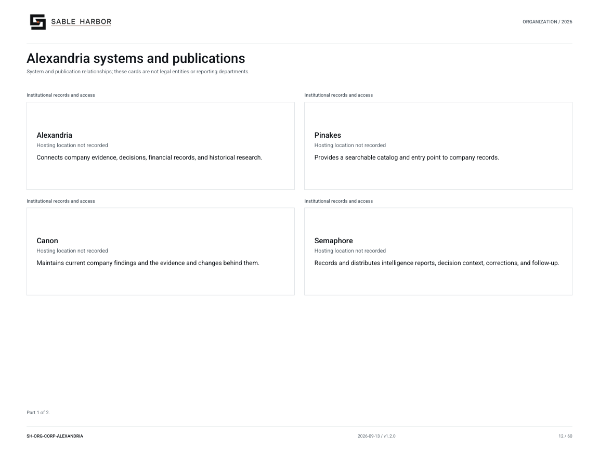

# Alexandria institutional environment

[Wiki home](../Home.md) · [Departments](README.md) · [All files](../Files.md)

Alexandria connects company records with the questions, investigations and decisions that used them. It keeps earlier versions available so a reader can follow both what changed and what was known at the time. Pinakes is the catalog and portal; Daedalus helps people examine the material. People remain responsible for the judgments and decisions they record.

## Records and institutional memory

The accepted portal, authorization and recovery implementations have specific documented scopes. The [runtime receipt](../../internal/company-closeout/daedalus-rehearsal-2026-09-29/ACCEPTED_RUNTIME_RECEIPT.md) describes the model rehearsal and the remaining work for broader use and external deployment.

## Documents

- [Alexandria source library](../../../docs/j2/alexandria/README.md) — Start with the charter and navigate all foundation doctrines.
- [Charter](../../../docs/j2/alexandria/ALEXANDRIA_CHARTER.md) — Temporal integrity, provenance and desktop-first access.
- [Pinakes portal doctrine](../../../docs/j2/alexandria/PINAKES_PORTAL_AND_UX.md) — Human navigation and portal responsibilities.
- [Temporal integrity](../../../docs/j2/alexandria/TEMPORAL_INTEGRITY.md) — Separate event, record, access and institutional knowledge dates.
- [Institutional catalog query guide](../../../docs/internal/INSTITUTIONAL_CATALOG_QUERY_GUIDE.md) — Use the existing generated database without treating it as new canon.
- [Institutional SQLite index](../../../docs/internal/institutional_catalog.sqlite3) — Download the queryable institutional document index.
- [Current runtime design](../../../enterprise/runtime/README.md) — Later accepted hosting and runtime implementation records.
- [Controlled charter PDF](../../../docs/j2/publications/SH-J2-ALX-001_v1.0.1.pdf) — Reader edition.

## Organization

[Organization chart and roster](../../organization/charts/corporate-alexandria.md) · [Complete chart book](../../organization/assets/current/Sable-Harbor-Organization-Charts.pdf).

## Related reading

- [Contact](contact.md)
- [Judgment](judgment.md)
- [Enterprise Technology Services](technology.md)
- [Enterprise security capability](security.md)

About this article

**Canon state:** LOCKED DIRECTION institutional environment; runtime design has separate accepted scope.
**Reviewed:** October 7, 2026. Supporting documents retain their own dates and status.

