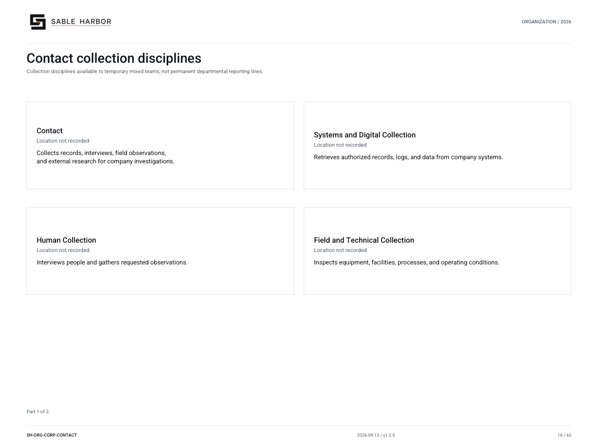

# Contact

[Wiki home](../Home.md) · [Departments](README.md) · [All files](../Files.md)

Contact gathers records, interviews, field observations and external research for J2 investigations. It chooses lawful ways to obtain the information and records where it came from. The Judgment Officer then uses that evidence to investigate the problem.

## Collecting evidence

Collection disciplines describe the methods available to Contact. Source access follows the permissions of the relevant system; the [Alexandria guide](alexandria.md) explains the portal and its supported authorization scope.

## Documents

- [Contact doctrine](../../../docs/j2/CONTACT.md) — Collection scope and boundaries.
- [Collection management](../../../docs/j2/CONTACT_COLLECTION_MANAGEMENT.md) — Requirements, capacity allocation, methods and evidentiary handoff.
- [Contact reader edition](../../../docs/j2/publications/SH-J2-CONTACT-001_v1.0.0.pdf) — Controlled PDF.
- [Establishment](../../../docs/j2/J2_ESTABLISHMENT.md) — 78 authorized Contact billets.
- [Leadership appointments](../../../docs/canon/J2_LEADERSHIP_APPOINTMENTS_2026-09-10.md) — Mara Hammer is Head of Contact; joined Sable Harbor in 2021.

## Organization

[Organization chart and roster](../../organization/charts/corporate-contact-disciplines.md) · [Complete chart book](../../organization/assets/current/Sable-Harbor-Organization-Charts.pdf).

## Related reading

- [Judgment](judgment.md)
- [Orientation](orientation.md)
- [Alexandria institutional environment](alexandria.md)
- [J2 Headquarters](j2-headquarters.md)

About this article

**Canon state:** LOCKED DIRECTION doctrine; LOCKED establishment and current leadership.
**Reviewed:** October 7, 2026. Supporting documents retain their own dates and status.

