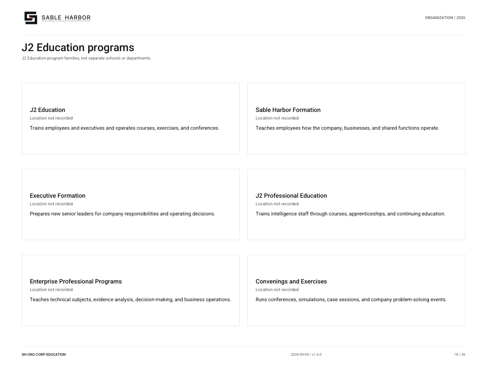

# J2 Education

**Canon state:** LOCKED institutional scope; implementation detail varies by linked record. 
**Last substantive review:** September 11, 2026. This page is secondary navigation; the linked source records control.

Education designs and teaches enterprise and professional courses, cases and exercises, and supports conferences. Subject owners retain responsibility for law, safety, controls and technical content; Education owns instructional design.

## Read and use the records

- [Education doctrine](../../../docs/j2/EDUCATION.md) — Five program families, teaching responsibilities, residential use and rotating faculty.
- [Program chart](../../../docs/organization/charts/corporate-education-programs.md) — Current program names and concise descriptions.
- [Controlled publication catalog](../../../docs/j2/publications/README.md) — Find published editions; compare revision metadata with the current Markdown before use.
- [Establishment](../../../docs/j2/J2_ESTABLISHMENT.md) — 35 permanent Education billets, included in J2’s 237 total.
- [Leadership appointments](../../../docs/canon/J2_LEADERSHIP_APPOINTMENTS_2026-09-10.md) — Brett Calder is Head of Education; joined in 2021.
- [Campus and floor plans](../../../geospatial/facilities/README.md) — Modelled education and residential facilities with explicit status.

## Organization and identity

[Current chart and all of its pages](../../organization/charts/corporate-education-programs.md) · [Complete organization publication](../../organization/assets/current/Sable-Harbor-Organization-Charts.pdf).

The shared chart retains its original scope; it is not a new reporting chart for this page. The approved J2 mark above identifies the parent institution.

## Boundaries and unresolved detail

Learners, rotating faculty, permanent billets and residential capacity are different populations. A planned classroom or course design does not establish a completed operating campus.

[Department and institution directory](README.md) · [Wiki home](../Home.md)
