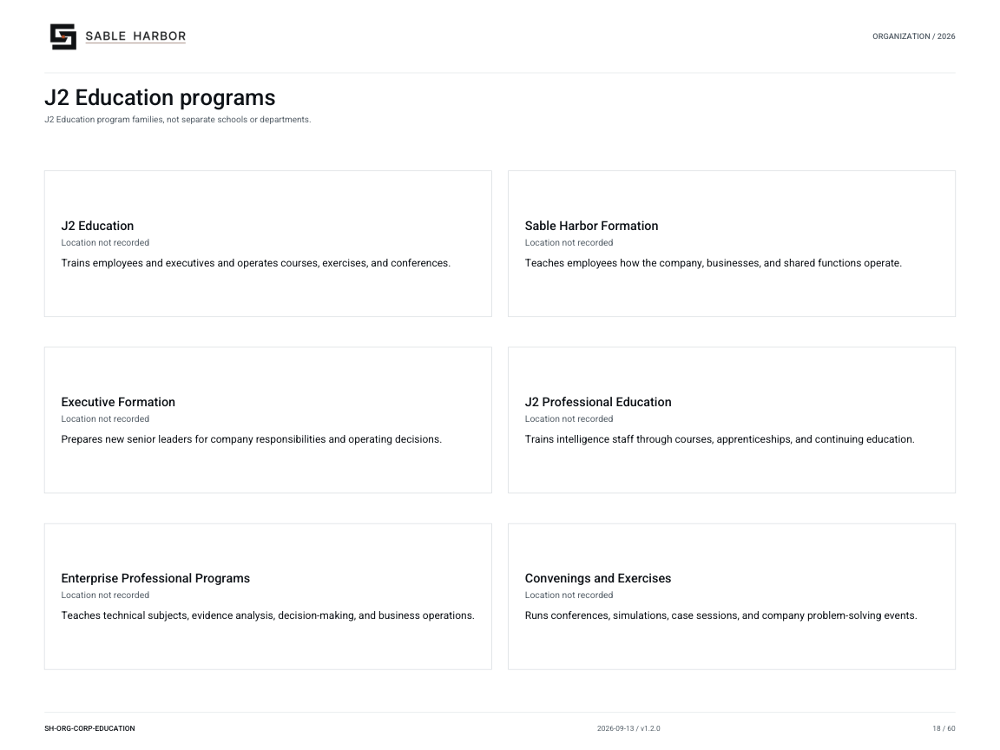

# J2 Education

[Wiki home](../Home.md) · [Departments](README.md) · [All files](../Files.md)

J2 Education develops courses, cases and exercises from professional practice and company experience. It also supports conferences and a rotating practitioner faculty. Education designs the teaching; the relevant subject owners remain responsible for legal, safety, control and technical requirements.

## Teaching from company experience

Program descriptions explain the intended learning and faculty arrangements. Capacity models describe planned provision; teaching events and residential attendance have their own records.

## Documents

- [Education doctrine](../../../docs/j2/EDUCATION.md) — Five program families, teaching responsibilities, residential use and rotating faculty.
- [Program chart](../../../docs/organization/charts/corporate-education-programs.md) — Current program names and concise descriptions.
- [Controlled publication catalog](../../../docs/j2/publications/README.md) — Find published editions; compare revision metadata with the current Markdown before use.
- [Establishment](../../../docs/j2/J2_ESTABLISHMENT.md) — 35 permanent Education billets, included in J2’s 237 total.
- [Leadership appointments](../../../docs/canon/J2_LEADERSHIP_APPOINTMENTS_2026-09-10.md) — Brett Calder is Head of Education; joined in 2021.
- [Campus and floor plans](../../../geospatial/facilities/README.md) — Modelled education and residential facilities with explicit status.

## Organization

[Organization chart and roster](../../organization/charts/corporate-education-programs.md) · [Complete chart book](../../organization/assets/current/Sable-Harbor-Organization-Charts.pdf).

## Related reading

- [People & Culture](people-culture.md)
- [Orientation](orientation.md)
- [Junction Advisory Group](jag.md)
- [Sable Harbor Advisory](../businesses/Advisory.md)

About this article

**Canon state:** LOCKED institutional scope; implementation detail varies by linked record.
**Reviewed:** October 7, 2026. Supporting documents retain their own dates and status.

