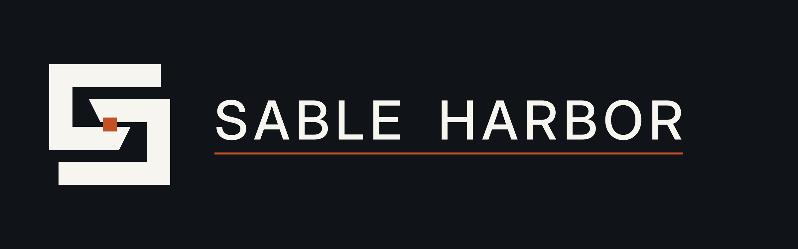
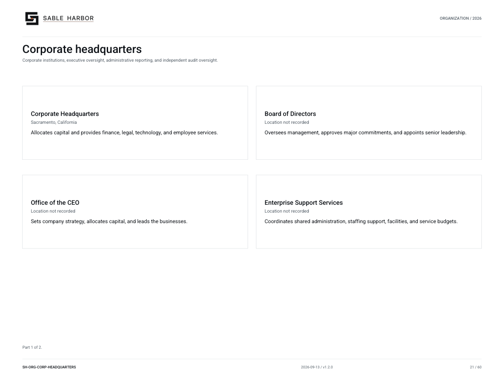

# Office of the CEO

[Wiki home](../Home.md) · [Departments](README.md) · [All files](../Files.md)

The CEO directs Sable Harbor within the authority reserved to the Board. The corporate center allocates surplus capital and provides shared services, while business presidents take responsibility for their operations. Executive coordination groups bring context and expertise to a decision; the accountable owner still makes it.

## Leading the enterprise

The capital and planning records explain how proposals reach the right decision-maker. Individual appointments and investment approvals appear in the relevant dated records.

## Documents

- [Enterprise authority and executive rhythm](../../../docs/governance/ENTERPRISE_AUTHORITY_CAPITAL_AND_EXECUTIVE_RHYTHM.md) — Decision owners, capital allocation and executive coordination.
- [Headquarters closeout](../../../docs/canon/CORPORATE_HEADQUARTERS_CLOSEOUT_2026-09-03.md) — Sections 9–14 explain capital, planning, executive rings and business authority.
- [Management system](../../../docs/governance/SABLE_HARBOR_MANAGEMENT_SYSTEM.md) — Read the accepted management doctrine.
- [Decision quality and after-action learning](../../../docs/governance/DECISION_QUALITY_AND_AFTER_ACTION_LEARNING.md) — Distinguish information available at the time from later outcomes.
- [Current named enterprise leadership](../../../docs/organization/charts/people-enterprise.md) — Read approved names, offices and company joining years.
- [Controlled authority publication](../../../docs/governance/publications/SH-GOV-AUTH-002_v1.0.1.pdf) — Reader edition of enterprise authority and rhythm.

## Organization

[Organization chart and roster](../../organization/charts/corporate-headquarters.md) · [Complete chart book](../../organization/assets/current/Sable-Harbor-Organization-Charts.pdf).

## Related reading

- [Board and committees](board.md)
- [Enterprise Support Services](ess.md)
- [J2 — Judgment & Junction](j2.md)
- [Finance](finance.md)

About this article

**Canon state:** LOCKED institutional scope; implementation detail varies by linked record.
**Reviewed:** October 7, 2026. Supporting documents retain their own dates and status.

