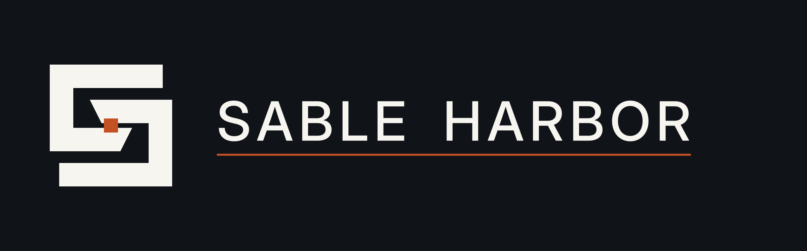
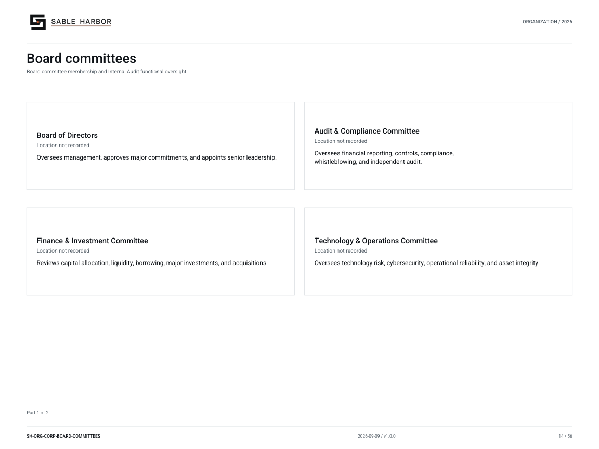

# Internal Audit

**Canon state:** LOCKED institutional scope; implementation detail varies by linked record. 
**Last substantive review:** September 11, 2026. This page is secondary navigation; the linked source records control.

Internal Audit independently evaluates governance, controls and operations. It controls its audit scope, methods, findings and communications under its charter and Board committee oversight.

## Read and use the records

- [Assessment workpapers and evidence requests](../../../enterprise/ccf/assurance/README.md) — Follow requirement, implementation, period, population, procedure and independent review; generated plans are not performed tests.
- [Independence doctrine](../../../docs/governance/ENTERPRISE_SUPPORT_SERVICES_AND_INDEPENDENCE.md) — Read the protected reporting and communication boundaries.
- [Audit & Compliance Committee charter](../../../docs/governance/committees/AUDIT_AND_COMPLIANCE_COMMITTEE_CHARTER.md) — Functional accountability and oversight.
- [Committee reader edition](../../../docs/governance/publications/SH-GOV-COM-AUDIT-001_v1.0.0.pdf) — Controlled PDF.
- [Control preparation exercises](../../../enterprise/ccf/README.md) — Public synthetic testing examples and explicit coverage limitations.
- [Runtime assurance scope](../../../enterprise/runtime/docs/ASSURANCE_SCOPE.md) — Distinguish design evidence from actual operation.

## Organization and identity

[Current chart and all of its pages](../../organization/charts/corporate-board-committees.md) · [Complete organization publication](../../organization/assets/current/Sable-Harbor-Organization-Charts.pdf).

The shared chart retains its original scope; it is not a new reporting chart for this page. The approved corporate mark above identifies the parent institution.

## Boundaries and unresolved detail

Internal Audit is separate from Finance, OGC, Risk & Compliance, Technology and J2. ESS administrative support cannot condition its communications to the committee.

[Department and institution directory](README.md) · [Wiki home](../Home.md)

[Continuity and crisis responsibilities across the existing institutions](../subjects/Continuity.md).
