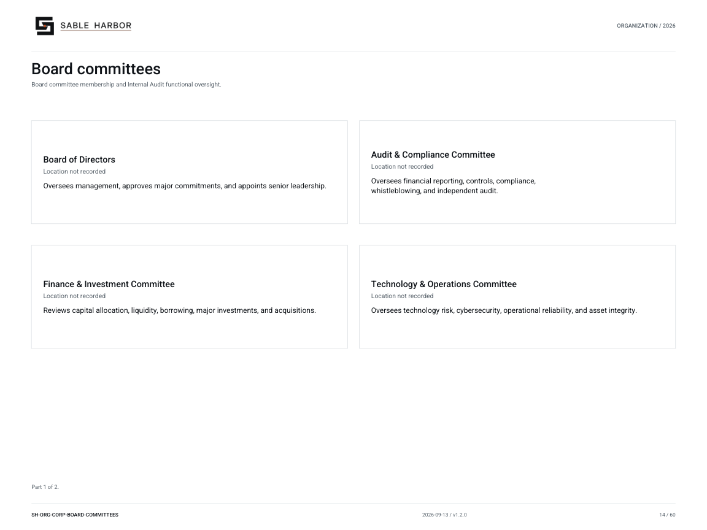

# Internal Audit

[Wiki home](../Home.md) · [Departments](README.md) · [All files](../Files.md)

Internal Audit examines governance, controls and operations independently of the managers responsible for them. It sets its audit scope, methods, findings and communications under its charter and the oversight of the Audit & Compliance Committee.

## Independent review

An audit starts with a question, a period and a population to test. Workpapers record the procedure, selected evidence, results and review. Management remains responsible for its controls and remediation. The [audit practice guide](../Audit.md) brings together the training workspace, accounting cases and assessment tools.

## Documents

- [Assessment workpapers and evidence requests](../../../enterprise/ccf/assurance/README.md) — Follow requirement, implementation, period, population, procedure and independent review; generated plans are not performed tests.
- [Independence doctrine](../../../docs/governance/ENTERPRISE_SUPPORT_SERVICES_AND_INDEPENDENCE.md) — Read the protected reporting and communication boundaries.
- [Audit & Compliance Committee charter](../../../docs/governance/committees/AUDIT_AND_COMPLIANCE_COMMITTEE_CHARTER.md) — Functional accountability and oversight.
- [Committee reader edition](../../../docs/governance/publications/SH-GOV-COM-AUDIT-001_v1.0.0.pdf) — Controlled PDF.
- [Control preparation exercises](../../../enterprise/ccf/README.md) — Public synthetic testing examples and explicit coverage limitations.
- [Runtime assurance scope](../../../enterprise/runtime/docs/ASSURANCE_SCOPE.md) — Distinguish design evidence from actual operation.

## Organization

[Organization chart and roster](../../organization/charts/corporate-board-committees.md) · [Complete chart book](../../organization/assets/current/Sable-Harbor-Organization-Charts.pdf).

## Related reading

- [Board and committees](board.md)
- [Risk & Compliance](risk-compliance.md)
- [Finance](finance.md)
- [Continuity and crisis responsibilities](../subjects/Continuity.md)

About this article

**Canon state:** LOCKED institutional scope; implementation detail varies by linked record.
**Reviewed:** October 7, 2026. Supporting documents retain their own dates and status.

