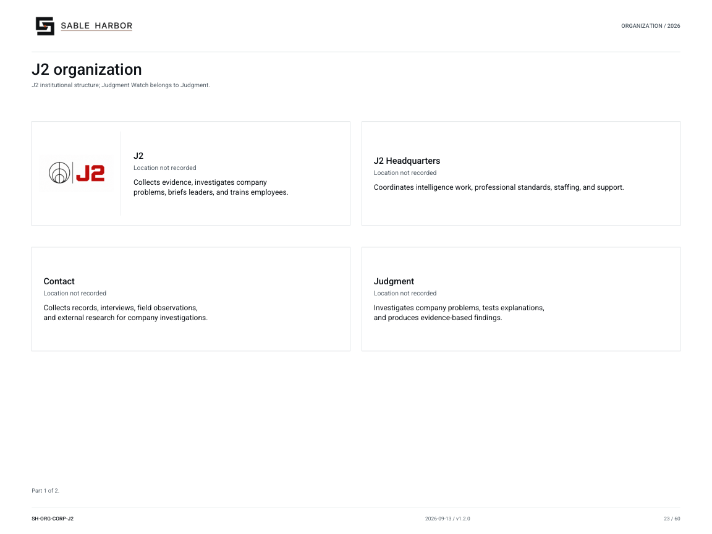

# J2 — Judgment & Junction

[Wiki home](../Home.md) · [Departments](README.md) · [All files](../Files.md)

J2 — Judgment & Junction — helps Sable Harbor understand its work. Contact gathers evidence, Judgment investigates problems, Orientation briefs leaders, JAG works alongside operating teams, and Education turns experience into learning. J2 sits outside Enterprise Support Services. Executives retain operating authority and Internal Audit retains independent assurance.

## Evidence, investigation and learning

The establishment contains 237 billets. The [people charts](../../organization/charts/people-j2.md) show recorded leaders and roles; the [Alexandria guide](alexandria.md) explains the records environment used to connect evidence and decisions.

## Documents

- [J2 source library](../../../docs/j2/README.md) — Complete institutional and arm-specific doctrine.
- [Establishment](../../../docs/j2/J2_ESTABLISHMENT.md) — 237 authorized billets across Contact, Judgment, Orientation, JAG, Education and headquarters.
- [Approved leadership](../../../docs/canon/J2_LEADERSHIP_APPOINTMENTS_2026-09-10.md) — Six current leaders and company joining years.
- [Headquarters doctrine](../../../docs/j2/J2_HEADQUARTERS.md) — Professional standards, staffing and institutional support.
- [Current leadership chart](../../../docs/organization/charts/people-j2.md) — Approved leader cards.
- [Contact](../../../docs/wiki/departments/contact.md) — Collection requirements and evidence handoff.
- [Judgment](../../../docs/wiki/departments/judgment.md) — Individual investigations and Problem Books.
- [Orientation](../../../docs/wiki/departments/orientation.md) — Enterprise questions, briefings and institutional knowledge.
- [JAG](../../../docs/wiki/departments/jag.md) — Rotating field teams.
- [Education](../../../docs/wiki/departments/education.md) — Teaching and professional formation.
- [Alexandria](../../../docs/wiki/departments/alexandria.md) — Institutional records, provenance and portal doctrine.
- [Controlled J2 publications](../../../docs/j2/publications/README.md) — Download the reader editions.

## Organization

[Organization chart and roster](../../organization/charts/corporate-j2.md) · [Complete chart book](../../organization/assets/current/Sable-Harbor-Organization-Charts.pdf).

## Related reading

- [Contact](contact.md)
- [Judgment](judgment.md)
- [Orientation](orientation.md)
- [J2 Education](education.md)

About this article

**Canon state:** LOCKED institutional scope; implementation detail varies by linked record.
**Reviewed:** October 7, 2026. Supporting documents retain their own dates and status.

