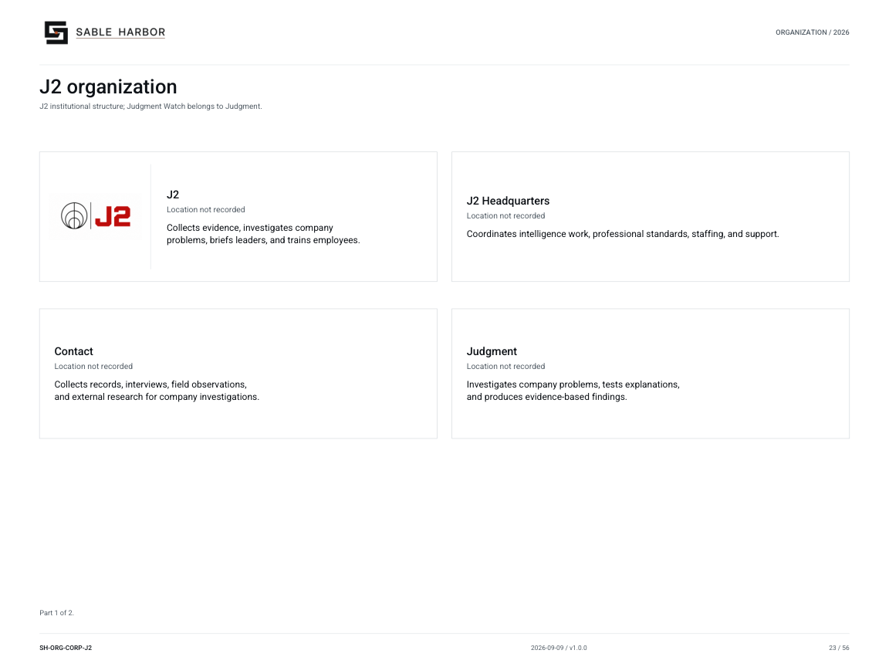

# Judgment

**Canon state:** LOCKED DIRECTION doctrine; LOCKED establishment and current leadership. 
**Last substantive review:** September 11, 2026. This page is secondary navigation; the linked source records control.

Judgment Officers investigate defined company problems, test explanations against evidence and maintain living Problem Books. Judgment Watch screens and connects incoming material without taking ownership of resulting cases.

## Read and use the records

- [Judgment doctrine](../../../docs/j2/JUDGMENT.md) — Commissions, Problem Books, challenge, dissent and closure.
- [Judgment Officer profession](../../../docs/j2/JUDGMENT_OFFICER_PROFESSION.md) — Professional responsibilities and working practice.
- [Judgment reader edition](../../../docs/j2/publications/SH-J2-JUDGMENT-001_v1.0.0.pdf) — Controlled PDF.
- [Establishment](../../../docs/j2/J2_ESTABLISHMENT.md) — 42 authorized Judgment billets.
- [Leadership appointments](../../../docs/canon/J2_LEADERSHIP_APPOINTMENTS_2026-09-10.md) — Anika Trish is Head of Judgment; joined in 2021.

## Organization and identity

[Current chart and all of its pages](../../organization/charts/corporate-j2.md) · [Complete organization publication](../../organization/assets/current/Sable-Harbor-Organization-Charts.pdf).

The shared chart retains its original scope; it is not a new reporting chart for this page. The approved J2 mark above identifies the parent institution.

## Boundaries and unresolved detail

A Judgment Officer can investigate and bring a question to institutional attention, but cannot command operations or replace Internal Audit.

[Department and institution directory](README.md) · [Wiki home](../Home.md)
