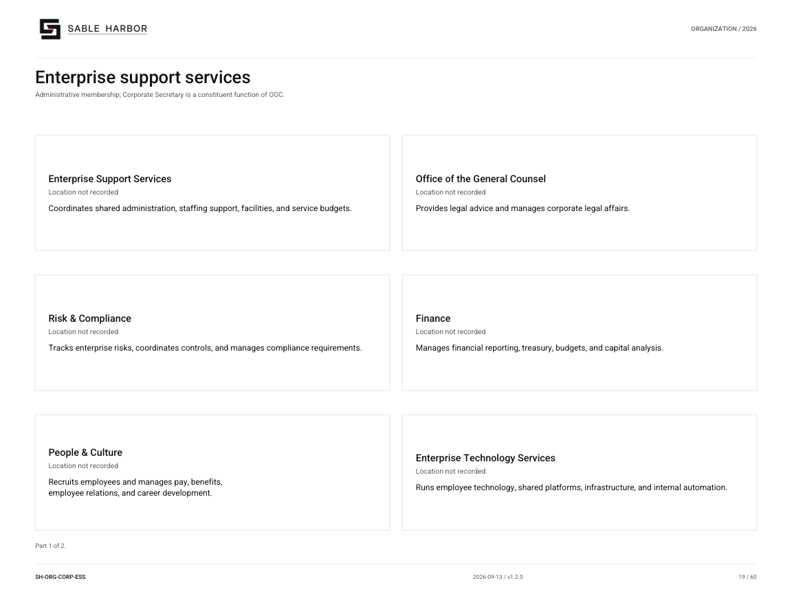

# Quality and technical standards

[Wiki home](../Home.md) · [Departments](README.md) · [All files](../Files.md)

Quality and technical standards maintains shared requirements where consistent practice benefits the enterprise. Professional practices look after the methods; businesses apply them to their own work and remain responsible for daily operations.

## Common methods and technical standards

A transfer from research into operations needs business-specific qualification evidence. The relevant operating records show the conditions tested and whether the proposed equipment or process is ready for use.

## Documents

- [Headquarters closeout](../../../docs/canon/CORPORATE_HEADQUARTERS_CLOSEOUT_2026-09-03.md) — Sections 2 and 13 establish scope and professional-practice boundaries.
- [ESS doctrine](../../../docs/governance/ENTERPRISE_SUPPORT_SERVICES_AND_INDEPENDENCE.md) — Quality stewardship within shared support.
- [Industrial operating material](../../../industrial/operations/README.md) — Find business-specific technical constraints and outputs.
- [Control catalog](../../../docs/controls/COMMON_CONTROL_CATALOG_v0.1.md) — Browse accepted framework statements and qualification limits.

## Organization

[Organization chart and roster](../../organization/charts/corporate-enterprise-support.md) · [Complete chart book](../../organization/assets/current/Sable-Harbor-Organization-Charts.pdf).

## Related reading

- [Willow](../businesses/Willow.md)
- [Project Cradle](../businesses/Cradle.md)
- [Safety and environmental governance](safety-environment.md)
- [Enterprise Technology Services](technology.md)

About this article

**Canon state:** LOCKED institutional scope; implementation detail varies by linked record.
**Reviewed:** October 7, 2026. Supporting documents retain their own dates and status.

