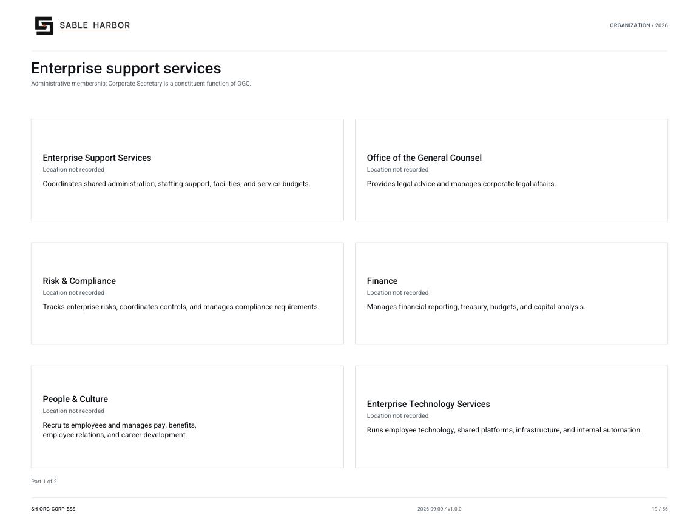

# Enterprise security capability

**Canon state:** LOCKED institutional scope; implementation detail varies by linked record. 
**Last substantive review:** September 11, 2026. This page is secondary navigation; the linked source records control.

The enterprise security capability protects systems and data and manages cybersecurity incidents. The CISO retains an independent security authority boundary within the enterprise support environment.

## Read and use the records

- [Technology and security doctrine](../../../docs/governance/ENTERPRISE_TECHNOLOGY_SERVICES_DOCTRINE.md) — Security authority, engineered controls and monitoring boundaries.
- [Accepted security/vendor direction](../../../docs/controls/CCF_ENTERPRISE_SECURITY_VENDOR_DECISIONS_2026-09-11.md) — Read the current enterprise security and sourcing decisions.
- [Runtime controls and evidence](../../../docs/controls/RUNTIME_CONTROL_AND_EVIDENCE_MATRIX_2026-09-11.md) — Follow local runtime controls and their evidence expectations.
- [CCF preparation](../../../enterprise/ccf/README.md) — Synthetic identity and recovery checks.
- [Runtime assurance scope](../../../enterprise/runtime/docs/ASSURANCE_SCOPE.md) — Actual implementation and evidence limits.

## Organization and identity

[Current chart and all of its pages](../../organization/charts/corporate-enterprise-support.md) · [Complete organization publication](../../organization/assets/current/Sable-Harbor-Organization-Charts.pdf).

The shared chart retains its original scope; it is not a new reporting chart for this page. The approved corporate mark above identifies the parent institution.

## Boundaries and unresolved detail

“Enterprise Security” is the current chart’s capability label; it does not establish a newly named department. System monitoring is not generalized employee surveillance.

[Department and institution directory](README.md) · [Wiki home](../Home.md)
