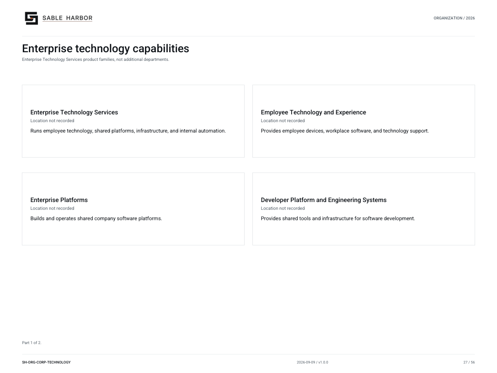

# Enterprise Technology Services

**Canon state:** LOCKED institutional scope; implementation detail varies by linked record. 
**Last substantive review:** September 11, 2026. This page is secondary navigation; the linked source records control.

Technology Services runs employee technology, shared platforms, developer systems, compute infrastructure and reliability services. Product engineering remains within the businesses.

## Read and use the records

- [Technology doctrine](../../../docs/governance/ENTERPRISE_TECHNOLOGY_SERVICES_DOCTRINE.md) — Read the seven technology capability areas and autonomy/security boundaries.
- [Controlled technology publication](../../../docs/governance/publications/SH-ITS-001_v1.0.0.pdf) — Reader edition.
- [Service register and requirements](../../../enterprise/services/README.md) — Services, workload requirements, dependencies and cost comparison.
- [Runtime estate](../../../enterprise/runtime/README.md) — Accepted synthetic runtime design, hosting, finance and recovery records.
- [Architecture and procedures](../../../enterprise/runtime/docs/ARCHITECTURE_AND_RUNBOOKS.md) — Runtime design and operational reference procedures.

## Organization and identity

[Current chart and all of its pages](../../organization/charts/corporate-technology-capabilities.md) · [Complete organization publication](../../organization/assets/current/Sable-Harbor-Organization-Charts.pdf).

The shared chart retains its original scope; it is not a new reporting chart for this page. The approved corporate mark above identifies the parent institution.

## Boundaries and unresolved detail

The runtime package is an accepted synthetic design, not an operating estate. Professional colocation and recovery locations do not become Sacramento campus data centers.

[Department and institution directory](README.md) · [Wiki home](../Home.md)

[Continuity and crisis responsibilities across the existing institutions](../subjects/Continuity.md).
