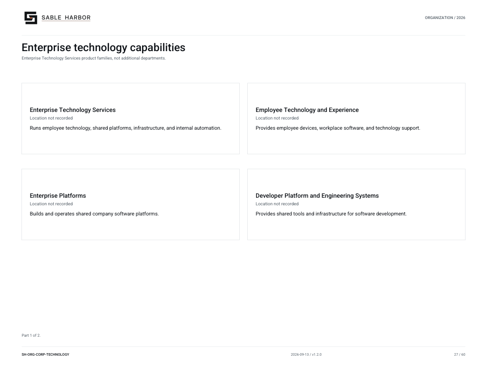

# Enterprise Technology Services

[Wiki home](../Home.md) · [Departments](README.md) · [All files](../Files.md)

Technology Services runs employee technology, shared platforms, developer systems, compute infrastructure and reliability services. Product engineering belongs to the businesses that build the products. Shared identity, security and delegated authority support the work across both.

## Employee technology and shared infrastructure

The runtime records describe the accepted design and its implementation dependencies. Supplier acceptance, installed services and production qualification are documented stages of putting that design into operation.

## Documents

- [Technology doctrine](../../../docs/governance/ENTERPRISE_TECHNOLOGY_SERVICES_DOCTRINE.md) — Read the seven technology capability areas and autonomy/security boundaries.
- [Controlled technology publication](../../../docs/governance/publications/SH-ITS-001_v1.0.0.pdf) — Reader edition.
- [Service register and requirements](../../../enterprise/services/README.md) — Services, workload requirements, dependencies and cost comparison.
- [Runtime estate](../../../enterprise/runtime/README.md) — Accepted synthetic runtime design, hosting, finance and recovery records.
- [Architecture and procedures](../../../enterprise/runtime/docs/ARCHITECTURE_AND_RUNBOOKS.md) — Runtime design and operational reference procedures.

## Organization

[Organization chart and roster](../../organization/charts/corporate-technology-capabilities.md) · [Complete chart book](../../organization/assets/current/Sable-Harbor-Organization-Charts.pdf).

## Related reading

- [Enterprise security capability](security.md)
- [Alexandria institutional environment](alexandria.md)
- [Procurement and vendor support](procurement.md)
- [Continuity and crisis responsibilities](../subjects/Continuity.md)

About this article

**Canon state:** LOCKED institutional scope; implementation detail varies by linked record.
**Reviewed:** October 7, 2026. Supporting documents retain their own dates and status.

