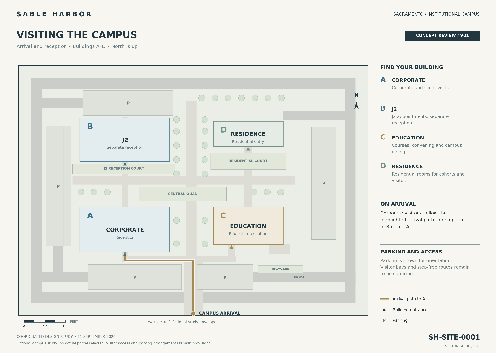

# Sacramento visitor map — first review draft

**Site:** SH-SITE-0001 · **Draft:** V01 · **State:** awaiting exact-file owner visual review.

[Review side by side](review.html) · [Draft PNG](artifacts/visitor-map-v01.png) · [PDF](artifacts/visitor-map-v01.pdf) · [Editable SVG](artifacts/visitor-map-v01.svg) · [Source](SOURCE.json) · [Manifest](MANIFEST.json)



This single visitor overview follows the approved campus composition and R01 sheet family. It identifies the four buildings, their source-supported entrances, the existing arrival path to Corporate reception, parking areas, bicycles and drop-off. It removes workplace/area statistics from the visitor-facing sheet. It does not allocate visitor parking or certify accessible routes.

The [approved campus source](../source/campus.json) supplies all site geometry. All four original R01 hashes are checked before rendering. The new blue/sage/sand building fills are an intentional use of the approved palette; the reference master used white building interiors. Individual parking bays are deliberately omitted. The original images, models, published atlas and map manifests are unchanged.

The draft has no production map allocation. Following visual acceptance, allocate a successor through the existing MAP_ID_REGISTER and integrate the approved individual sheet into the atlas manifest and reader library. The existing site ID identifies the draft without inventing another production naming system.

## Review and reproduce

From the repository root, with existing facilities dependencies installed:

```bash
python geospatial/facilities/visitor/build.py
python geospatial/facilities/visitor/validate.py
python -m http.server 8766 --bind 127.0.0.1
```

Open `http://127.0.0.1:8766/geospatial/facilities/visitor/review.html`. The page also opens directly as a local file. Use side-by-side or full-width views and open an image directly for full-resolution inspection. The three review questions are arrival, building identification, and visual continuity with R01.

Validation checks source/artifact hashes, all four reference originals, the four entrances, arrival-path containment within the accepted walking geometry, absence of routes through buildings, SVG validity, PDF page/text bounds and key labels. Visual acceptance remains separate from these checks.

This is a fictional campus planning study. Parcel, construction, visitor operation and engineering access arrangements remain unestablished. No general-purpose sign system or further map family is included.
