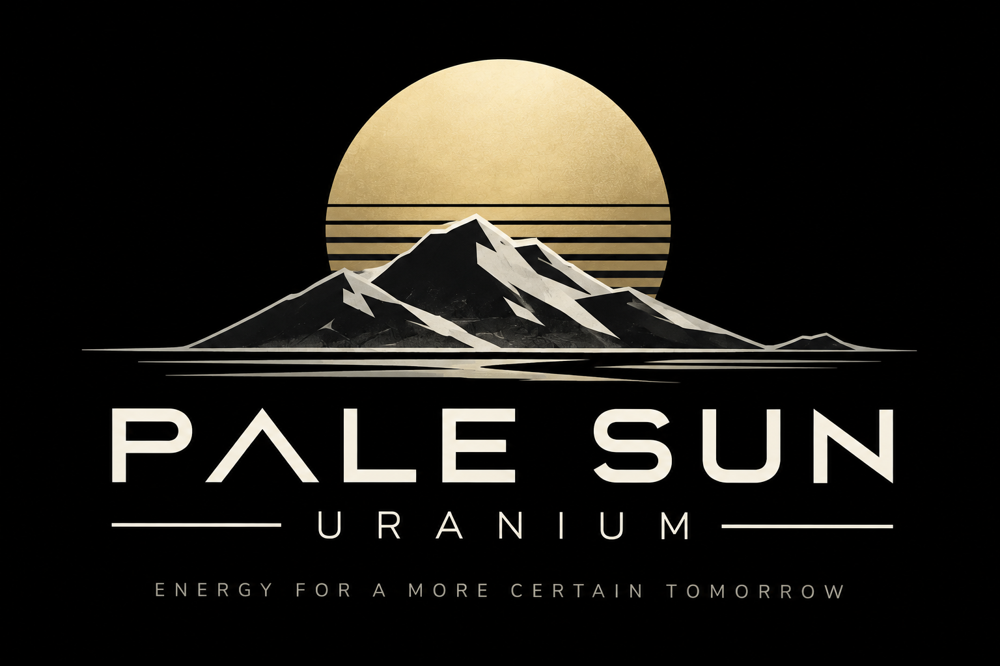
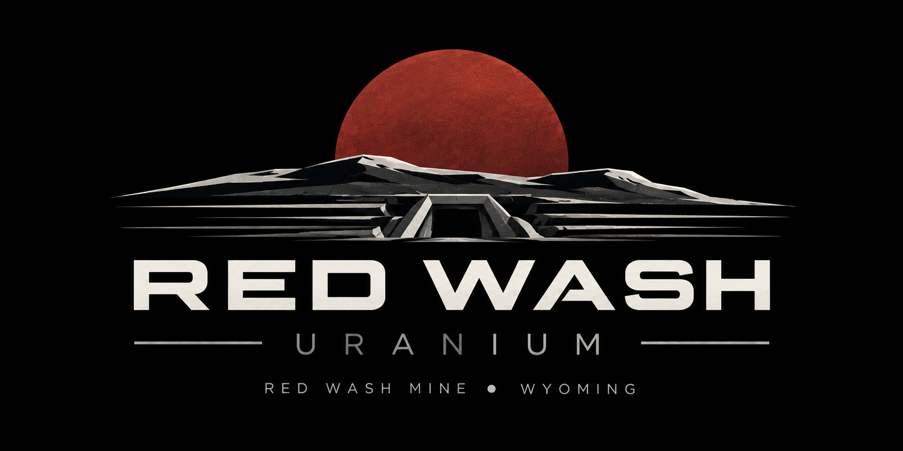
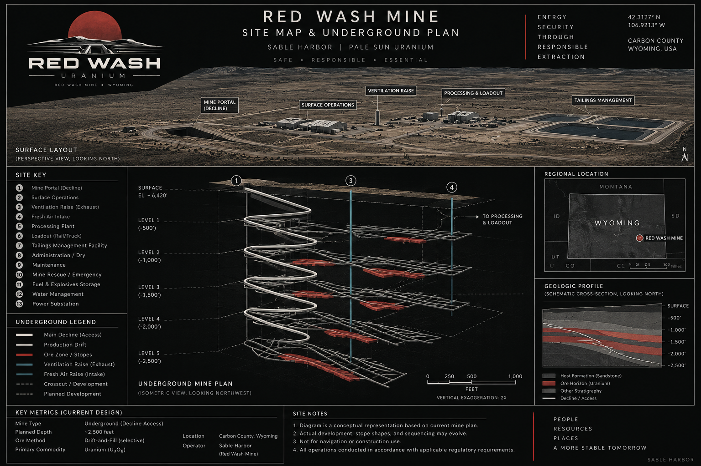

# Red Wash Transaction and Operating Record

**Record:** `SH-PS-RW-TOR-001`
**Version:** 1.0.0
**Synthetic calibration through:** 2026-08-31
**Canon reconciled through:** 2026-09-05
**Classification:** `PUBLIC_SYNTHETIC_DIEGETIC`
**Epistemic mode:** `RETROSPECTIVE_CURRENT_CANON`

> This package belongs to the fictional Sable Harbor enterprise. Agency names, legal frameworks,
> and external benchmarks are real only where identified in the source register. Red Wash parties,
> permits, contracts, measurements, generated rows, and financial records are synthetic unless a
> record explicitly says otherwise.

This is Sable Harbor's controlled public Red Wash acquisition and commodity-operating case. The
owner has approved the selected transaction and 2026 operating baseline. Approval fixes the case
used for this publication; it does not turn generated evidence into observed or audited history.

## Operating chain

> Geology → resource basis → mine plan → ore → mill recovery → product → inventory → contracts →
> custody → invoice → cash → statements and valuation.

The limited ARU/BS&T bridge follows a separate causal chain:

> 2025 carrier-market pressure → fictional carrier consolidation → Red Wash lane-capacity loss →
> preserved annual delivery → replacement-carrier search → rail mapping → ARU/BS&T discovery →
> gated interface screen.

ARU was not a pre-existing Red Wash vendor, carried no Red Wash material in 2025, and receives no
automatic uranium-custody authority. The $15 million interface amount is an unbooked preliminary
screen. The complete ARU transaction and operating case remains open and outside this package.

## Source, generated, and release boundaries

- `source/` contains the three manually controlled input records.
- `generated/` is an ignored build directory rebuilt from empty by the canonical generator; its
  27 CSV datasets ship in the verified release artifact rather than as self-referential source.
- `dist/` is an ignored build directory containing the deterministic SQLite database and database
  manifest; CI stages the broader release artifact from an explicit public allowlist.
- Unexpected source or generated files are rejected; stale files cannot satisfy validation.
- The generation manifest's RFC3339 `built_at` is deterministically normalized from the controlled
  `prepared_at` date to `00:00:00Z`; it is a reproducibility coordinate, not wall-clock execution
  time. `REQUIRES_EXACT_RELEASE_MANIFEST_BINDING` remains a policy state until a post-merge release
  manifest supplies the exact commit-binding evidence.

## Navigation

| Area | Entry point |
|---|---|
| Controlling transaction/operating record | `../docs/canon/RED_WASH_TRANSACTION_OPERATING_RECORD_2026-09-05.md` |
| Decision-register closeout | `../docs/canon/DECISION_REGISTER_ADDENDUM_2026-09-05_RED_WASH.md` |
| Integrated casebook | `RED_WASH_CASEBOOK.md` |
| Structured transaction/operating record | `../docs/structured/red_wash_transaction_operating_record.json` |
| ARU/BS&T interface record | `logistics/ARU_BST_INTERFACE_AND_DEPENDENCY_RECORD.md` |
| Structured ARU/BS&T bridge | `../docs/structured/aru_bst_red_wash_bridge.json` |
| Controlled core input | `source/core_operating_data.json` |
| Controlled bridge input | `source/aru_bst_bridge.json` |
| External evidence register | `source/external_source_register.csv` |
| Canonical generator | `tools/build_red_wash_package.py` |
| Compatibility entry point | `tools/generate_red_wash_corpus.py` |
| Validator | `tools/validate_red_wash_record.py` |
| Visual control | `../assets/brand/red_wash_visual_manifest.json` |

## Authority and evidence states

Canon-document decisions use the repository's `LOCKED`, `PROVISIONAL`, `OPEN`, and supersession
vocabulary. Machine records preserve separate finance `fact_state` and constitutional
`epistemic_state` fields. In particular:

- an owner-approved selected case may be `LOCKED` as a decision;
- an input inside that case may remain `SCENARIO_INPUT`, `MODEL_PROPOSED`, or
  `PROVISIONAL_ASSUMPTION`;
- generated rows remain `SYNTHETIC_INSTANCE`;
- arithmetic and accounting outputs remain `DERIVED`;
- cited real-world observations remain `EXTERNAL_RESEARCH` with dates and limitations;
- unresolved ARU implementation details remain `OPEN`.

There is no `ACTUAL` layer in this package. January–August 2026 rows are shared synthetic
calibration; September–December rows are selected synthetic-scenario forecasts.

## Visual originals

The approved Pale Sun logo, Red Wash logo, site overview, and underground plan are present at their
canonical paths and verified against the exact hashes in the visual manifest. They must not be
recompressed or replaced. Any derivative uses a different filename and independent provenance.

| Approved original | Repository view |
|---|---|
| Pale Sun logo |  |
| Red Wash logo |  |
| Red Wash site overview |  |
| Red Wash underground plan |  |

## Public/private boundary

This repository contains company-facing evidence and decisions only. The private Alexandria case
may bind to the exact final public merge commit after this record reaches `main`; no statement here
claims that binding already exists. Nonpublic evaluation material does not belong in this package.
