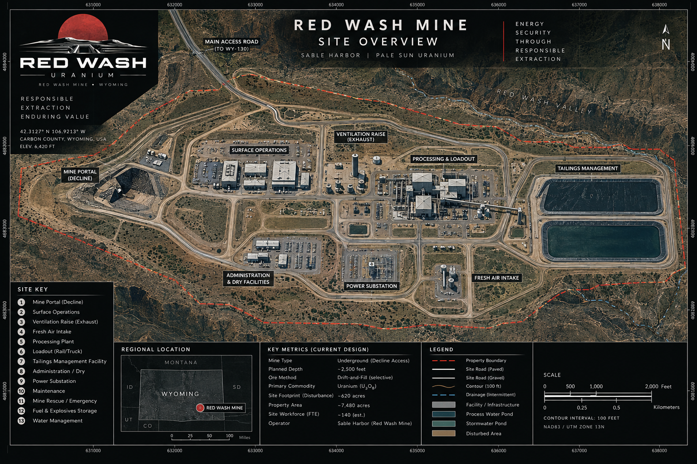

# Red Wash Transaction and Operating Casebook

The owner-approved [Red Wash logo](../assets/brand/logos/red_wash__canonical.png),
[Pale Sun logo](../assets/brand/logos/pale_sun__canonical.png),
[site overview](../assets/brand/maps/red_wash__site_overview.png), and
[underground plan](../assets/brand/maps/red_wash__underground_plan.png) are controlled
byte-exact originals. The [visual manifest](../assets/brand/red_wash_visual_manifest.json)
governs their paths and hashes.

**Case ID:** `SH-PS-RW-TOR-001`
**Version:** 1.0.0
**Synthetic calibration through:** 2026-08-31
**Classification:** PUBLIC SYNTHETIC DIEGETIC

> This is a fictional Sable Harbor record constructed inside real U.S. uranium, mining, environmental, safety and commercial frameworks. Permit numbers, parties, contracts, operating facts and amounts are synthetic. External agencies, legal frameworks and cited public sources are real.

---

## 1. Case purpose

Red Wash is Sable Harbor's selected acquisition and commodity-operating case. Blackridge asks how competent people collectively fail when meaning, timing, authority and physical reality do not travel together. Red Wash asks a different question:

> Can a buyer determine what it is actually acquiring when the geology, permits, equipment, environmental obligations, contracts, people, accounting and operating history are individually plausible but do not reconcile cleanly as one asset?

The evidence universe is designed so a serious reviewer can reconstruct the deal from first principles rather than accept management's headline valuation. The causal chain is:

> geology → mineable shapes → development sequence → ore tons and grade → mill feed domain → recovery → product lots → drums and inventory → contracts → custody → invoice → cash → statements → valuation → purchase accounting.

No preferred margin or return is imposed after the fact. The operating and financial outcomes follow the accepted physical and commercial assumptions.

---

## 2. Asset identity

The governing September5,2026 addendum supersedes the Carbon County scenario. Red Wash is a fictional underground uranium mine in the Great Divide Basin / Red Desert, Sweetwater County, Wyoming, north of Wamsutter, with a user-approved working map anchor at42.22N,108.18W. The point is not a surveyed portal, real mine identity or property title. Earlier elevation, acreage and disturbance metrics remain scenario inputs pending revalidation at the new anchor. See `geospatial/docs/RED_WASH_LOCATION_SUPERSESSION_NOTE.md`.

The mine uses selective drift-and-fill mining with cemented paste backfill. Access is by decline. The current operating plan extends through five principal levels to an approximate maximum depth of 2,500 feet. Ore is trucked to surface, crushed, ground, acid leached, washed, purified, precipitated, dried and packed as U3O8 concentrate. Red Wash does not enrich uranium or fabricate nuclear fuel.

Pale Sun is the Sable Harbor business line that owns the operating thesis. Red Wash operates through a dedicated legal operating company. Pale Sun is not itself a separate legal entity merely because it has a name.

---

## 3. Ownership and development archaeology, 2004–2026

### Frontier Basin Minerals LLC — 2004–2007

Frontier Basin assembled federal claims, state leases, surface-access rights and historical exploration records beginning in 2004. It reprocessed airborne radiometric work, digitized 1970s drill logs and completed the first modern core program in 2006. The work established stacked mineralized sandstone lenses rather than one continuous tabular orebody.

### Carbon Basin Uranium Corp. — 2007–2010

Carbon Basin acquired Frontier Basin in September 2007, expanded drilling, completed initial bottle-roll and column-leach tests and issued the first internal resource estimate in 2008. Falling uranium prices and the financing environment delayed construction. Carbon Basin nevertheless advanced the federal plan-of-operations, environmental and source-material licensing packages far enough to make the property acquirable rather than merely speculative.

### Northstar Resources — 2010–2025

Northstar Resources is the provisional seller display name; its exact legal name, suffix, and jurisdiction remain open. In the selected synthetic history, Northstar acquired the project in December 2010, completed permitting, constructed the decline and a compact conventional mill, and shipped first concentrate in 2013. Production rose through 2016. Western-lens dilution, commodity weakness and deferred development then reduced performance. The mine entered limited care and maintenance in 2018, remained constrained through the pandemic, and underwent staged restart work in 2021–2023.

Northstar's 2024 operating year looked materially stronger than the underlying system. Throughput and sales increased, but reported EBITDA benefited from liquidation of lower-cost legacy inventory, capitalization of work that did not create new asset capability, delayed environmental work and below-market affiliated services.

### Sable Harbor / Pale Sun — from 18 July 2025

Sable Harbor acquired the operating company on 18 July 2025 after walking away from a seller re-trade and returning only after liability, escrow, price and continuity terms changed. Pale Sun began an $11.0 million H2 2025 stabilization program immediately after closing. The selected 2026 commercial operating case is not a mine-shaped technology demonstration.

---

## 4. Geology and resource basis

Mineralization occurs in stacked, permeable fluvial sandstones of the lower Eocene Wasatch Formation along reduced–oxidized interfaces. Uranium occurs primarily as coffinite/uraninite with secondary oxidation products near altered margins. Five operating domains are used:

1. North Roll;
2. Central Lens;
3. East 12;
4. Lower Channel;
5. South Limb.

The acquisition database contains a deterministic 240-hole collar population, 720 downhole-survey stations and 2,400 assay intervals. It also contains standards, blanks and duplicates so data-quality review is part of the case rather than a paragraph asserting quality.

The selected internal operating basis is a supported synthetic estimate of 2.5 million short tons at 0.170% U3O8, containing approximately 8.5 million pounds and yielding an estimated 7.82 million recoverable pounds at the operating recovery basis. A further 0.9 million tons at 0.145% is treated as inferred exploration inventory and excluded from the base valuation and mine plan.

The principal geological diligence correction concerns East 12. Northstar's 2024 wireframes used smoothing and continuity assumptions that converted several locally supported lenses into mineable continuity. Sable Harbor re-blocked the domain, excluded unsupported stope shapes and preserved the remaining material as upside. The correction did not destroy the asset. It made the base case smaller and more defensible.

The resource basis is an internal acquisition and operating estimate. It is not represented as a public S-K 1300 reserve disclosure.

---

## 5. Mine plan and physical operating system

The 2026 plan mines 175,000 short tons at 0.170% U3O8. The physical sequence is:

- development and ground support;
- face sampling and grade-control release;
- selective drilling and blasting;
- load–haul–dump extraction;
- underground haulage to decline transfer;
- surface stockpile by geometallurgical domain;
- controlled mill blending;
- cemented paste backfill;
- survey and reconciliation.

The mine is intentionally selective. Dilution control matters more than maximum bulk movement. The 2014–2016 record shows why: changes in ore-control cutoff, local continuity and field classification could produce internally consistent records while moving a materially different physical feed.

The site establishment is 128 people. The Pale Sun business layer adds 12, for a combined 140 FTE. Site organization includes mine operations, maintenance, mill/process, geology/resource, safety/radiation, environmental/permitting, supply/warehouse, administration/finance/P&C and emergency/security capability.

Cole, the long-serving site superintendent, receives explicit temporary stop authority when observed conditions differ materially from the assumptions under which work was authorized. The authority creates a required disposition; it does not make the underlying claim automatically true.

### September 2025 stop event

On 14 September 2025, Cole stopped work after a combination of support loading, sound, convergence behavior and local condition changes appeared wrong even though no single modeled parameter had breached its normal limit. Instrumentation subsequently recorded approximately 14 mm of convergence consistent with the concern. The record preserves:

- what was observed;
- what Cole believed;
- the basis that could and could not be articulated;
- the authority exercised;
- the conservative action;
- later evidence;
- remaining uncertainty.

The shorthand “Cole was right” is not the accounting of the event. The accounting is that a defined authority made a defensible conservative decision under uncertainty, and later evidence was consistent with the concern.

---

## 6. Processing, metallurgy and product

The 600-ton-per-day nameplate mill uses a conventional small-mill flowsheet:

1. run-of-mine receiving and domain-controlled stockpiles;
2. primary jaw and secondary cone crushing;
3. closed-circuit grinding;
4. sulfuric-acid leach with controlled oxidation;
5. counter-current washing/solid–liquid separation;
6. solution clarification and impurity control;
7. ion-exchange or solvent-extraction purification;
8. precipitation;
9. thickening, filtration, drying and controlled calcination;
10. drum loading, weighing, sampling, sealing and licensed storage.

The modeled 2026 mass balance is:

- 175,000 short tons milled;
- 0.170% U3O8 head grade;
- 595,000 contained pounds;
- 92.0% recovery;
- 547,400 pounds U3O8 product.

Lower Channel material is carbonate-sensitive. Acid consumption and recovery do not move linearly once feed exceeds the controlled blend envelope. The operating model therefore carries feed-domain constraints rather than one universal mill-recovery percentage detached from mine sequencing.

Finished product remains source material. It is packed in numbered, weighed and sealed drums with lot-level assay, moisture, chain-of-custody and exception records. Final commercial settlement occurs after receipt and assay at the licensed conversion-facility delivery point.

---

## 7. Permitting and regulatory architecture

The synthetic permit register is built against the real framework applicable to a Wyoming conventional uranium mine and mill. It includes:

- Bureau of Land Management plan of operations under 43 CFR Subpart 3809;
- environmental assessment and finding of no significant impact under NEPA;
- Wyoming DEQ non-coal mine permit and reclamation bond;
- source-material license under 10 CFR Part 40 and Appendix A, transferred into Wyoming's Agreement State program after 2018;
- air-quality permit;
- WYPDES industrial-stormwater authorization;
- groundwater-protection permit;
- tailings authorization under the source-material license and 40 CFR Part 192 framework;
- MSHA mine identification and 30 CFR metal/nonmetal compliance;
- explosives authorization;
- water-appropriation permits;
- radon-control program under 40 CFR Part 61 Subpart W;
- PHMSA hazardous-material registration and 49 CFR shipping controls.

A permit is evidence of authorization within its terms. It is not proof that the mine is economically operable, physically safe in every condition, environmentally complete or correctly represented in a transaction model.

---

## 8. Environmental history, tailings and closure

The environmental record includes groundwater wells, underdrain flow, uranium, sulfate, selenium, radium, pH, dust and radon observations. One key diligence problem is organizational rather than numerical: the Cell 1 underdrain records and the MW-17 trend were stored in different data-room folders and explained by different consultants. Individually, each record appeared manageable. Together, they required a more conservative corrective-action and closure case.

The evidence supports a causal concern between underdrain performance and the local monitoring trend. It does not establish off-site migration or a catastrophic release. The transaction response is therefore measured:

- raise the current-cost closure basis;
- create environmental/title escrow;
- fund corrective work;
- retain monitoring and reporting;
- preserve indemnity;
- avoid claiming either harmlessness or catastrophe beyond the evidence.

The accepted engineering current-cost closure basis is $25.0 million. The opening accounting ARO is $16.0 million after timing, inflation and discount assumptions. Principal scopes include progressive reclamation, underground sealing and demobilization, mill decontamination/demolition, tailings final cover, water treatment/monitoring, long-term surveillance transfer and contingency. Accounting ARO, engineering current cost and regulatory surety are not interchangeable numbers.

---

## 9. Safety, radiation and emergency record

The case contains reportable events, near misses, medical cases, property events and operating stops from commissioning through 2026. Examples include a 2013 hand injury, a 2014 unsupported-slab near miss, a 2015 ventilation interruption, a 2018 loader fire, a 2023 brake-temperature alarm, a 2024 sulfuric-acid splash and the September 2025 ground-control stop.

The operating system includes:

- ground-control plan and inspections;
- ventilation surveys and action levels;
- radiation-protection program;
- dosimetry, contamination and radon monitoring;
- hazardous-energy and confined-space controls;
- explosives management;
- emergency response and mine rescue interfaces;
- chemical handling and process safety;
- MSHA training and reporting;
- stop-work and temporary operating disposition authority.

The mine does not use safety as a narrative shortcut. A near miss is not automatically a hidden disaster, and an absence of injury is not proof that the decision process was sound.

---

## 10. Transaction chronology

The sequence, walk-away, return, changed risk allocation, and 18 July 2025 close are
selected canon. Except for that exact close date, these day-level dates are synthetic
scenario precision rather than independently LOCKED dates.

- **19 Aug 2024:** Mari Varela opens the western uranium “graveyard” review.
- **4 Oct 2024:** Northstar circulates an anonymous teaser.
- **18 Oct 2024:** mutual NDA executed.
- **1 Nov 2024:** virtual data room opens.
- **17 Jan 2025:** Sable Harbor submits a $34.0M indicative offer subject to liabilities.
- **7 Feb 2025:** LOI signed at $38.0M headline operating value.
- **14 Mar 2025:** East 12 continuity issue identified.
- **27 Mar 2025:** MW-17 and underdrain records connected.
- **11 Apr 2025:** seller raises price expectation to $48.0M.
- **5 May 2025:** exclusivity and drafting terminate.
- **29 May 2025:** Northstar returns with a liability-retention proposal.
- **6 Jun 2025:** revised term sheet sets $42.0M operating value, $28.0M cash and assumed liabilities.
- **20 Jun 2025:** final technical and QoE reports issued.
- **27 Jun 2025:** Sable Harbor Board authorizes the transaction.
- **2 Jul 2025:** Equity Purchase Agreement signed.
- **18 Jul 2025:** closing.
- **19 Jul 2025:** 100-day stabilization begins.

The walk-away is part of the value-creation record. Sable Harbor did not “win” by browbeating a seller. It refused to purchase an asset it could not yet value under terms that failed to allocate known exposure.

---

## 11. Purchase agreement and closing structure

The transaction is a purchase of the Red Wash operating company from the seller using the provisional display name Northstar Resources. The exact seller and operator legal names, suffixes, and jurisdictions remain open. Principal economics:

| Item | Amount |
|---|---:|
| Operating-asset fair value | $42.0M |
| Acquired current assets | $4.5M |
| ARO assumed | $(16.0)M |
| Other assumed liabilities | $(2.5)M |
| Net identifiable assets | $28.0M |
| Cash consideration | $28.0M |
| Goodwill / bargain purchase | $0 |
| Transaction debt | $0 |
| Environmental/title escrow | $3.0M |
| Holdback | $0.5M |

The principal closing set comprises NDA, LOI, revised term sheet, Equity Purchase Agreement, disclosure schedules, bill of sale, assignment and assumption, escrow agreement, transition-services agreement, utility consents, title curatives, officer certificates, funds-flow memorandum, working-capital statement and Cole retention/authority agreement.

Material representations cover organization, title, permits, environmental matters, mine safety, radiation records, resource data, financial statements, inventory, material contracts, taxes, employees, equipment and absence of undisclosed liabilities. Known environmental/title matters receive negotiated protection rather than an artificial representation that they do not exist.

---

## 12. Due diligence and forensic findings

Twenty-five integrated findings are tracked. The most material are:

- East 12 continuity overstatement;
- inconsistent historical grade-control cutoffs;
- nonlinear carbonate-feed recovery and acid consumption;
- Cell 1 underdrain / MW-17 integrated interpretation;
- incomplete seller closure scope;
- approximately $5.6M incremental deferred-maintenance exposure;
- inadequate ventilation control redundancy;
- mill MCC obsolescence;
- acquired-drum moisture/assay timing discrepancies;
- incorrect reference month in one pricing workbook;
- incomplete change-of-control consents;
- royalty step-up exposure;
- predecessor-name easements;
- water-permit purpose mismatch;
- undocumented combined-condition stop authority;
- retired-format dosimetry records;
- pollution-insurance known-condition exclusion;
- dependence on Cole and five technical veterans;
- 2024 quality-of-earnings distortion;
- lagged ad valorem accruals;
- unmanaged mill historian / business-network trust path;
- superseded resource models not clearly marked;
- reagent minimum-take exposure;
- incompatible custody timestamps;
- unrealistic community-consultation schedule.

### Quality of earnings

| Adjustment | Amount |
|---|---:|
| Seller-reported 2024 EBITDA | $7.1M |
| Inventory liquidation benefit | $(2.7)M |
| Capitalized repair normalization | $(1.1)M |
| Deferred environmental monitoring | $(0.5)M |
| Related-party service undercharge | $(0.4)M |
| **Normalized 2024 EBITDA** | **$2.4M** |

The normalized figure is a forensic baseline, not the primary valuation method. The asset is valued through resource, replacement cost, operating cash flow, rehabilitation, closure and downside cases.

---

## 13. 2026 uranium contract book and logistics

The 2026 book contains three term arrangements and one discretionary placement:

| Arrangement | Pounds | Modeled realized price |
|---|---:|---:|
| Base-escalated term contract | 150,000 | $61/lb |
| Market-related term contract with collar | 150,000 | $72/lb |
| Fixed-price term contract | 125,000 | $80/lb |
| Discretionary placement | 75,000 | $87/lb |
| **Total / weighted average** | **500,000** | **$72.95/lb** |

The buyers are synthetic utility/purchasing entities. Delivery occurs to a licensed conversion-facility point in Illinois. Title transfers only after receiving confirmation and final assay under the applicable contract.

Product is moved by qualified external carriers under documented package, drum, seal, weight, assay, shipping-paper, emergency-response, receipt and exception controls. ARU/BS&T had no pre-existing Red Wash relationship and does not retroactively enter any 2025 shipment. No acquisition or interface screen automatically grants it authority to carry source material. The custody-timestamp incident is handled by preserving each source record and holding the next movement until the representation is corrected; intact seals and present material do not justify rewriting inconsistent source times into false certainty.

### Limited ARU/BS&T bridge

A fictional 2025 carrier consolidation, situated within a real soft but costly and uneven freight market, reduces qualified capacity allocated to the low-frequency Red Wash lane. A delivery window is rescheduled, creating a real operational warning without lost annual sales or a change to 2025 annual revenue.

Red Wash first searches for another qualified carrier. The search broadens to rail-access mapping, where the question “Whose line is this?” surfaces American Resource Utility and Blood, Sweat & Tears Railway through operating analysis. They are not a turnkey answer: there is no direct mine connection, suitable secure transload, or demonstrated uranium-specific capability. The $15.0 million interface number is an unbooked preliminary screen. Limited service can begin only after applicable gates, no automatic uranium custody is authorized, and the complete ARU/BS&T case remains open.

---

## 14. 2026 operating and financial record

The 2026 model uses shared `SYNTHETIC_CALIBRATION` rows through 31 August and `MANAGEMENT_FORECAST` rows for September through year-end. Neither layer is observed or audited historical actual.

### Physical result

| Measure | 2026 |
|---|---:|
| Ore mined/milled | 175,000 tons |
| Head grade | 0.170% U3O8 |
| Contained uranium | 595,000 lb |
| Recovery | 92.0% |
| Product | 547,400 lb |
| Opening finished inventory | 125,000 lb |
| Sales | 500,000 lb |
| Ending finished inventory | 172,400 lb |

### Income statement

| Line | 2026 |
|---|---:|
| Uranium revenue | $36.475M |
| Cash production cost of sales | $(24.967)M |
| DD&A in cost of sales | $(3.114)M |
| Production/mineral taxes | $(2.125)M |
| Royalties | $(0.730)M |
| Freight, assay and handling | $(0.600)M |
| **Gross profit** | **$4.940M** |
| Pale Sun and site G&A | $(2.800)M |
| **Operating income** | **$2.140M** |
| ARO accretion | $(1.040)M |
| Pre-tax income | $1.100M |
| Income tax | $(0.198)M |
| **Net income** | **$0.902M** |

### Cash-flow bridge

| Line | 2026 |
|---|---:|
| Net income | $0.902M |
| DD&A released to cost of sales | $3.114M |
| ARO accretion | $1.040M |
| Finished-inventory cash-cost build | $(2.983)M |
| Other working capital | $(0.550)M |
| **Operating cash flow** | **$1.522M** |
| Sustaining and rehabilitation capital | $(9.000)M |
| **Free cash flow before parent funding** | **$(7.478)M** |

These statement values are subordinate derived outputs from the released weighted-average inventory model. The generator must reproduce and reconcile them; no profitability or cash-flow outcome is reverse-solved to a narrative target.

---

## 15. Pale Sun governance and integration

Pale Sun remains lean. It owns mine-life stewardship, commercial strategy, capital planning, reserve/resource challenge, regulatory posture, closure, community obligations and performance. Red Wash management owns site execution.

The first 100 days prioritize:

1. people and operating continuity;
2. ventilation and ground control;
3. tailings/groundwater corrective work;
4. electrical and mill reliability;
5. inventory reweigh, assay and seal control;
6. contract consents and price corrections;
7. OT segmentation;
8. authoritative resource/model register;
9. finance and purchase-accounting close;
10. field-qualification gates for Sable Harbor technology.

The rule is **Pale Sun first; proving ground second**. Willow, Foundry or Atlas may support work only through a named operating owner, bounded trial, stop/rollback criteria and evidence-preservation plan.

---

## 16. Decision questions

A reviewer should be able to answer, from the public evidence rather than hidden answers:

1. Was the May 2025 walk-away economically rational at the time?
2. What changed enough to justify returning?
3. Which seller representations were technically true but economically misleading?
4. How should East 12 affect value without erasing upside?
5. What is the relationship between the $25M current-cost closure estimate, $16M accounting ARO and regulatory surety?
6. How much of 2024 EBITDA was repeatable?
7. What profitability and cash-flow result follows from the selected operating, inventory, and capital drivers?
8. Was Cole's stop reasonable ex ante?
9. What authority, if any, should ARU have over U3O8 movement?
10. Does the purchase accounting reconcile without goodwill?

Private evaluator truth and scoring remain outside this repository.

---

## 17. Real-world framework sources

The synthetic case is anchored to official sources including:

- U.S. NRC, Uranium Recovery: https://www.nrc.gov/materials/uranium-recovery
- U.S. NRC, Conventional Uranium Mills: https://www.nrc.gov/materials/uranium-recovery/extraction-methods/conventional-mills
- U.S. NRC, Uranium Mill Tailings: https://www.nrc.gov/waste/mill-tailings
- U.S. EPA, 40 CFR Part 192 standards: https://www.epa.gov/radiation/health-and-environmental-protection-standards-uranium-and-thorium-mill-tailings-40-cfr
- U.S. EPA, Subpart W: https://www.epa.gov/radiation/subpart-w-national-emission-standards-radon-emissions-operating-mill-tailings
- Wyoming DEQ Uranium Recovery: https://deq.wyoming.gov/land-quality/uranium/
- Wyoming DEQ Land Quality: https://deq.wyoming.gov/land-quality/
- BLM Surface Management / 43 CFR 3809: https://www.blm.gov/programs/energy-and-minerals/mining-and-minerals/locatable-materials/surface-management
- EIA Uranium Marketing Annual Report: https://www.eia.gov/uranium/marketing/index.php
- MSHA regulations: https://www.msha.gov/regulations/standards-regulations
- PHMSA regulations: https://www.phmsa.dot.gov/regulations

Real sources constrain the synthetic case. They do not convert fictional permit numbers, contracts or operating records into real documents.
